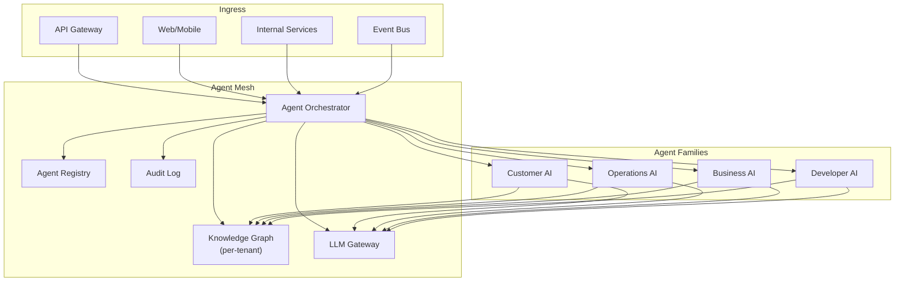
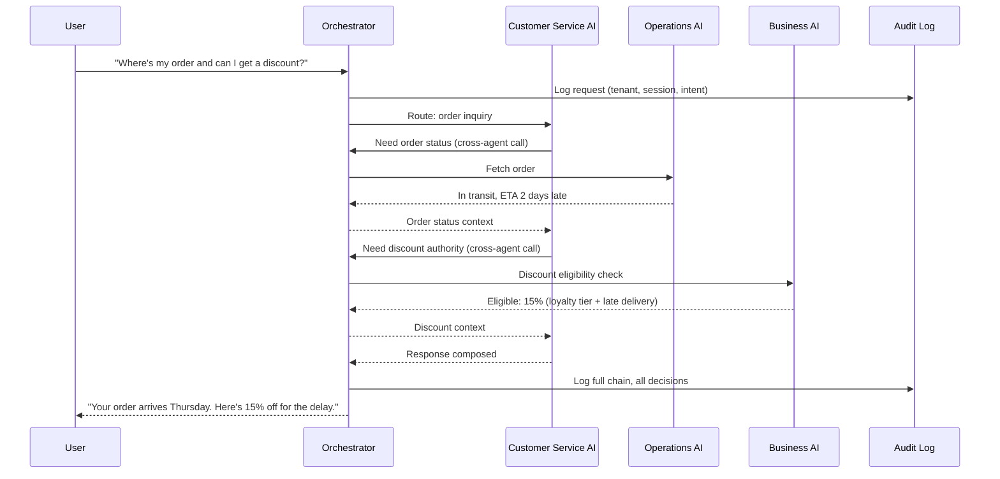
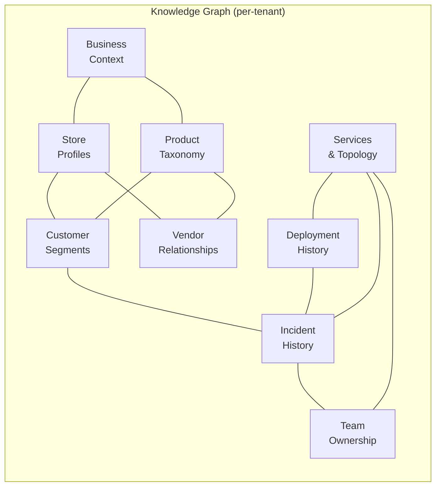
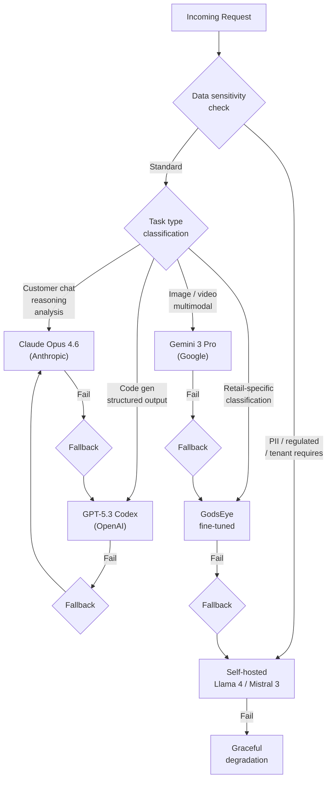
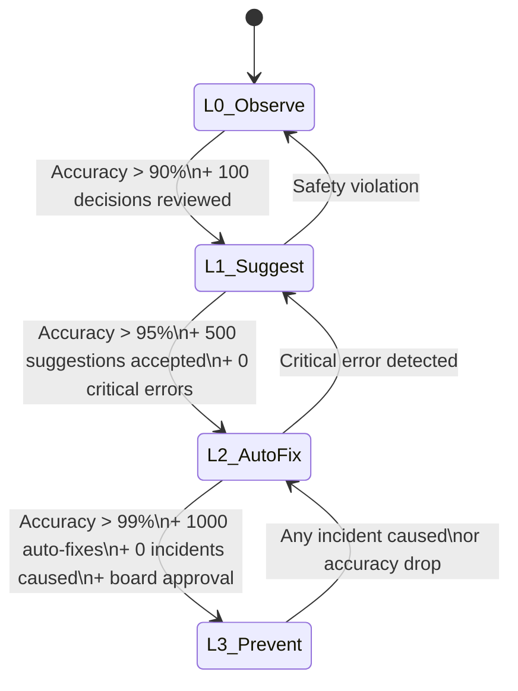
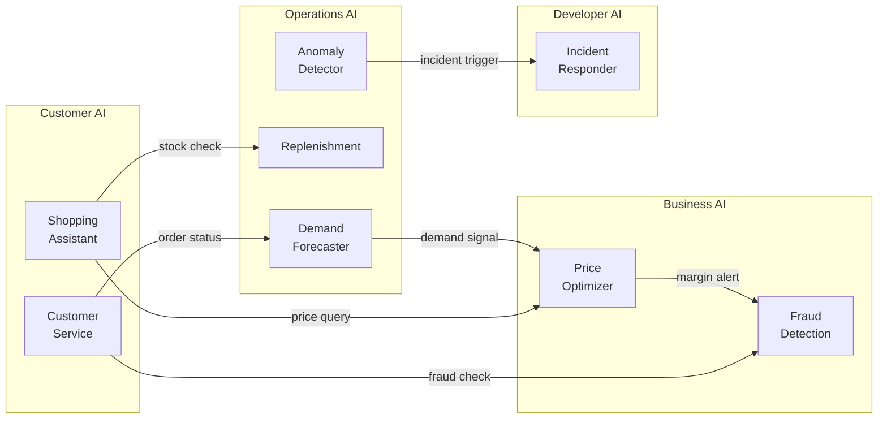

# AI Agent Mesh

GodsEye runs 20+ AI agents across four families. The Agent Mesh is the coordination layer that routes requests, enforces safety boundaries, manages shared memory, and selects the right LLM for every task.

## Architecture Overview



---

## Agent Orchestrator

The orchestrator is the single entry point into the mesh. Every request -- API call, event, internal trigger -- flows through it.

### Responsibilities

| Function | Detail |
|---|---|
| **Request routing** | Matches intent to the correct agent using registry metadata and request context |
| **Agent-to-agent comms** | Manages cross-agent calls (e.g., Customer AI asking Operations AI for inventory) |
| **Blast radius limits** | Caps the scope of any single agent action -- per tenant, per resource type, per time window |
| **Conversation context** | Maintains multi-turn state across agent interactions within a session |
| **Audit logging** | Every decision, every LLM call, every action -- logged immutably with tenant, agent, timestamp, input/output hash |
| **Kill switch** | Instant shutdown per agent, per tenant, or per action type. Three granularities, sub-second enforcement |

### Kill Switch Granularity

```
Kill Switch Levels:
  L1  Agent-level     →  Disable a specific agent across all tenants
  L2  Tenant-level    →  Disable all agents for a specific tenant
  L3  Action-level    →  Disable a specific action type (e.g., "auto-refund") globally
  L4  Combined        →  Disable a specific action for a specific agent on a specific tenant
```

### Agent-to-Agent Communication



---

## Knowledge Graph

Per-tenant institutional memory. Every tenant gets an isolated graph that grows over time and is never shared across tenant boundaries.

### Entity Model



### What Lives in the Graph

| Entity | Examples | Used By |
|---|---|---|
| **Service topology** | Service dependency map, API contracts, data flows | Developer AI, Operations AI |
| **Team ownership** | Who owns what service, on-call rotations, escalation chains | Developer AI |
| **Incident history** | Past incidents, root causes, remediation steps, blast radius | Developer AI, Operations AI |
| **Deployment history** | Release versions, rollback events, feature flags, config changes | Developer AI |
| **Business context** | What's in season, upcoming sales, promotional calendar, margin targets | Business AI, Customer AI |
| **Customer segments** | Cohort definitions, lifetime value tiers, churn risk scores | Customer AI, Business AI |
| **Product taxonomy** | Category trees, attributes, substitution rules, cross-sell mappings | Customer AI, Operations AI |
| **Store profiles** | Location, format, capacity, local demographics, performance history | Operations AI, Business AI |
| **Vendor relationships** | Lead times, reliability scores, contract terms, alternate sources | Operations AI, Business AI |

### Growth Model

The graph is append-heavy and versioned. Agents write observations back to the graph after every interaction.

```
Day 1:     Base topology + product catalog + store list
Week 1:    + first incident patterns, deployment correlations
Month 1:   + customer segment behaviors, seasonal patterns
Month 6:   + vendor reliability trends, demand forecast accuracy feedback
Year 1:    + full institutional memory, cross-domain correlations
```

### Isolation

- Tenant A cannot read Tenant B's graph. Enforced at storage layer (separate keyspaces) and API layer (tenant context injected at orchestrator).
- No cross-tenant aggregation. No shared embeddings. No federated queries.

---

## LLM Gateway

The gateway selects the best model for each task based on capability requirements, data sensitivity, cost, and latency constraints.

### Model Routing Matrix

| Provider | Models | Strengths | Routed For | Latency | Cost |
|---|---|---|---|---|---|
| **Anthropic (Claude API)** | Claude Opus 4.6, Sonnet 4.5, Haiku 4.5 | Reasoning, analysis, safety, 1M context window | Customer-facing chat, complex analysis, policy decisions | Medium | $$$|
| **OpenAI (GPT-5 API)** | GPT-5.3 Codex, GPT-5.2 | Code generation, structured output, function calling | Code analysis, auto-fix generation, schema transforms | Medium | $$$ |
| **Google (Gemini API)** | Gemini 3 Pro, Gemini 2.0 Flash | Multimodal, image/video understanding, agentic coding | Product image search, shelf scanning, damage detection | Medium | $$ |
| **Self-hosted (Llama/Mistral)** | Llama 4 Maverick, Mistral Large 3 | Data sovereignty, no external calls, MoE efficiency | Data-sensitive tenants, PII processing, on-prem requirements | Low | $ (infra) |
| **GodsEye fine-tuned** | Custom retail models | Retail-specific accuracy, smaller/faster | Product categorization, demand signals, return reason classification | Low | $ |

### Routing Decision Flow



### Fallback Chain

Every primary model has a defined secondary. If the primary returns an error, times out, or produces low-confidence output, the gateway retries with the fallback.

```
Claude Opus 4.6  → fallback → GPT-5.3
GPT-5.3          → fallback → Claude Opus 4.6
Gemini 3 Pro     → fallback → GodsEye fine-tuned (vision)
Fine-tuned       → fallback → Self-hosted Llama 4
Self-hosted → fallback → Graceful degradation (cached response / human handoff)
```

### Gateway Behaviors

- **Token budgeting**: Per-tenant monthly token limits. Alerts at 80%, hard cap at 100%, overflow to cheaper model.
- **Prompt caching**: Identical prompts within a window return cached responses. Cache key = hash(prompt + model + tenant).
- **Response validation**: Output schema enforcement. If the model returns malformed JSON, retry once, then fail to fallback.
- **Latency SLOs**: Customer-facing calls must respond in < 2s (p95). Internal analysis calls can take up to 30s.

---

## Agent Trust Levels

Every agent starts at L0 (observe-only) and graduates upward based on demonstrated accuracy and safety.

### Trust Progression



### Level Definitions

| Level | Name | What the Agent Can Do | Human Involvement |
|---|---|---|---|
| **L0** | Observe | Read data, build context, surface insights in dashboards | Human does everything |
| **L1** | Suggest | All of L0 + propose specific actions with reasoning | Human reviews and approves each action |
| **L2** | Auto-fix | All of L1 + execute known-safe patterns automatically | Human notified post-action, can reverse |
| **L3** | Prevent | All of L2 + proactively block problems before they occur | Human sets policy, agent enforces |

### Graduation Criteria

- **L0 to L1**: Agent has observed 100+ decisions in production, accuracy of observations > 90% (validated against outcomes).
- **L1 to L2**: 500+ suggestions accepted by human operators, accuracy > 95%, zero critical errors in last 30 days.
- **L2 to L3**: 1,000+ auto-fixes executed successfully, accuracy > 99%, zero agent-caused incidents, explicit board-level approval required.

### Demotion

Agents can be demoted at any time:
- L3 to L2: any incident directly caused by agent action.
- L2 to L1: any critical error (data loss, incorrect financial transaction, customer impact).
- Any level to L0: safety violation or kill switch activation.

---

## Agent Families

GodsEye organizes its 20+ agents into four families. Each family has its own documentation page.

| Family | Focus | Key Agents | Primary LLMs |
|---|---|---|---|
| **[Customer AI](./customer-ai)** | Shopping, service, personalization, visual search | Shopping Assistant, Visual Search, Customer Service AI, Personalization Engine | Claude Opus 4.6, Gemini 3 |
| **[Operations AI](./operations-ai)** | Demand, inventory, fulfillment, anomaly detection | Demand Forecaster, Replenishment AI, Route Optimizer, Anomaly Detector | GPT-5.3, fine-tuned |
| **[Business AI](./business-ai)** | Pricing, fraud, finance, workforce | Price Optimizer, Fraud Detection, Finance Forecaster, Workforce Planner | Claude Opus 4.6, GPT-5.3 |
| **Developer AI** | Code, incidents, capacity, testing | Code Reviewer, Incident Responder, Capacity Planner, Test Generator | GPT-5.3 Codex, Claude Opus 4.6 |

### Cross-Family Interactions



Every cross-family call routes through the orchestrator. No direct agent-to-agent connections. The orchestrator enforces access control, rate limits, and audit logging on every hop.
