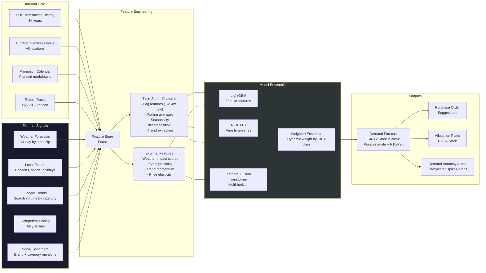
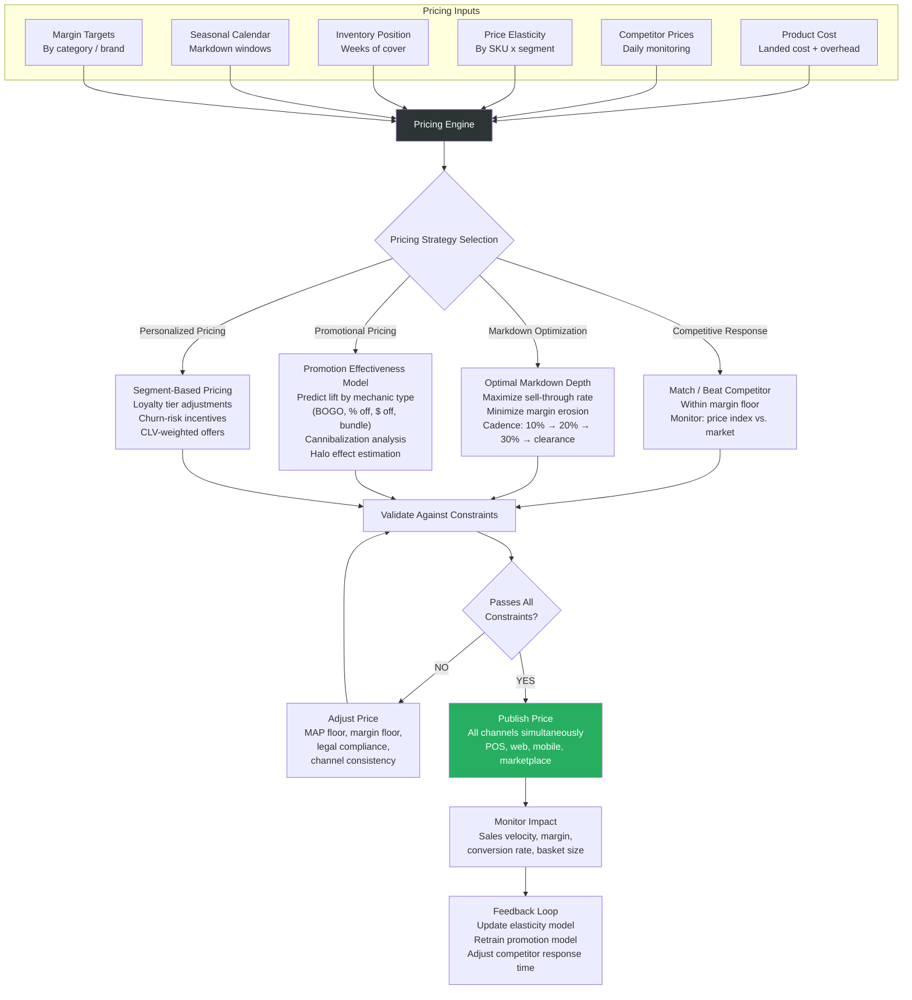
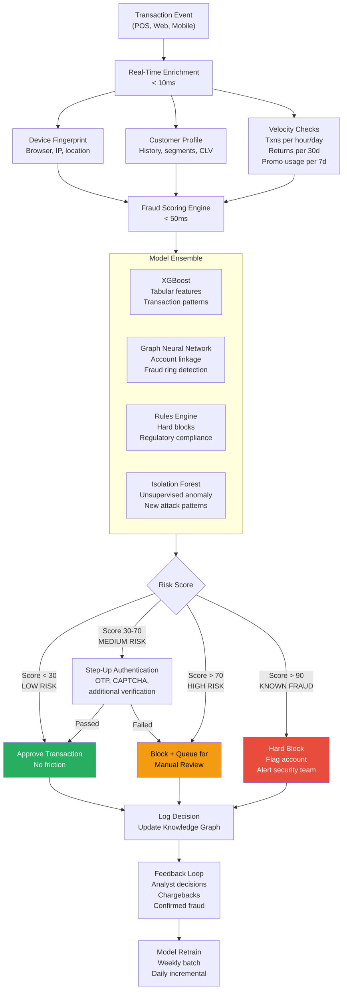
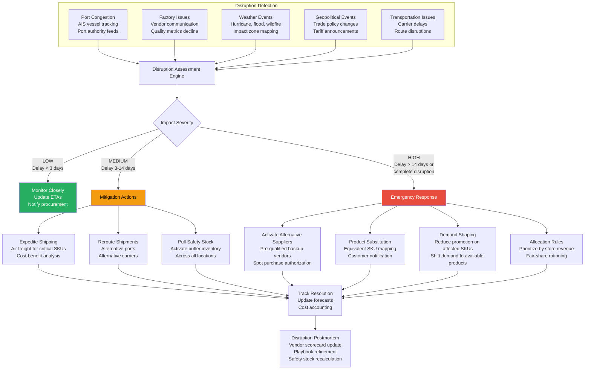
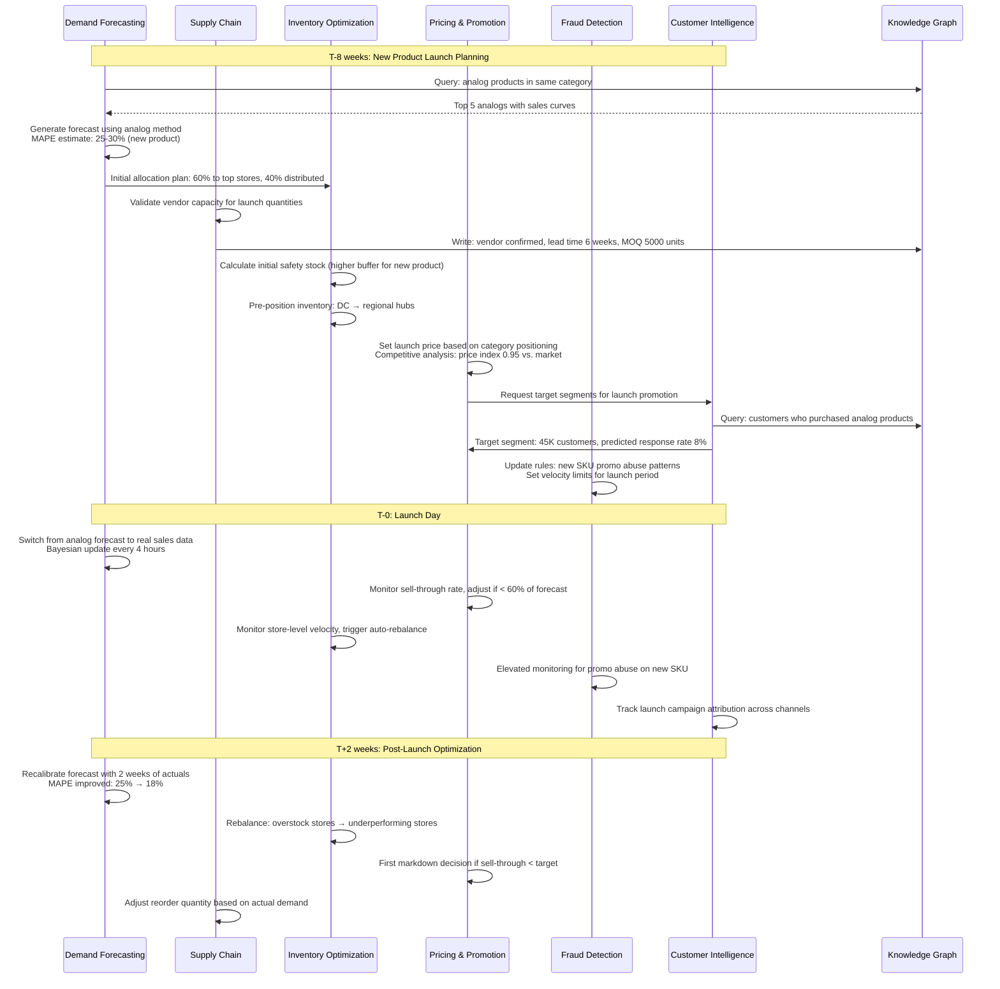

# Business AI Agents

Six autonomous agents that optimize retail operations end-to-end: predict demand, set prices, balance inventory, catch fraud, understand customers, and manage the supply chain. Every agent feeds the Knowledge Graph and consumes from it -- decisions compound.

---

## Agent Overview

| # | Agent | Trust Level | Scope | Key Metric |
|---|-------|-------------|-------|------------|
| 1 | Demand Forecasting Agent | L3 PREVENT | SKU x store x week predictions | < 15% MAPE |
| 2 | Pricing & Promotion Agent | L2 AUTO-FIX | Dynamic pricing, markdown, promos | Gross margin +200bps |
| 3 | Inventory Optimization Agent | L2 AUTO-FIX | All channels: DC, in-transit, in-store, online | Stockout rate < 2% |
| 4 | Fraud Detection Agent | L2 AUTO-FIX | Real-time transaction scoring, return/promo/employee fraud | < 100ms scoring, < 0.1% false positive |
| 5 | Customer Intelligence Agent | L1 SUGGEST | CLV, churn, next-best-action, segmentation, attribution | Churn prediction AUC > 0.85 |
| 6 | Supply Chain Agent | L2 AUTO-FIX | Vendor scoring, lead time, disruption, transportation | On-time delivery > 95% |

---

## 1. Demand Forecasting Agent

Predicts demand at the SKU x store x week granularity. Combines historical sales with external signals (weather, events, trends, competitor pricing, social sentiment). Outputs purchase order suggestions and allocation plans.

### Demand Forecasting Data Pipeline

### Forecast Accuracy Targets

| Category | MAPE Target | Granularity | Horizon | Refresh Frequency |
|----------|------------|-------------|---------|-------------------|
| Fast movers (top 20% SKUs) | < 10% | Store-level | 4 weeks | Daily |
| Core assortment | < 15% | Store-level | 8 weeks | Daily |
| Long tail | < 25% | Region-level | 12 weeks | Weekly |
| New products (< 8 weeks history) | < 30% | Category analog | 4 weeks | Daily |
| Promotional periods | < 20% | Store-level | 2 weeks | Daily |

---

## 2. Pricing & Promotion Agent

Dynamically optimizes markdowns to maximize margin recovery. Monitors competitor pricing in real time. Predicts promotion effectiveness before launch. Delivers personalized pricing per customer segment. Optimizes markdown cadence to minimize margin erosion.

### Pricing Optimization Workflow

### Promotion Effectiveness Metrics

| Mechanic | Avg Lift | Cannibalization Rate | Margin Impact | Best For |
|----------|---------|---------------------|---------------|----------|
| BOGO | 80-120% | 15-25% | -30 to -40% | Clearance, trial generation |
| % Off (20-30%) | 40-60% | 10-15% | -15 to -25% | Seasonal, competitive response |
| $ Off threshold | 25-35% | 5-10% | -10 to -15% | Basket building, AOV increase |
| Bundle pricing | 30-50% | 5-8% | -5 to -10% | Cross-sell, category penetration |
| Loyalty-only | 20-30% | 2-5% | -8 to -12% | Retention, data capture |

---

## 3. Inventory Optimization Agent

Real-time inventory visibility across every node: distribution centers, in-transit, in-store (front-of-house + backroom), and online-allocated. Auto-rebalances between stores. Optimizes ship-from-store. Detects shrinkage. Calculates safety stock per SKU per location.

### Inventory Visibility Across Channels

```mermaid
graph TD
    subgraph DC["Distribution Centers"]
        DC1["DC East<br/>Available: raw count<br/>Allocated: by channel<br/>Reserved: for replenishment"]
        DC2["DC West<br/>Available: raw count<br/>Allocated: by channel<br/>Reserved: for replenishment"]
    end

    subgraph Transit["In-Transit"]
        INBOUND["Inbound from Vendor<br/>PO-level tracking<br/>ETA by DC"]
        TRANSFER["Store Transfers<br/>Store-to-store<br/>DC-to-store"]
        RETURNS_T["Return Shipments<br/>Customer → DC<br/>Store → DC"]
    end

    subgraph Store["In-Store (per location)"]
        FLOOR["Sales Floor<br/>Planogram position<br/>Sellable units"]
        BACK["Backroom<br/>Overflow stock<br/>Received not shelved"]
        HOLD["Customer Hold<br/>BOPIS reserved<br/>Layaway"]
    end

    subgraph Online["Online Channels"]
        WEB_INV["Web Available<br/>= DC available<br/>+ store available (SFS eligible)<br/>- all reservations"]
        MARKET["Marketplace Allocated<br/>Amazon, Walmart.com<br/>Channel-specific buffers"]
        BOPIS["BOPIS Available<br/>= Store floor + backroom<br/>- in-store holds<br/>per pickup location"]
    end

    subgraph Agent["Inventory Optimization Agent"]
        UNIFIED["Unified Inventory View<br/>Single source of truth<br/>Real-time (< 30s latency)"]
        REBALANCE["Auto-Rebalance Engine<br/>Overstock → understock<br/>Minimize transfer cost"]
        SFS["Ship-From-Store Optimizer<br/>Closest fulfillment node<br/>Balance cost vs. speed"]
        SHRINK["Shrinkage Detector<br/>Expected vs. actual<br/>Pattern: theft, damage, miscount"]
        SAFETY["Safety Stock Calculator<br/>Per SKU x location<br/>Demand variability + lead time"]
    end

    DC1 --> UNIFIED
    DC2 --> UNIFIED
    INBOUND --> UNIFIED
    TRANSFER --> UNIFIED
    RETURNS_T --> UNIFIED
    FLOOR --> UNIFIED
    BACK --> UNIFIED
    HOLD --> UNIFIED
    WEB_INV --> UNIFIED
    MARKET --> UNIFIED
    BOPIS --> UNIFIED

    UNIFIED --> REBALANCE
    UNIFIED --> SFS
    UNIFIED --> SHRINK
    UNIFIED --> SAFETY

    REBALANCE -->|"transfer orders"| TRANSFER
    SFS -->|"fulfillment routing"| WEB_INV
    SHRINK -->|"investigation tickets"| FLOOR
    SAFETY -->|"replenishment triggers"| DC1
    SAFETY -->|"replenishment triggers"| DC2

    style Agent fill:#2d3436,color:#fff
    style DC fill:#3498db,color:#fff
    style Transit fill:#f39c12,color:#000
    style Store fill:#27ae60,color:#fff
    style Online fill:#9b59b6,color:#fff
```

### Rebalancing Decision Logic

| Trigger | Condition | Action | Constraint |
|---------|-----------|--------|------------|
| Overstock | Weeks of cover > 2x target | Transfer to understock stores | Transfer cost < margin gain |
| Stockout risk | Forecast demand > available + incoming | Emergency replenishment from nearest node | Prioritize by revenue velocity |
| Ship-from-store | Online order + store has stock closer to customer | Route to store fulfillment | Store capacity, labor cost |
| Shrinkage alert | Actual inventory < expected by > 3% | Flag for investigation, adjust counts | Do not auto-correct without audit |
| Seasonal shift | Category velocity changing > 20% week-over-week | Pre-position inventory by climate zone | Lead time to destination |

### Safety Stock Formula Inputs

| Factor | Data Source | Update Frequency |
|--------|------------|-----------------|
| Demand variability (sigma) | Forecast Agent -- prediction intervals | Daily |
| Lead time variability | Supply Chain Agent -- vendor lead time history | Weekly |
| Service level target | Business rules -- by SKU class (A/B/C) | Quarterly |
| Review period | Replenishment cycle time | Per vendor |
| Cost of stockout | Lost sales + customer churn impact | Monthly |
| Holding cost | Warehouse cost per cubic foot per day | Monthly |

---

## 4. Fraud Detection Agent

Real-time transaction scoring in < 100ms. Detects return fraud (serial returners, wardrobing), promotion abuse (coupon stacking, fake accounts), employee fraud (unauthorized discounts, voids), and cross-channel fraud patterns.

### Fraud Detection Real-Time Scoring Flow

### Fraud Type Detection

| Fraud Type | Signals | Detection Method | Response |
|------------|---------|-----------------|----------|
| **Return fraud -- Serial returners** | > 5 returns/month, return rate > 40% | Velocity rules + ML threshold | Flag account, require manager approval |
| **Return fraud -- Wardrobing** | Return after event date, wear signs, tag removal | Image analysis + temporal patterns | Block return, flag for review |
| **Promo abuse -- Coupon stacking** | Multiple single-use coupons, rapid account creation | Graph analysis (linked accounts) | Void coupons, flag accounts |
| **Promo abuse -- Fake accounts** | Same device/IP, similar emails, new accounts before promo | Device fingerprint clustering | Block promo redemption |
| **Employee fraud -- Unauthorized discounts** | Discount rate > peer average, specific time patterns | Statistical outlier detection per employee | Alert loss prevention, audit trail |
| **Employee fraud -- Excessive voids** | Void rate > 3x peer average, void-then-repurchase | Sequential pattern mining | Escalate to store manager |
| **Cross-channel fraud** | Buy online return in-store different item, price arbitrage | Cross-channel transaction linking | Unified fraud score across channels |
| **Payment fraud** | Stolen cards, account takeover, velocity mismatch | Real-time scoring + 3DS challenge | Block transaction, notify cardholder |

### Latency Budget

| Stage | Budget | Description |
|-------|--------|-------------|
| Event ingestion | < 5ms | Kafka consume to scoring service |
| Feature enrichment | < 10ms | Redis lookup: device, customer, velocity |
| Model inference | < 50ms | Ensemble scoring (XGBoost + GNN + rules) |
| Decision routing | < 5ms | Score threshold evaluation + action dispatch |
| **Total end-to-end** | **< 100ms** | **From transaction event to approve/block** |

---

## 5. Customer Intelligence Agent

Predicts customer lifetime value (CLV). Identifies customers at risk of churning. Recommends next-best-action per customer. Discovers new customer segments automatically. Provides multi-touch attribution modeling across all channels.

### Customer Intelligence Data Model

| Model | Algorithm | Input Features | Output | Update Cadence |
|-------|-----------|---------------|--------|----------------|
| CLV Prediction | BG/NBD + Gamma-Gamma ensemble | Purchase frequency, recency, monetary, tenure, channel mix | 12-month CLV estimate (P50, P90) | Weekly |
| Churn Prediction | Gradient boosting + survival analysis | Days since last purchase, purchase frequency decline, support tickets, NPS | Churn probability (30/60/90 day) | Daily |
| Next-Best-Action | Contextual bandit (Thompson sampling) | Customer segment, lifecycle stage, channel preference, recent behavior | Ranked action list with expected uplift | Real-time |
| Segment Discovery | HDBSCAN clustering + LLM labeling | RFM, channel affinity, category preference, price sensitivity, promo response | Auto-discovered segments with descriptions | Monthly |
| Attribution | Shapley value-based multi-touch | All touchpoints: email, push, social, paid, organic, in-store | Channel contribution to conversion | Weekly |

### Customer Lifecycle Actions

| Lifecycle Stage | Trigger | Next-Best-Action | Channel | Expected Impact |
|----------------|---------|-----------------|---------|-----------------|
| New (0-30 days) | First purchase | Welcome series, category education | Email + push | +15% second purchase rate |
| Growing (active, CLV increasing) | 3+ purchases | Cross-sell, loyalty enrollment | In-app + email | +20% category penetration |
| Mature (stable, high CLV) | Consistent purchase pattern | Exclusive access, early drops | SMS + app | +10% retention |
| At-risk (declining frequency) | Churn score > 0.6 | Win-back offer, survey | Email + direct mail | -25% churn rate |
| Lapsed (90+ days inactive) | No purchase in 90 days | Re-activation discount, new arrivals | Paid social + email | 8-12% reactivation rate |
| Lost (180+ days inactive) | No purchase in 180 days | Suppress from campaigns, reduce spend | None (save cost) | Marketing efficiency +5% |

---

## 6. Supply Chain Agent

Scores vendor performance continuously. Predicts lead times with confidence intervals. Detects supply chain disruptions early (port delays, factory issues, weather events). Suggests alternative suppliers when disruptions hit. Optimizes transportation cost and routing.

### Supply Chain Disruption Response

### Vendor Scorecard

| Metric | Weight | Measurement | Threshold (Good / Warning / Critical) |
|--------|--------|-------------|---------------------------------------|
| On-time delivery | 30% | % of POs delivered within agreed window | > 95% / 90-95% / < 90% |
| Fill rate | 25% | % of ordered units actually shipped | > 98% / 95-98% / < 95% |
| Quality defect rate | 20% | % of units with quality issues | < 1% / 1-3% / > 3% |
| Lead time accuracy | 15% | Actual vs. quoted lead time variance | < 2 days / 2-5 days / > 5 days |
| Responsiveness | 10% | Avg time to respond to inquiries/issues | < 4h / 4-24h / > 24h |

### Transportation Cost Optimization

| Strategy | Method | Savings Potential |
|----------|--------|-------------------|
| Mode optimization | LTL consolidation, FTL when volume justifies | 15-25% |
| Carrier bidding | Multi-carrier spot market for non-contract lanes | 10-20% |
| Route optimization | Multi-stop consolidation, backhaul utilization | 10-15% |
| Shipment timing | Off-peak scheduling, avoid surge pricing | 5-10% |
| Regional pooling | Cross-dock consolidation at regional hubs | 8-12% |
| Parcel diversification | Zone-skip injection, regional carrier mix | 10-20% |

---

## Cross-Agent Workflow: New Product Launch

---

## Business Impact Targets

| Agent | Primary KPI | Baseline (Pre-AI) | Target (Year 1) | Target (Year 2) |
|-------|------------|-------------------|-----------------|-----------------|
| Demand Forecasting | MAPE | 28% | 15% | 12% |
| Pricing & Promotion | Gross Margin | 38% | 40% (+200bps) | 41.5% (+350bps) |
| Inventory Optimization | Stockout Rate | 8% | 3% | 2% |
| Inventory Optimization | Inventory Turns | 4.2x | 5.5x | 6.5x |
| Fraud Detection | Fraud Loss Rate | 0.45% of revenue | 0.15% | 0.10% |
| Fraud Detection | False Positive Rate | 2.5% | 0.5% | 0.1% |
| Customer Intelligence | Churn Rate | 32% annual | 24% | 20% |
| Customer Intelligence | Marketing ROI | 3.2x | 4.5x | 5.5x |
| Supply Chain | On-Time Delivery | 88% | 95% | 97% |
| Supply Chain | Lead Time Accuracy | +/- 5 days | +/- 2 days | +/- 1 day |
