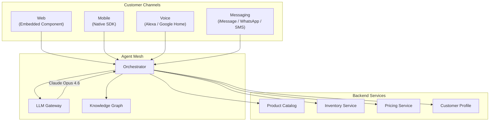
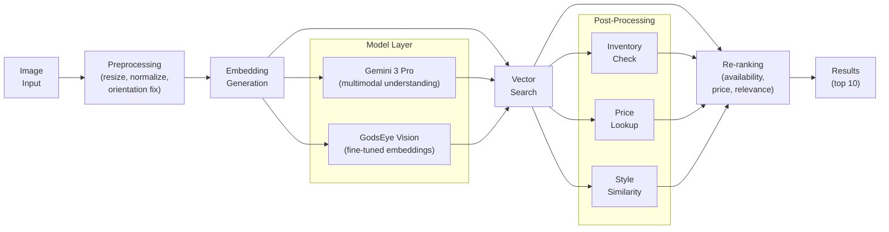
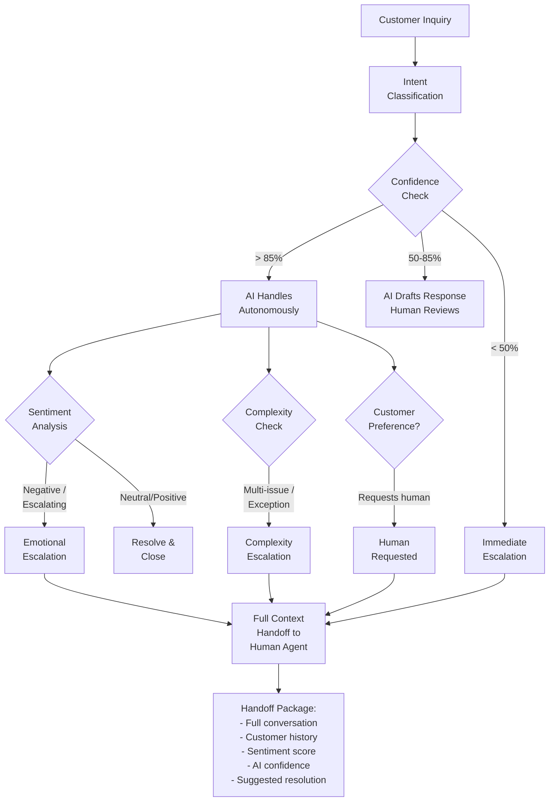
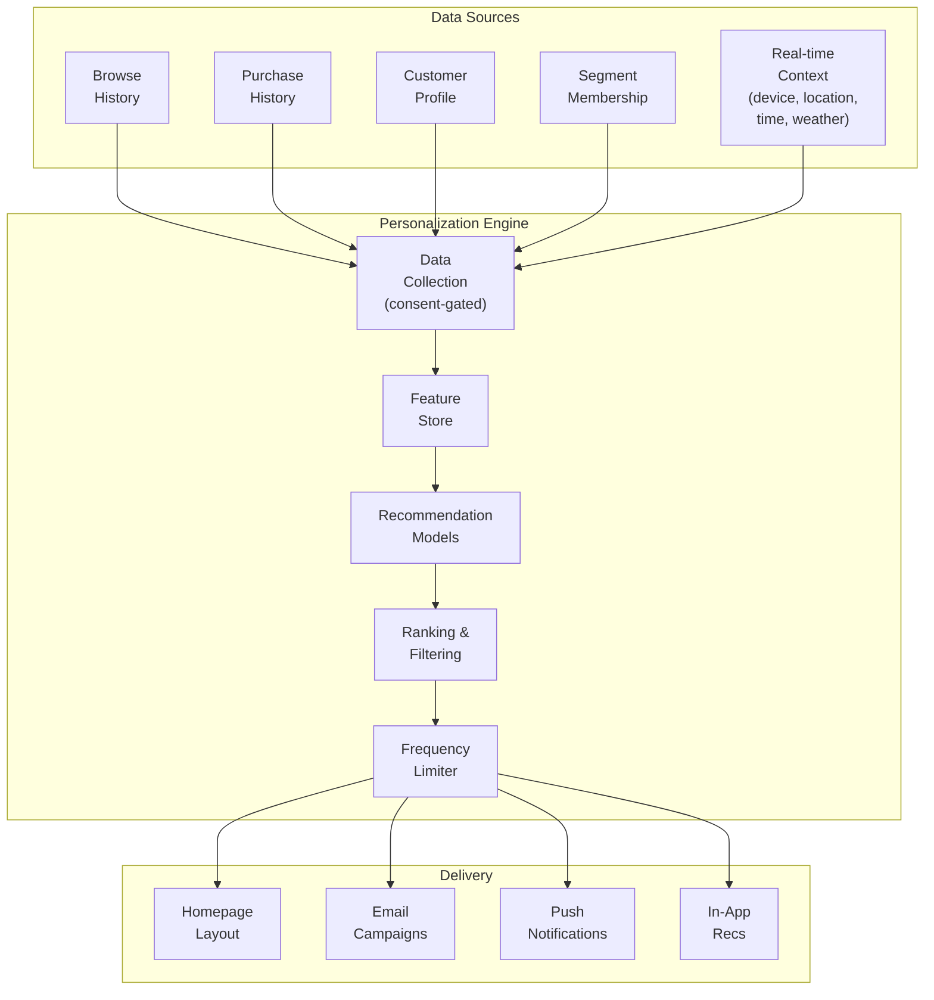

# Customer AI Agents

Customer AI is the customer-facing agent family. Four agents handle shopping assistance, visual search, customer service, and personalization. All run through the [Agent Mesh](./agent-mesh) orchestrator and share the per-tenant Knowledge Graph.

---

## 1. Shopping Assistant

Embedded directly into the shopping experience -- not a chatbot popup. The assistant is woven into the page context: product listings, search results, product detail pages, and cart.

### Capabilities

| Capability | Example | How It Works |
|---|---|---|
| **Natural language search** | "Find me a blue dress for a summer wedding under $200" | Intent extraction + product taxonomy query + price/availability filter |
| **Size & fit comparison** | "Will this run large? I'm usually a medium in Nike" | Cross-brand size mapping table + return rate analysis by size |
| **Outfit builder** | "What shoes go with this?" | Style graph embeddings + purchase co-occurrence data |
| **Local stock check** | "Is this available at the downtown store?" | Real-time inventory API (sub-second, synced with POS) |
| **Pricing intelligence** | "Is this a good price? Has it been cheaper?" | Price history + competitor tracking + promotional calendar |

### Integration Architecture



### Channel Details

| Channel | Implementation | Session Handling |
|---|---|---|
| **Web** | React component embedded in storefront DOM. No iframe, no popup. Shares page context (current product, cart, filters). | Cookie-based session, synced with customer login |
| **Mobile** | Native SDK (Swift / Kotlin). Uses on-device context: location, camera, notification preferences. | Device token + customer ID |
| **Voice** | Alexa Skill / Google Action. Constrained to search, reorder, and order status. No browsing. | Account-linked voice profile |
| **Messaging** | WhatsApp Business API, Apple Business Chat, Twilio SMS. Async, multi-turn. Rich cards where supported. | Phone number linked to customer profile |

### Privacy Controls

- **Consent-based**: No personalization until explicit opt-in. Opt-in is granular (search history, purchase history, location).
- **PII handling**: CCPA and GDPR compliant. Right to delete. Data retention limits enforced per jurisdiction.
- **AI disclosure**: Every AI-generated response is labeled. Customer always knows they are interacting with AI.
- **Data minimization**: Only the data needed for the current request is sent to the LLM. No full customer profile in prompt.

---

## 2. Visual Search & Style AI

Camera-first product discovery. Customers upload a photo or use their phone camera to find matching products.

### Capabilities

| Capability | Input | Output |
|---|---|---|
| **Photo upload match** | Upload image of a dress seen on the street | Top 10 visually similar products in catalog, ranked by similarity |
| **Live camera match** | Point phone camera at a product | Real-time product identification + in-store availability |
| **Style transfer** | "Find similar but in red" | Color/attribute-modified search with visual similarity preserved |
| **Shelf scanning** | Store associate scans a shelf with tablet | Inventory verification: expected vs. actual, gap report |
| **Damage detection** | Photo of returned item | Damage classification (none, minor, major, unsellable) + auto-disposition |

### Visual Search Pipeline



### Model Stack

| Component | Model | Purpose |
|---|---|---|
| **Multimodal understanding** | Gemini 3 Pro (Google) | Scene understanding, attribute extraction from natural photos |
| **Product embeddings** | GodsEye fine-tuned ResNet/ViT | Catalog-specific visual similarity, trained on tenant product images |
| **Damage classification** | GodsEye fine-tuned model | 4-class damage grading for returns processing |
| **Shelf recognition** | Gemini 3 + custom object detection | Planogram compliance, stock gap detection |

### Performance Targets

| Metric | Target |
|---|---|
| Photo-to-results latency | < 1.5s (p95) |
| Top-10 relevance accuracy | > 85% |
| Damage classification accuracy | > 92% |
| Shelf scan coverage | > 95% of SKUs recognized |

---

## 3. Customer Service AI

Handles 70-80% of common customer inquiries autonomously. The remaining 20-30% escalate to human agents with full context.

### Handled Inquiry Types

| Inquiry | Resolution | Data Sources |
|---|---|---|
| **"Where's my order?"** | Real-time tracking status from OMS, carrier API, last-mile ETA | OMS, carrier integrations, fulfillment service |
| **"I want to return this"** | Eligibility check, return label generation, refund estimate, initiate return flow | Order history, return policy engine, shipping service |
| **"I was charged twice"** | Payment ledger check, duplicate detection, auto-initiate refund if confirmed | Payment service, transaction ledger, fraud check |
| **"Wrong item received"** | Photo verification (Visual Search AI), replacement initiation, return label | Visual Search AI, OMS, inventory service |
| **"Cancel my order"** | Check fulfillment status, cancel if pre-ship, intercept if in-transit where possible | OMS, fulfillment service, carrier API |
| **"Price dropped after I bought"** | Price history check, price protection policy evaluation, auto-credit if eligible | Pricing service, order history, policy engine |

### Escalation Flow



### Escalation Triggers

| Trigger | Detection Method | Action |
|---|---|---|
| **Emotional distress** | Sentiment analysis detects anger, frustration, or distress keywords | Immediate escalation with empathy flag |
| **Complex complaint** | Multi-issue detection or exception outside policy rules | Escalate with all issues listed and partial resolutions attempted |
| **Low confidence** | Model confidence < 50% on intent or resolution | Escalate before responding, avoid incorrect resolution |
| **Customer requests human** | Explicit "talk to a person" / "speak to a manager" | Instant escalation, no friction, no "are you sure?" |
| **Financial threshold** | Refund or credit exceeds agent authority limit | Escalate with recommendation and amount |

### Context Handoff

When escalating, the AI packages everything the human agent needs:

```
Handoff Package:
  - Full conversation transcript (all turns)
  - Customer profile (tier, LTV, history)
  - Sentiment trajectory (started neutral, escalated at turn 3)
  - AI confidence scores per turn
  - Actions already taken (e.g., "verified duplicate charge exists")
  - Suggested resolution with reasoning
  - Related past interactions (from Knowledge Graph)
```

Zero re-explanation required from the customer.

---

## 4. Personalization Engine

Per-customer experience across every touchpoint. The engine decides what each customer sees, when, and through which channel.

### Touchpoints

| Touchpoint | Personalization | Frequency Control |
|---|---|---|
| **Homepage** | Layout, featured products, categories, banners -- all personalized per customer segment and individual behavior | Every visit |
| **Email: post-purchase** | "Here's how to style what you bought" + complementary recs | 1 email, 3 days post-delivery |
| **Email: browse abandonment** | Products viewed but not purchased + similar alternatives | Max 1 per 7 days |
| **Push notification** | Price drop on wishlist items, back-in-stock alerts | Max 3 per week, quiet hours enforced |
| **In-app recs** | "Complete the look", "Others also bought", "New in your size" | Contextual, inline |
| **Post-purchase tips** | Care instructions, styling guides, usage tips | 1 per purchase, relevant to product category |

### Personalization Data Flow



### Recommendation Models

| Model | Input | Output | Update Frequency |
|---|---|---|---|
| **Collaborative filtering** | Purchase history across similar customers | "Customers like you bought..." | Daily batch |
| **Content-based** | Product attributes + customer preference vector | "Based on your style profile..." | Real-time |
| **Sequential** | Recent browse/purchase sequence | "Next in your journey..." | Real-time |
| **Context-aware** | Location, time, weather, device | "Perfect for today's weather..." | Real-time |

### Guardrails

| Control | Implementation |
|---|---|
| **Frequency limits** | Per-channel caps enforced at the engine level. No customer receives more than configured max per channel per time window. |
| **Opt-out** | Full opt-out and granular opt-out (per channel, per type). Opt-out is instant, not "within 48 hours". |
| **No dark patterns** | No urgency manufacturing. No fake scarcity. No hidden pre-checks. |
| **Diversity** | Recommendations include category diversity to avoid filter bubbles. Not just "more of the same". |
| **Cold start** | New customers get segment-level defaults, not empty pages. Personalization improves with interaction. |
| **Feedback loop** | Click-through rates, conversion rates, and unsubscribe rates feed back into model training. Declining engagement auto-reduces frequency. |

---

## Agent Summary

| Agent | Trust Level (typical) | Primary LLM | Fallback LLM | Key Integration |
|---|---|---|---|---|
| Shopping Assistant | L1 Suggest | Claude Opus 4.6 (Anthropic) | GPT-5.2 (OpenAI) | Product Catalog, Inventory, Pricing |
| Visual Search & Style AI | L1 Suggest | Gemini 3 Pro (Google) | GodsEye fine-tuned | Product Image Index, Inventory |
| Customer Service AI | L2 Auto-fix | Claude Opus 4.6 (Anthropic) | GPT-5.2 (OpenAI) | OMS, Payments, Returns |
| Personalization Engine | L2 Auto-fix | GodsEye fine-tuned | Claude Sonnet 4.5 (Anthropic) | Customer Profile, Feature Store |
