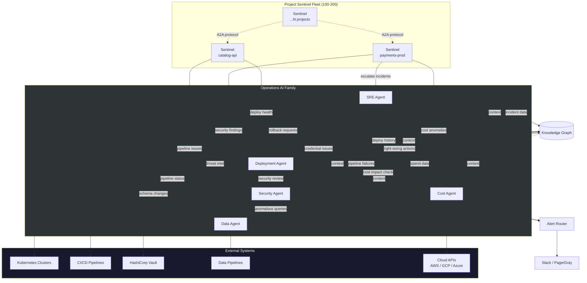
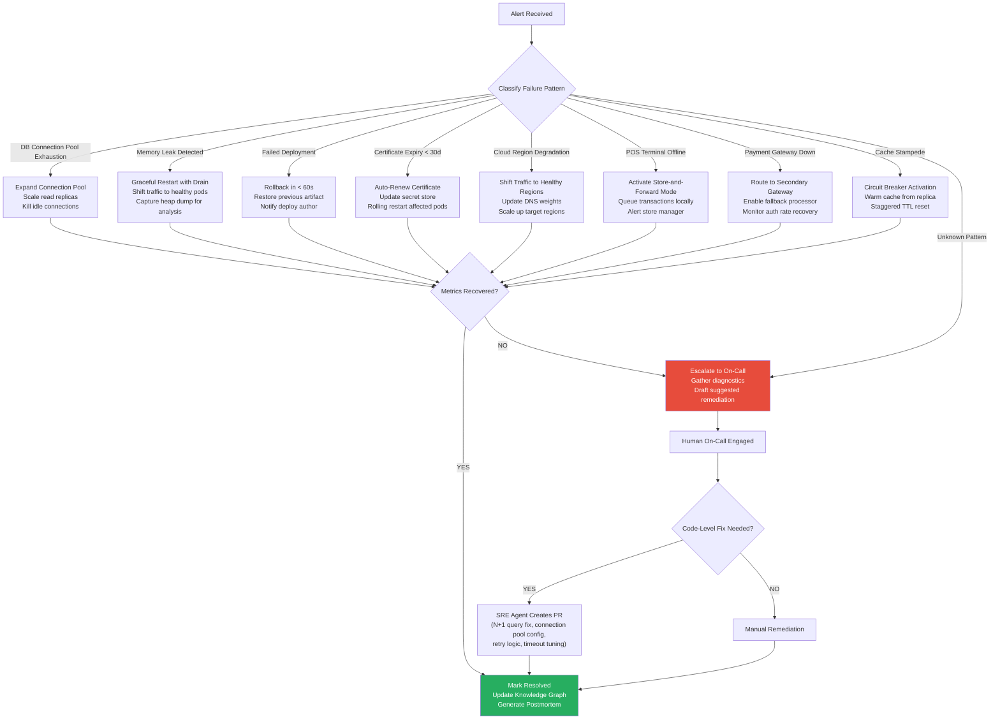
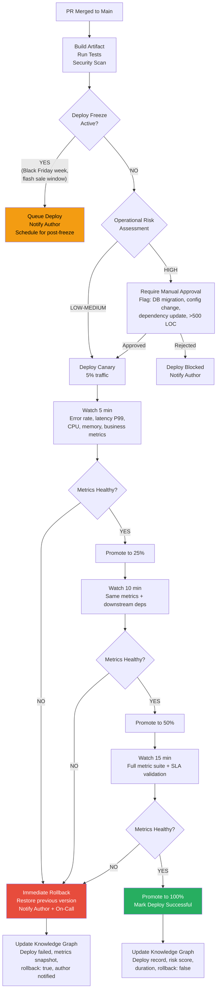
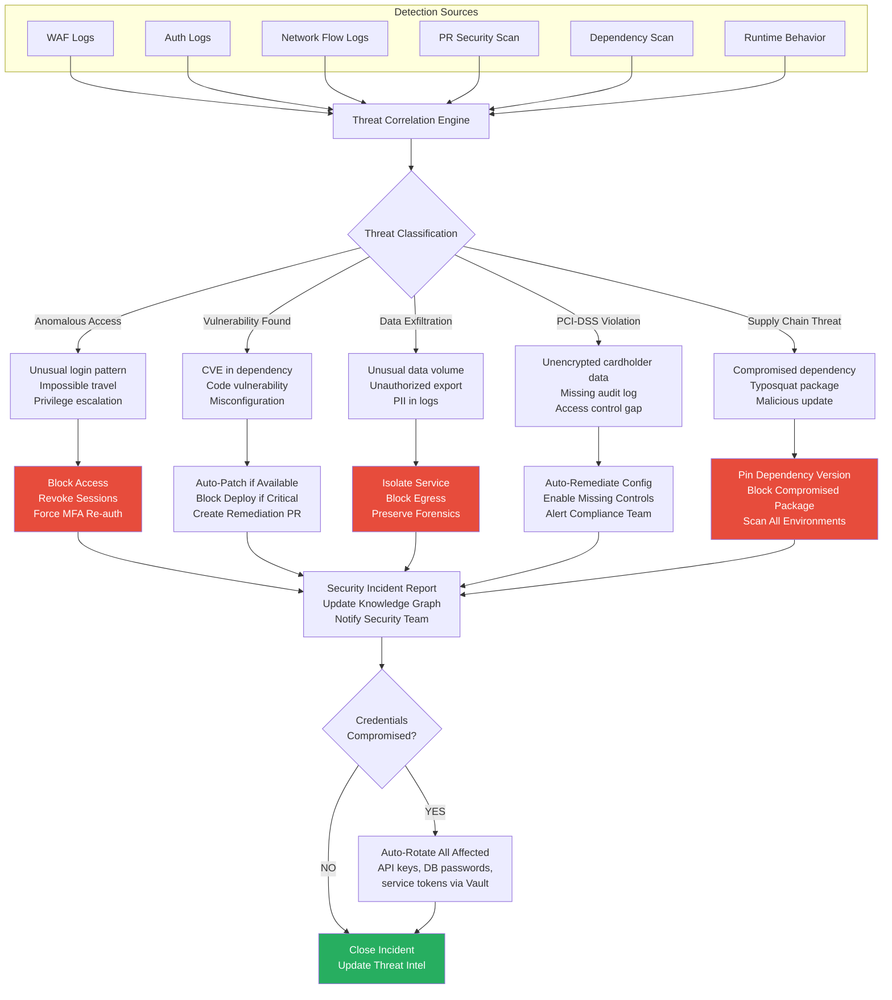
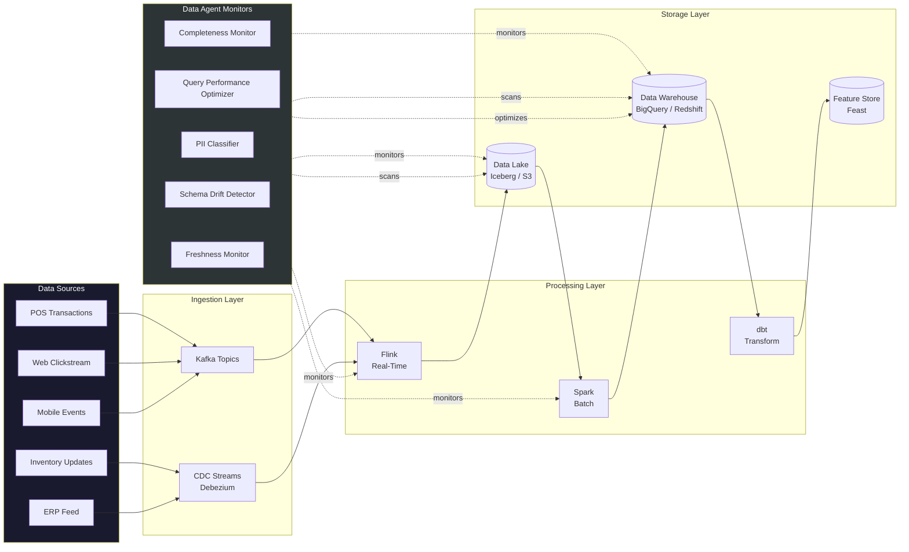
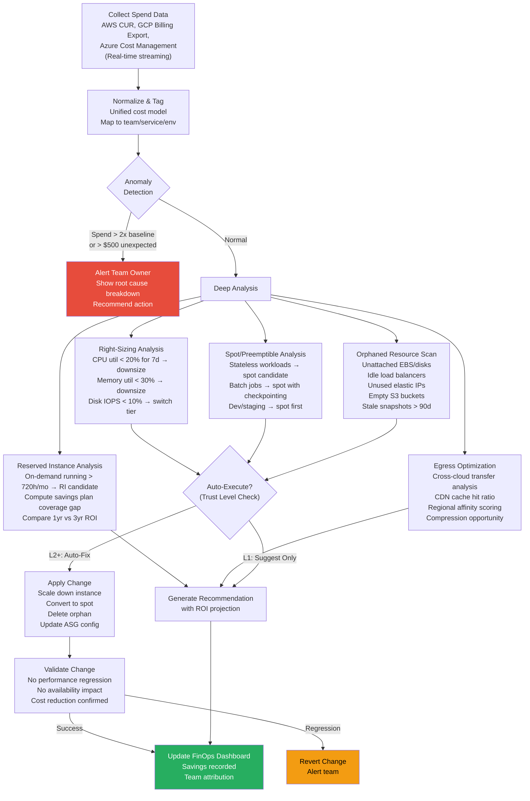
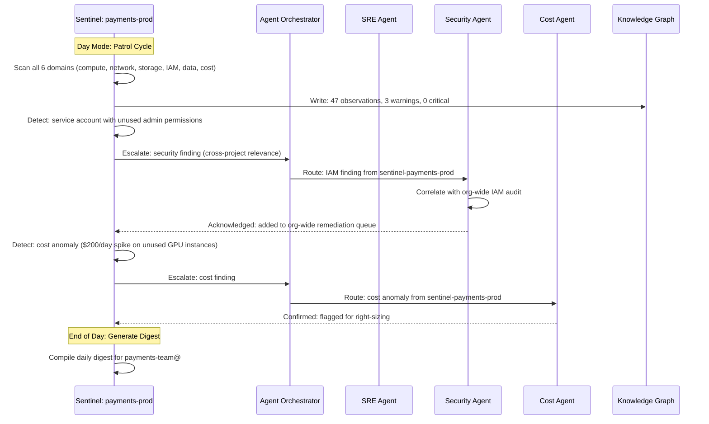
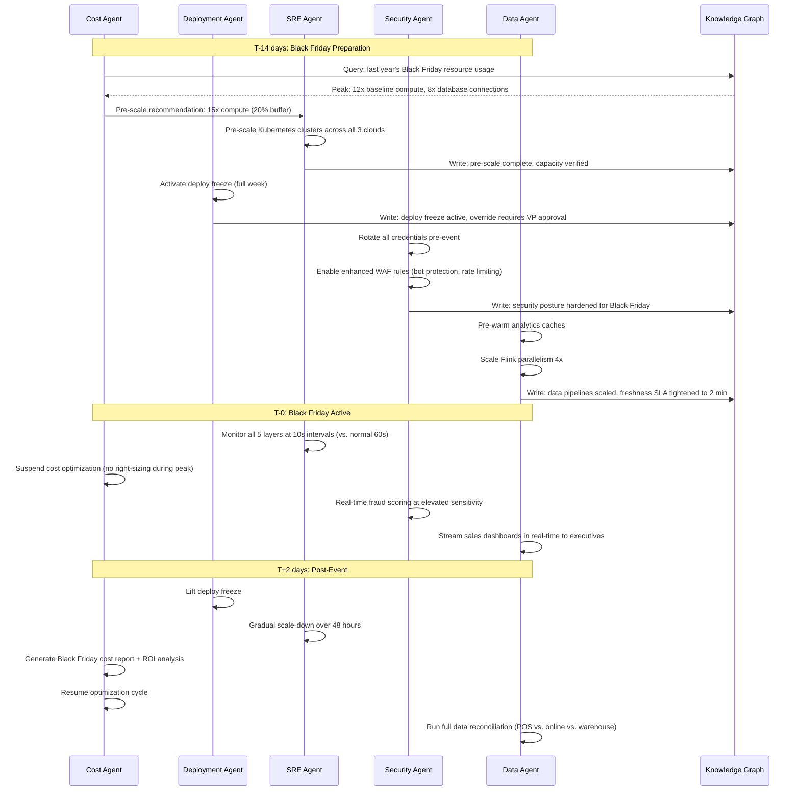

# ⚡ Operations AI Agents

Six autonomous agents that keep GodsEye running 24/7 across all clouds, all channels, all stores. Five central agents handle platform-wide operations, plus a fleet of **Project Sentinel Agents** -- one per cloud project -- that patrol individual projects 24/7 with day/night duty cycles.

---

## Agent Overview

| # | Agent | Trust Level | Scope | Key Metric |
|---|-------|-------------|-------|------------|
| 1 | SRE Agent | L2 AUTO-FIX | All 5 layers -- web, mobile, POS, payments, infra | MTTR < 2 min for known patterns |
| 2 | Deployment Agent | L2 AUTO-FIX | CI/CD pipelines, canary promotion, deploy freezes | Zero failed deploys reaching 100% traffic |
| 3 | Security Agent | L2 AUTO-FIX | PCI-DSS, credential rotation, supply chain, exfiltration | 0 unpatched critical CVEs > 24h |
| 4 | Data Agent | L1 SUGGEST | Pipeline health, schema drift, PII, query performance | < 5 min data freshness SLA |
| 5 | Cost Agent | L1 SUGGEST | Multi-cloud spend, right-sizing, reserved/spot, egress | 30% YoY cost reduction target |
| 6 | Project Sentinel Fleet | L0→L3 PHASED | Per-project health, security, cost, data -- day/night cycles | 100% project coverage, health score > 90 |

---

## All 6 Agents -- Interaction Topology

---

## 1. SRE Agent

Monitors all 5 layers continuously. Correlates alerts across web, mobile, POS, payments, and infrastructure. Auto-remediates known failure patterns in seconds. Creates PRs for code-level fixes. Generates postmortems automatically.

### Monitored Layers

| Layer | Signals | Example Alerts |
|-------|---------|----------------|
| Web | Core Web Vitals, JS error rate, API latency | LCP > 2.5s, error rate > 1% |
| Mobile | Crash rate, ANR, API timeout | Crash rate > 0.5%, ANR > 0.2% |
| POS | Terminal heartbeat, transaction latency, offline duration | Terminal offline > 30s, txn > 5s |
| Payments | Gateway response time, auth rate, decline rate | Auth rate < 95%, decline spike > 3x |
| Infrastructure | CPU, memory, disk, network, pod health, DB connections | CPU > 80% sustained, OOM kills |

### Auto-Remediation Decision Flow

### Known Auto-Remediation Patterns

| Pattern | Detection Signal | Action | Time to Remediate |
|---------|-----------------|--------|-------------------|
| DB connection pool exhaustion | Active connections > 90% pool size | Expand pool, scale read replicas, kill idle | < 15s |
| Memory leak | RSS growth > 5% per hour, no plateau | Graceful restart with connection drain | < 30s |
| Failed deployment | Error rate spike within 5 min of deploy | Rollback to last known good artifact | < 60s |
| Certificate expiry | Days to expiry < 30 | Auto-renew via ACME, update Vault, rolling restart | < 5 min |
| Cloud region degradation | Health check failures > 3 consecutive | Shift traffic via DNS weight update | < 30s |
| POS terminal offline | Heartbeat missed > 30s | Activate store-and-forward queue | < 5s |
| Payment gateway down | Auth rate drops below 90% | Route to secondary processor | < 10s |
| Cache stampede | Cache miss rate > 50x baseline | Circuit breaker, warm from replica, stagger TTL | < 10s |

---

## 2. Deployment Agent

Reviews every PR for operational risk before merge. Manages canary promotion with live metric watching. Enforces deploy freezes around business events. Validates infrastructure changes against cost and security baselines. Detects configuration drift and auto-reconciles.

### Canary Promotion Workflow

### Deploy Freeze Calendar

| Event | Freeze Window | Scope | Override Policy |
|-------|--------------|-------|-----------------|
| Black Friday / Cyber Monday | Full week (Mon-Mon) | All services | VP Engineering approval only |
| Flash sale | 2 hours before through 1 hour after | Commerce, payments, inventory | No overrides |
| End-of-month close | Last 2 days of month | Finance, reporting, data pipelines | Finance director approval |
| Peak hours (11am-2pm, 6pm-9pm) | Daily recurring | Tier 1 services only | SRE lead approval |
| PCI audit window | Duration of audit | Payment services | Security team approval |

### Drift Detection and Reconciliation

| Drift Type | Detection Method | Reconciliation Action |
|------------|-----------------|----------------------|
| Terraform state drift | Hourly `terraform plan` comparison | Auto-apply if safe, alert if destructive |
| K8s config drift | ArgoCD sync status monitoring | Auto-sync from Git source of truth |
| Feature flag drift | Flag state vs. expected per environment | Reconcile to environment-defined state |
| Secret rotation drift | Vault lease expiry tracking | Auto-rotate and rolling restart |
| DNS record drift | Cross-cloud DNS consistency check | Reconcile to primary DNS source |

---

## 3. Security Agent

Continuous PCI-DSS compliance monitoring across all environments. Detects anomalous access patterns in real time. Auto-rotates credentials on schedule and on compromise detection. Scans every PR for vulnerabilities. Monitors the full supply chain dependency tree. Detects data exfiltration attempts.

### Threat Detection and Response Flow

### PCI-DSS Continuous Compliance

| Requirement | Monitoring Mechanism | Auto-Remediation |
|-------------|---------------------|------------------|
| Req 1: Firewall config | Network policy audit every 15 min | Auto-revert unauthorized rule changes |
| Req 2: No vendor defaults | Config scan on deploy | Block deploy with default credentials |
| Req 3: Protect stored data | Encryption-at-rest verification | Alert + auto-enable encryption |
| Req 4: Encrypt transmission | mTLS certificate monitoring | Auto-renew, force TLS 1.3 |
| Req 6: Secure systems | CVE scan on every PR + nightly full scan | Auto-patch, block critical deploys |
| Req 7: Restrict access | RBAC policy audit hourly | Revoke excessive permissions |
| Req 8: Identify users | Auth log anomaly detection | Force re-authentication |
| Req 10: Track access | Audit log completeness check | Alert on missing audit events |
| Req 11: Test security | Automated pen test weekly | Generate findings, create tickets |
| Req 12: Security policy | Policy drift detection | Auto-reconcile to baseline |

### Credential Rotation Schedule

| Credential Type | Rotation Interval | On-Compromise Rotation | Method |
|----------------|-------------------|----------------------|--------|
| Database passwords | 30 days | Immediate | Vault dynamic secrets |
| API keys | 90 days | Immediate | Key pair rotation |
| Service tokens | 24 hours | Immediate | Short-lived JWT via SPIFFE |
| TLS certificates | 60 days (auto-renew at 30) | Immediate | ACME / cert-manager |
| Cloud IAM keys | 7 days | Immediate | STS temporary credentials |
| Encryption keys | 365 days | Immediate | KMS key rotation |

---

## 4. Data Agent

Monitors all data pipeline health with freshness and completeness SLAs. Detects schema drift before it breaks downstream consumers. Auto-fixes broken pipelines with known repair patterns. Classifies PII across all data stores. Optimizes query performance across analytics and operational databases.

### Pipeline Health Monitoring

| Metric | SLA | Detection | Response |
|--------|-----|-----------|----------|
| Freshness | < 5 min for real-time, < 1h for batch | Watermark tracking per pipeline stage | Alert, auto-retry, failover to backup source |
| Completeness | > 99.5% row delivery | Row count reconciliation source vs. target | Auto-backfill missing ranges |
| Schema drift | Zero unexpected changes | Schema registry diff on every write | Block write, notify owner, suggest migration |
| Duplicate rate | < 0.01% | Dedup key monitoring | Auto-dedup, alert if rate exceeds threshold |
| Latency | < 2x baseline per stage | Per-stage timing instrumentation | Identify bottleneck, scale stage, repartition |

### Data Pipeline Architecture

### PII Classification Actions

| Data Class | Examples | Action | Storage Policy |
|------------|----------|--------|----------------|
| PCI (Level 1) | Card numbers, CVV | Tokenize at ingestion, never store raw | Vault tokenization, PCI-scoped access only |
| PII (Level 2) | Name, email, phone, address | Encrypt at rest, mask in analytics | Column-level encryption, RBAC per dataset |
| Sensitive (Level 3) | Purchase history, preferences | Pseudonymize for analytics | Anonymize after 24-month retention |
| Internal (Level 4) | Product catalog, pricing | Standard encryption | Standard access controls |
| Public (Level 5) | Store locations, hours | No special handling | Open access within platform |

---

## 5. Cost Agent

Real-time visibility into cloud spend across AWS, GCP, and Azure. Detects cost anomalies within minutes. Recommends and executes right-sizing. Manages reserved instance and spot instance conversions. Identifies and cleans orphaned resources. Optimizes cross-cloud egress. Provides FinOps dashboards broken down by team, service, and environment.

### Cost Optimization Cycle

### FinOps Dashboard Dimensions

| Dimension | Breakdown | Metrics |
|-----------|-----------|---------|
| By Team | Platform, Commerce, Payments, Data, Mobile, AI/ML | Monthly spend, trend, budget vs. actual |
| By Service | Each microservice, database, cache, queue | Cost per request, cost per transaction |
| By Environment | Production, staging, dev, sandbox | Prod-to-dev ratio (target: 5:1) |
| By Cloud | AWS, GCP, Azure | Per-cloud spend, cross-cloud egress |
| By Category | Compute, storage, network, database, AI/ML inference | Category trends, unit economics |
| By Tier | Tier 1 (mission critical), Tier 2, Tier 3 | Cost of redundancy per tier |

### Optimization Targets

| Strategy | Current State | Target | Estimated Annual Savings |
|----------|--------------|--------|--------------------------|
| Right-sizing | 40% of instances over-provisioned | < 10% over-provisioned | $180K |
| Reserved instances | 30% RI coverage | 70% RI coverage | $320K |
| Spot/preemptible | 5% spot usage | 40% for eligible workloads | $150K |
| Orphaned resources | ~120 orphans discovered monthly | 0 orphans > 48h old | $60K |
| Egress optimization | 15% of spend on egress | < 8% of spend on egress | $200K |
| Storage tiering | 80% in hot storage | Lifecycle policies on all buckets | $90K |

---

## 6. Project Sentinel Fleet

One sentinel per cloud project. Each sentinel inhabits its assigned project, crawling through every resource, configuration, and permission boundary. Sentinels operate in day/night duty cycles and collaborate via the A2A protocol. See **[Project Sentinel Agents](./project-sentinels)** for the full architecture, phased rollout plan, and daily digest format.

### Sentinel ↔ Central Agent Integration

### Phased Rollout Summary

| Phase | Trust Level | Duration | Key Capability | Graduation Gate |
|-------|-------------|----------|----------------|-----------------|
| 1: Shadow Observer | L0 | Days 1-30 | Read-only monitoring, baseline building | Accuracy > 90%, engineer sign-off |
| 2: Guided Assistant | L1 | Days 31-120 | Propose actions, create tickets, draft runbooks | 70%+ suggestions accepted, 0 critical errors |
| 3: Autonomous Operator | L2 | Days 121-300 | Auto-remediate, fix on request, share playbooks | 99%+ accuracy, 0 incidents, board approval |
| 4: Predictive Guardian | L3 | Day 301+ | Predict issues, block risks, mentor new sentinels | Continuous 99%+ accuracy, quarterly review |

### Fleet Scaling

| Metric | Value |
|--------|-------|
| Sentinels per org | 100-200 (one per cloud project) |
| Resource footprint | ~256MB RAM, 0.25 vCPU per sentinel |
| LLM cost | $2-5/day per sentinel (tiered: Haiku → Sonnet → Opus) |
| Rollout pace | 5 projects initially, +10-20/month, full coverage in 6-12 months |
| Night-mode A2A traffic | < 100 messages per sentinel per night |

---

## Cross-Agent Workflow: Black Friday Preparation

---

## Operational SLAs

| Agent | Response Time | Auto-Remediation Time | Escalation Threshold | Audit Requirement |
|-------|--------------|----------------------|---------------------|-------------------|
| SRE Agent | < 5s alert detection | < 60s for known patterns | 2 failed auto-remediations | Every action logged to Knowledge Graph |
| Deployment Agent | < 30s PR risk assessment | < 60s rollback | Canary failure at any stage | Full deploy trace with metrics snapshots |
| Security Agent | < 1s threat detection | < 10s for blocking actions | Any PCI-DSS violation | Immutable audit log, 7-year retention |
| Data Agent | < 1 min freshness check | < 5 min pipeline repair | Data freshness > 3x SLA | Pipeline lineage tracked end-to-end |
| Cost Agent | < 5 min anomaly detection | < 1h for safe optimizations | Spend anomaly > $1000 | All changes tracked with cost impact |
| Sentinel Fleet | < 10s patrol cycle | < 60s for known patterns (L2+) | Unresponsive > 5 min | Every action logged to Knowledge Graph + daily digest |
