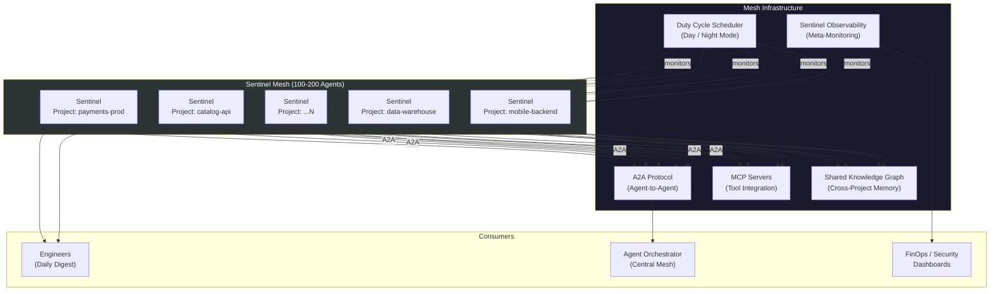
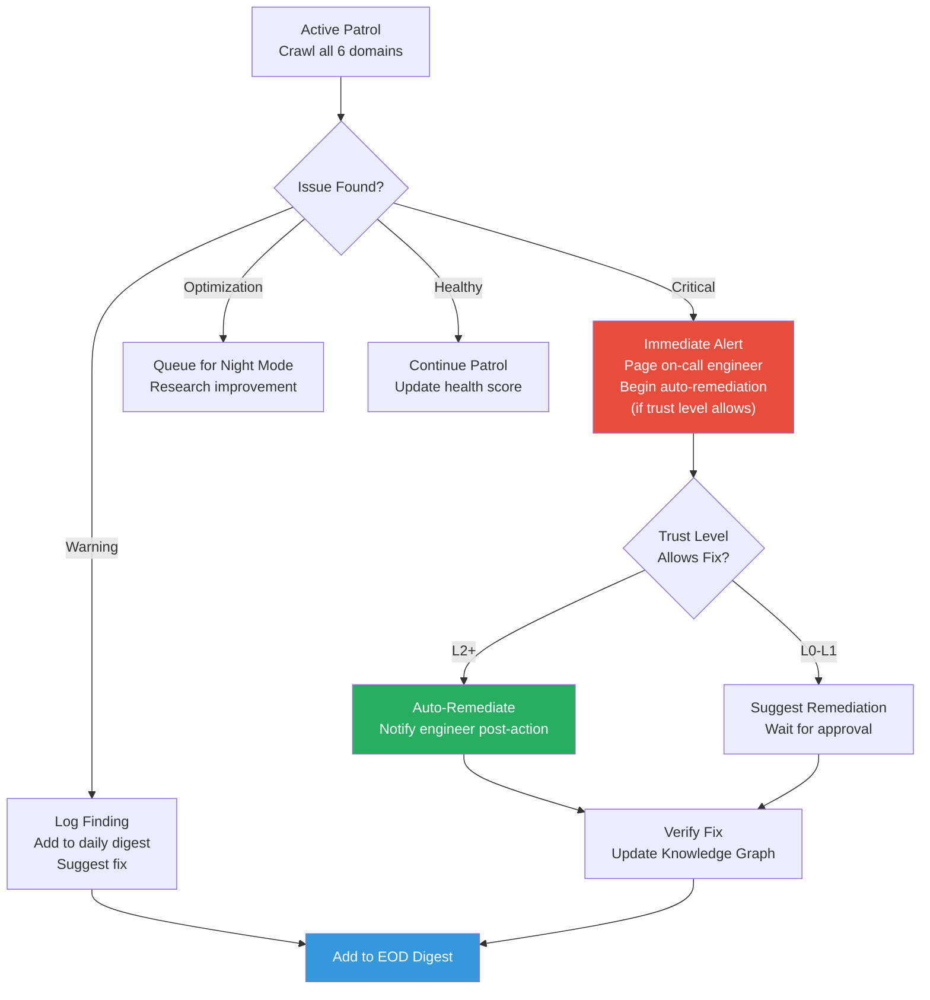
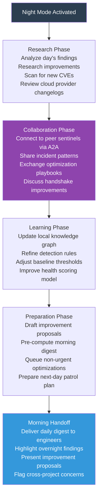
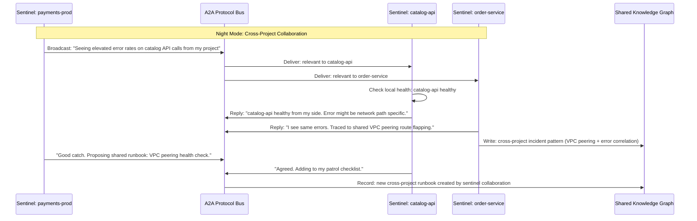
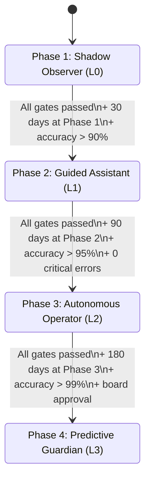
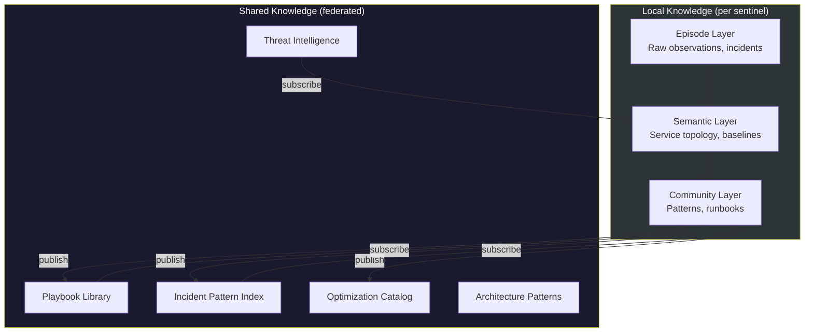

# 🛡️ Project Sentinel Agents

One autonomous agent per cloud project. 100-200 sentinels across the org, each one seeping into every crevice of its assigned project -- finding vulnerabilities, checking health, fixing minor issues, and reporting daily to the responsible engineers. At night, sentinels collaborate with each other, share learnings, and research improvements.

---

## Vision

Traditional infrastructure monitoring watches dashboards and reacts to alerts. Project Sentinels are different -- they **inhabit** the project. Like a liquid that fills every gap, a sentinel crawls through every resource, every configuration, every permission boundary. It doesn't wait for alerts. It actively explores.

Each sentinel is scoped to a single cloud project (AWS account, GCP project, or Azure subscription) and knows that project better than any human could. Across an org with 100-200 projects, the sentinels form a mesh -- sharing intelligence, coordinating fixes, and building collective institutional knowledge.

---

## Architecture Overview



---

## What a Sentinel Monitors

Each sentinel crawls its assigned cloud project across 6 domains:

| Domain | What It Checks | Frequency |
|--------|---------------|-----------|
| **Compute** | Container health, pod restarts, CPU/memory anomalies, autoscaling behavior, zombie processes | Continuous (10s) |
| **Networking** | Load balancer health, DNS resolution, certificate expiry, firewall rules, unused security groups | Every 5 min |
| **Storage** | Bucket permissions, encryption status, lifecycle policies, orphaned volumes, cost anomalies | Every 15 min |
| **IAM & Security** | Overprivileged service accounts, unused credentials, public access, policy violations, CVEs | Every 30 min |
| **Data** | Pipeline freshness, schema drift, PII exposure, query performance, backup status | Every 5 min |
| **Cost** | Spend anomalies, idle resources, right-sizing opportunities, reserved instance coverage | Hourly |

---

## Day / Night Duty Cycles

Sentinels operate in two modes. The scheduler transitions between modes based on the project's timezone and business hours.

### Day Mode (Business Hours)



**Day mode responsibilities:**
- Continuous health patrol across all 6 domains
- Immediate alerting for critical issues
- Auto-remediation of known patterns (trust-level gated)
- Minor fix execution on engineer request (bypassing ticket queues)
- Real-time health score maintenance
- Accumulating findings for end-of-day digest

### Night Mode (Off-Hours)



**Night mode responsibilities:**
- Deep analysis of the day's findings and patterns
- Research: new cloud features, better configurations, cost savings
- Inter-sentinel collaboration via A2A protocol
- Knowledge graph enrichment and baseline recalibration
- Draft improvement proposals for engineer review
- Prepare comprehensive morning digest

---

## Inter-Sentinel Communication

Sentinels communicate using the **A2A (Agent-to-Agent) protocol** -- Google's open standard for agent interoperability, now governed by the Linux Foundation with 150+ supporting organizations.

### Agent Card (Discovery)

Each sentinel publishes an Agent Card (JSON) that advertises its capabilities:

```json
{
  "name": "sentinel-payments-prod",
  "description": "Sentinel for payments-prod project (AWS us-east-1)",
  "project": "payments-prod",
  "cloud": "aws",
  "region": "us-east-1",
  "capabilities": [
    "health-check", "vulnerability-scan", "cost-analysis",
    "iam-audit", "incident-pattern-sharing", "playbook-exchange"
  ],
  "trustLevel": "L2",
  "owner": "payments-team@company.com",
  "meshEndpoint": "https://sentinel-mesh.internal/a2a/payments-prod"
}
```

### Communication Patterns

| Pattern | When | Example |
|---------|------|---------|
| **Incident broadcast** | A sentinel detects a cross-project issue | "payments-prod sentinel: seeing 3x latency on shared Redis cluster. Any other sentinels affected?" |
| **Playbook exchange** | Night mode collaboration | "data-warehouse sentinel found 30% BigQuery cost reduction via slot commitments. Sharing playbook." |
| **Handshake negotiation** | API contract issues between projects | "catalog-api sentinel: your /v2/products response changed schema. My consumers are failing." |
| **Pattern correlation** | Multiple sentinels see related anomalies | "3 sentinels reporting memory spikes in Go services after v1.23 runtime update. Likely runtime bug." |
| **Knowledge sync** | Night mode learning | "mobile-backend sentinel: what baseline thresholds do you use for API p99 latency?" |

### Communication Flow



---

## Tool Integration via MCP

Each sentinel connects to cloud infrastructure through **MCP (Model Context Protocol)** servers -- Anthropic's open standard for agent-to-tool integration, now with 97M+ monthly SDK downloads and backed by all major cloud providers.

| MCP Server | Purpose | Actions |
|------------|---------|---------|
| `mcp-aws` / `mcp-gcp` / `mcp-azure` | Cloud resource discovery and management | List resources, read configs, apply changes |
| `mcp-kubernetes` | Container orchestration | Pod health, scaling, rollbacks, node status |
| `mcp-vault` | Secret management | Credential rotation, lease monitoring |
| `mcp-terraform` | Infrastructure as Code | Drift detection, plan preview, state inspection |
| `mcp-prometheus` | Metrics collection | Query metrics, check thresholds, anomaly detection |
| `mcp-security-scanner` | Vulnerability scanning | CVE lookup, misconfiguration detection, IAM audit |
| `mcp-cost` | Cost management | Spend queries, budget checks, optimization recommendations |

---

## Phased Rollout Plan

Sentinels follow a 4-phase rollout aligned with GodsEye's trust graduation model (L0 through L3). Each phase has clear entry criteria, capabilities, and graduation gates.

### Phase Overview



### Phase 1 -- Shadow Observer (L0)

**Duration**: First 30 days per project

**Capabilities**:
- Read-only access to all cloud resources
- Passive monitoring and anomaly detection
- Build project-specific baseline (CPU, memory, latency, error rates, cost patterns)
- Map service topology and dependency graph
- Identify IAM permission patterns and security posture
- Generate daily observation reports (no actions taken)

**What the engineer sees**:
- Morning digest: "Here's what I observed in your project yesterday. 3 warnings, 0 critical. No actions taken."
- Findings include what the sentinel *would* have done if it had permission

**Graduation gate**:
- 100+ observations validated against actual outcomes
- Accuracy of anomaly detection > 90%
- Zero false-positive critical alerts in 7 consecutive days
- Engineer sign-off on baseline accuracy

---

### Phase 2 -- Guided Assistant (L1)

**Duration**: Days 31-120

**New capabilities** (additive to Phase 1):
- Propose specific remediation actions with reasoning
- Create tickets/issues for identified problems
- Draft runbooks for recurring issues
- Suggest configuration improvements
- Participate in night-mode collaboration (receive-only: listen to peer sentinels)
- Generate improvement proposals for engineer review

**What the engineer sees**:
- Morning digest + action proposals: "I found 5 issues. Here's what I recommend for each, with reasoning."
- Engineer approves/rejects each proposal
- Sentinel learns from approval patterns

**Graduation gate**:
- 500+ suggestions made, > 70% accepted by engineers
- Accuracy of root-cause analysis > 95%
- Zero critical errors in last 30 days
- 3+ runbooks created and validated
- Engineer team vote to promote

---

### Phase 3 -- Autonomous Operator (L2)

**Duration**: Days 121-300

**New capabilities** (additive to Phase 2):
- Auto-remediate known-safe patterns without human approval
- Execute on-request fixes from engineers (bypass ticket queue)
- Active participant in night-mode collaboration (send + receive)
- Share playbooks with peer sentinels
- Negotiate cross-project handshake issues
- Auto-rotate credentials on schedule
- Clean up orphaned resources
- Right-size compute resources

**Known-safe auto-remediation patterns**:

| Pattern | Action | Rollback |
|---------|--------|----------|
| Pod crash loop | Restart pod, if persistent: rollback to previous image | Automatic if restart fails |
| Certificate expiry < 7d | Auto-renew via ACME | Alert if renewal fails |
| Orphaned resource > 48h | Tag for deletion, delete after 24h confirmation | Restore from snapshot |
| CPU sustained > 85% | Scale horizontally | Scale back after load normalizes |
| Idle load balancer > 7d | Flag and propose deletion | No auto-delete for network resources |
| Overprivileged service account | Suggest least-privilege policy | Apply only with engineer approval |
| Known CVE with patch | Apply patch to non-prod, propose for prod | Rollback patch if tests fail |

**What the engineer sees**:
- Morning digest + actions already taken: "Overnight I fixed 2 issues automatically and have 3 proposals for your review."
- Post-action notifications for every auto-remediation
- Full audit trail in Knowledge Graph

**Graduation gate**:
- 1,000+ auto-remediations executed
- Accuracy > 99% (zero bad auto-fixes)
- Zero agent-caused incidents in 60 days
- 10+ playbooks shared with peer sentinels
- Cross-project collaboration validated (3+ successful negotiations)
- Board-level approval required

---

### Phase 4 -- Predictive Guardian (L3)

**Duration**: Day 301+ (long-term steady state)

**New capabilities** (additive to Phase 3):
- Predict issues before they occur (capacity exhaustion, certificate expiry, cost overruns)
- Proactively block risky deployments to the project
- Pre-scale for predicted traffic patterns
- Propose architectural improvements based on cross-project learnings
- Mentor newly deployed Phase 1 sentinels in neighboring projects
- Autonomous night-mode research: explore new cloud features, evaluate applicability

**What the engineer sees**:
- Morning digest + predictions: "No incidents today. However, at current growth, you'll hit your DB connection limit in 12 days. Here's my plan."
- Weekly improvement report: architectural proposals from cross-project learning
- Monthly health score trend with peer benchmarking

**Maintenance criteria** (stay at L3):
- Continuous accuracy > 99%
- Zero agent-caused incidents
- Active contributor to sentinel mesh knowledge
- Quarterly review by engineering leadership

---

## Daily Digest Format

Every sentinel delivers a daily digest to its project's engineers. Format evolves with phase.

### Digest Structure

```
=== SENTINEL DAILY DIGEST ===
Project: payments-prod | Date: 2026-02-06
Sentinel Phase: 3 (Autonomous Operator) | Trust: L2
Health Score: 94/100 (up from 91 yesterday)

--- CRITICAL (0) ---
(none)

--- ACTIONS TAKEN (2) ---
1. [AUTO-FIX] Restarted crash-looping pod payment-worker-7b3f
   Root cause: OOM after memory leak in v2.14.3
   Time to remediate: 12s
   Verification: pod healthy, 0 errors for 4h

2. [AUTO-FIX] Rotated expiring API key for stripe-gateway
   Was expiring in 3 days, rotated to new key
   Verification: all payment calls succeeding

--- PROPOSALS (3) ---
1. [COST] Right-size payment-processor instances
   Current: m5.2xlarge (avg CPU 18%)
   Proposed: m5.xlarge (save $340/mo)
   Risk: LOW | Confidence: 94%

2. [SECURITY] 2 service accounts with unused admin permissions
   Proposed: Reduce to least-privilege policy
   Risk: MEDIUM | Requires your approval

3. [ARCHITECTURE] From night-mode collaboration:
   catalog-api sentinel found 40% latency reduction
   using connection pooling pattern. Applicable here.
   Proposed: PR draft ready for review

--- NIGHT MODE SUMMARY ---
Collaborated with: catalog-api, order-service, data-warehouse sentinels
Shared: payment retry playbook (adopted by 3 peers)
Learned: new connection pooling pattern from catalog-api
Researched: AWS re:Invent 2025 announcements for payment services
Queued: 2 optimization experiments for next night cycle

--- TRENDS ---
Incidents this week: 1 (down from 3 last week)
Auto-remediations: 7 (100% success rate)
Cost trend: -4.2% MoM
Security posture: 96/100
```

---

## Sentinel Observability (Meta-Monitoring)

Agents monitoring infrastructure need their own monitoring. GodsEye deploys a dedicated observability layer for sentinels using distributed tracing and evaluation pipelines.

| Metric | Description | Alert Threshold |
|--------|-------------|-----------------|
| **Patrol coverage** | % of project resources scanned in last cycle | < 95% |
| **Detection accuracy** | True positive rate of anomaly detection | < 90% |
| **Remediation success** | % of auto-fixes that resolved the issue | < 98% |
| **Digest delivery** | Daily digest delivered on time | Miss > 1 day |
| **A2A message health** | Sentinel responsive to peer queries | Unresponsive > 5 min |
| **LLM token usage** | Token consumption per sentinel per day | > 2x baseline |
| **Knowledge graph writes** | New observations written per day | < 10 (sentinel may be stuck) |
| **Night mode participation** | Active in peer collaboration sessions | Missed > 3 consecutive nights |

### Observability Stack

- **Tracing**: OpenTelemetry spans for every patrol cycle, LLM call, and A2A message
- **Evaluation**: Langfuse for tracking detection accuracy, remediation quality, and digest usefulness
- **Alerting**: Prometheus alerts for sentinel health, with PagerDuty escalation if a sentinel goes dark
- **Dashboard**: Grafana fleet view showing all 100-200 sentinels, health scores, and phase distribution

---

## Knowledge Sharing Architecture

Sentinels maintain two tiers of memory, inspired by recent advances in agent memory systems:

### Local Knowledge (Per-Project)

Per-sentinel temporal knowledge graph (similar to Zep's architecture) with three layers:
- **Episode layer**: Raw observations, patrol findings, incident timelines
- **Semantic layer**: Service topology, dependency map, baseline profiles
- **Community layer**: Cross-referenced patterns, runbook index, improvement history

### Shared Knowledge (Cross-Project)

Federated knowledge accessible to all sentinels with access controls:
- **Playbook library**: Proven remediation patterns shared by L2+ sentinels
- **Incident pattern index**: Cross-project incident correlations
- **Optimization catalog**: Cost, performance, and security improvements
- **Architecture patterns**: Proven configurations from high-scoring projects
- **Threat intelligence**: CVE impacts, attack patterns, misconfiguration risks



---

## Integration with Existing GodsEye Agents

Project Sentinels don't replace existing Operations AI agents. They are a **per-project extension** that feeds into the central mesh.

| Existing Agent | Sentinel Relationship |
|---------------|----------------------|
| **SRE Agent** | Sentinel detects project-level issues, escalates to SRE Agent for cross-project incidents. SRE Agent handles platform-wide remediation. |
| **Security Agent** | Sentinel performs project-level IAM audit and CVE scan. Security Agent handles org-wide threat correlation and PCI-DSS compliance. |
| **Cost Agent** | Sentinel identifies per-project cost anomalies and orphaned resources. Cost Agent handles org-wide FinOps, reserved instance strategy, and cross-cloud optimization. |
| **Deployment Agent** | Sentinel monitors post-deploy health within its project. Deployment Agent handles CI/CD pipelines, canary promotion, and deploy freezes. |
| **Data Agent** | Sentinel checks data pipeline freshness and schema drift within its project. Data Agent handles cross-pipeline orchestration and PII classification. |

---

## Scaling Considerations

| Dimension | Approach |
|-----------|----------|
| **100-200 sentinels** | Each sentinel is a lightweight Python agent (LangGraph-based) running as a K8s deployment. Resource footprint: ~256MB RAM, 0.25 vCPU per sentinel. |
| **LLM cost** | Sentinels use tiered model selection: Haiku 4.5 for routine patrol, Sonnet 4.5 for analysis, Opus 4.6 for complex reasoning. Estimated: $2-5/day per sentinel. |
| **A2A traffic** | Night-mode collaboration is batched, not real-time. Sentinels exchange summaries, not raw data. Estimated: < 100 A2A messages per sentinel per night. |
| **Knowledge graph** | Local graphs stored in per-project Neo4j instances (or shared cluster with tenant isolation). Shared knowledge in central Neo4j with RBAC. |
| **Observability overhead** | < 5% of sentinel compute goes to self-monitoring (OpenTelemetry + Langfuse). |
| **Rollout pace** | Start with 5 critical projects in Phase 1. Add 10-20 projects per month. Full coverage in 6-12 months. |
