# 🎯 Triplet Loss Embedding Architecture

GodsEye uses **triplet loss** to learn unified product embeddings powering visual search, product matching, recommendations, and fraud detection. All training, serving, and storage runs on the **Big 3 cloud providers** (AWS primary, GCP secondary, Azure tertiary) — no private data centers.

---

## Why Triplet Loss for Retail

| Approach | Pros | Cons | GodsEye Fit |
|----------|------|------|-------------|
| **Triplet Loss** | Fine-grained similarity, works across modalities, proven at scale | Hard negative mining needed, slower convergence | **Primary** — best for product matching |
| Contrastive Loss | Simple, fast to train | Binary (same/different), loses nuance | Fallback for cold-start categories |
| Cross-Entropy Classification | Fast, well-understood | Fixed label set, can't handle new products | Not suitable — catalog changes daily |
| ArcFace / CosFace | Strong angular margins | Needs large balanced classes | Complementary for brand/category |

**Triplet loss** is ideal because GodsEye's catalog has millions of SKUs with continuous additions, requiring an embedding space that generalizes to unseen products without retraining the classification head.

---

## Triplet Loss Formulation

```
L(a, p, n) = max(0, ‖f(a) - f(p)‖² - ‖f(a) - f(n)‖² + margin)
```

| Symbol | Meaning | GodsEye Example |
|--------|---------|-----------------|
| `a` | Anchor | Product image/text of "Nike Air Max 90 Black" |
| `p` | Positive | Same product — different angle, listing, or store |
| `n` | Negative | Different product — "Adidas Ultraboost White" |
| `f(·)` | Encoder | ViT-L/14 backbone → 512-dim embedding |
| `margin` | Min gap | 0.3 (tuned per category) |

---

## End-to-End Pipeline

```mermaid
flowchart TD
    subgraph DataLayer["☁️ Data Ingestion"]
        CAT[(Product Catalog\nS3 / GCS / Azure Blob)]
        IMG[(Product Images\n100M+ photos)]
        TXT[(Product Text\nTitles, descriptions)]
        INTER[(Interaction Logs\nClicks, purchases, returns)]
    end

    subgraph TripletMining["⛏️ Triplet Mining — AWS SageMaker"]
        ANCHOR[Anchor Selection\nRandom SKU sampling]
        POS[Positive Selection\nSame-product variants\nco-purchased items]
        NEG_EASY[Easy Negatives\nRandom different category]
        NEG_SEMI[Semi-Hard Negatives\n‖f_a - f_n‖ > ‖f_a - f_p‖\nbut within margin]
        NEG_HARD[Hard Negatives\n‖f_a - f_n‖ ≈ ‖f_a - f_p‖\nvisually similar, different product]
    end

    subgraph Training["🏋️ Training — Multi-Cloud"]
        BASE[Base Encoder\nViT-L/14 pretrained]
        PROJ[Projection Head\n2048 → 512-dim]
        LOSS[Triplet Margin Loss\n+ Online Batch Mining]
        EVAL[Eval: Recall@K\nMAP, MRR]
    end

    subgraph Serving["🚀 Serving — Multi-Region"]
        EMB_SVC[Embedding Service\nK8s pods, GPU-backed]
        VDB[(Vector DB\nPinecone / Weaviate)]
        CACHE[Embedding Cache\nRedis Cluster]
        ANN[ANN Index\nHNSW algorithm]
    end

    subgraph Consumers["🤖 Agent Consumers"]
        VS[Visual Search Agent]
        REC[Personalization Agent]
        FRAUD[Fraud Detection Agent]
        INV[Inventory Optimization Agent]
        ASSORT[Assortment Planning Agent]
    end

    CAT --> ANCHOR
    IMG --> ANCHOR
    TXT --> ANCHOR
    INTER --> POS

    ANCHOR --> POS
    ANCHOR --> NEG_EASY
    ANCHOR --> NEG_SEMI
    ANCHOR --> NEG_HARD

    POS --> LOSS
    NEG_SEMI --> LOSS
    NEG_HARD --> LOSS
    BASE --> PROJ --> LOSS
    LOSS --> EVAL

    EVAL -->|Model artifact| EMB_SVC
    EMB_SVC --> VDB
    EMB_SVC --> CACHE
    VDB --> ANN

    ANN --> VS
    ANN --> REC
    ANN --> FRAUD
    ANN --> INV
    ANN --> ASSORT
```



---

## Model Architecture

### Base Encoder

```mermaid
flowchart LR
    subgraph ImageEncoder["Image Encoder"]
        I_IN[Product Image\n224×224×3] --> VIT[ViT-L/14\nPretrained CLIP]
        VIT --> I_EMB[Image Embedding\n1024-dim]
    end

    subgraph TextEncoder["Text Encoder"]
        T_IN[Title + Description\n+ Attributes] --> BERT[RetailBERT\nFine-tuned]
        BERT --> T_EMB[Text Embedding\n768-dim]
    end

    subgraph FusionHead["Multimodal Fusion"]
        I_EMB --> CONCAT[Concatenate\n1792-dim]
        T_EMB --> CONCAT
        CONCAT --> PROJ1[Linear 1792→1024\n+ LayerNorm + GELU]
        PROJ1 --> PROJ2[Linear 1024→512\n+ L2 Normalize]
        PROJ2 --> FINAL[Final Embedding\n512-dim unit vector]
    end
```



| Component | Choice | Rationale |
|-----------|--------|-----------|
| Image backbone | ViT-L/14 (CLIP pretrained) | Best transfer learning for product images, open-source |
| Text backbone | Fine-tuned BERT-base | Retail domain vocabulary, attribute-aware |
| Fusion | Late fusion (concat + project) | Modality-independent, handles missing text/images |
| Embedding dim | 512 | Balance between expressiveness and storage/latency |
| Normalization | L2 unit sphere | Cosine similarity = dot product, faster ANN |

### Training Hyperparameters

| Parameter | Value | Notes |
|-----------|-------|-------|
| Triplet margin | 0.3 | Tuned per top-level category |
| Mining strategy | Semi-hard + hard (50/50) | Avoids collapse, maintains gradient signal |
| Batch size | 4096 | Large batches for better in-batch mining |
| Learning rate | 1e-4 (cosine decay) | Warm-up 1000 steps |
| Epochs | 20 | Early stopping on Recall@10 |
| Optimizer | AdamW (weight decay 0.01) | Prevents overfitting on popular SKUs |
| Image augmentation | RandomCrop, ColorJitter, HorizontalFlip | Simulates real-world photo variation |
| Hard negative ratio | 30% of batch | Refreshed every 5 epochs via full-index ANN |

---

## Triplet Mining Strategies


### Positive Pair Sources

| Source | Example | Weight |
|--------|---------|--------|
| Same SKU, different image | Front vs back photo of same shoe | 0.35 |
| Same product, different seller | Same Nike Air Max from 2 vendors | 0.25 |
| Co-purchased together | Phone + same-brand case | 0.15 |
| Same product, text variation | "Nike AM90" vs "Nike Air Max 90" | 0.15 |
| Human-labeled duplicates | Catalog dedup ground truth | 0.10 |

---

## Cloud Infrastructure — Big 3 Only

```mermaid
flowchart TD
    subgraph AWS["☁️ AWS — Primary Training & Serving"]
        direction TB
        SM[SageMaker Training\np4d.24xlarge × 4\n8× A100 per node]
        S3_DATA[(S3\nTraining Data\n50TB product images)]
        S3_MODEL[(S3\nModel Artifacts\nVersioned)]
        EKS[EKS Cluster\nEmbedding Service\ng5.2xlarge inference]
        ECR[ECR\nDocker Images]
        SM_PIPE[SageMaker Pipelines\nOrchestration]
        CW[CloudWatch\nTraining Metrics]
    end

    subgraph GCP["☁️ GCP — Secondary Training & Evaluation"]
        direction TB
        VERTEX[Vertex AI Training\na2-ultragpu-4g\n4× A100]
        GCS[(GCS\nReplicated Data)]
        GKE[GKE Cluster\nEmbedding Service\ng2-standard-8 inference]
        GAR[Artifact Registry\nDocker Images]
        VERTEX_PIPE[Vertex AI Pipelines\nOrchestration]
        CMON[Cloud Monitoring\nTraining Metrics]
    end

    subgraph AZURE["☁️ Azure — Tertiary / DR"]
        direction TB
        AML[Azure ML\nND A100 v4\nDisaster Recovery]
        BLOB[(Azure Blob\nReplicated Data)]
        AKS[AKS Cluster\nEmbedding Service\nNC A100 inference]
        ACR[ACR\nDocker Images]
        AML_PIPE[Azure ML Pipelines\nOrchestration]
        AMON[Azure Monitor\nTraining Metrics]
    end

    subgraph VectorLayer["🔍 Vector Search — Multi-Cloud"]
        direction TB
        PINECONE[Pinecone\nManaged Vector DB\nPrimary index]
        WEAVIATE[Weaviate on K8s\nSelf-hosted fallback\nEKS / GKE / AKS]
    end

    SM --> S3_MODEL
    S3_MODEL -->|Sync| GCS
    S3_MODEL -->|Sync| BLOB

    EKS --> PINECONE
    GKE --> PINECONE
    AKS --> PINECONE

    EKS --> WEAVIATE
    GKE --> WEAVIATE
    AKS --> WEAVIATE
```



### Cloud Role Assignment

| Concern | AWS (Primary) | GCP (Secondary) | Azure (Tertiary) |
|---------|--------------|-----------------|------------------|
| **Training** | SageMaker — full training runs, hyperparameter tuning | Vertex AI — validation runs, A/B model evaluation | Azure ML — disaster recovery, quarterly retraining |
| **Data Store** | S3 — source of truth (50TB images, 2TB text) | GCS — replicated via cross-cloud sync | Azure Blob — replicated, cold tier |
| **Inference** | EKS (g5.2xlarge) — US-East, US-West | GKE (g2-standard-8) — US-Central, EU | AKS (NC A100) — APAC, DR failover |
| **Vector DB** | Pinecone (primary) + Weaviate on EKS | Weaviate on GKE (read replica) | Weaviate on AKS (read replica) |
| **Orchestration** | SageMaker Pipelines + Step Functions | Vertex AI Pipelines | Azure ML Pipelines |
| **Model Registry** | SageMaker Model Registry (source of truth) | Vertex AI Model Registry (synced) | Azure ML Model Registry (synced) |
| **Cost** | ~70% of ML budget | ~20% of ML budget | ~10% of ML budget |

### Cross-Cloud Data Sync


---

## Vector Search & Serving

### Embedding Service Architecture


### Latency Budget

| Stage | Target | P99 Budget |
|-------|--------|------------|
| Image preprocessing | < 5ms | 8ms |
| Embedding inference (GPU) | < 15ms | 25ms |
| Redis cache lookup | < 2ms | 5ms |
| ANN search (top-100) | < 10ms | 15ms |
| Metadata enrichment | < 5ms | 8ms |
| **Total (cache hit)** | **< 7ms** | **13ms** |
| **Total (cache miss)** | **< 37ms** | **61ms** |

### Index Configuration

| Parameter | Value | Rationale |
|-----------|-------|-----------|
| Algorithm | HNSW | Best recall/latency tradeoff at 50M+ scale |
| Dimensions | 512 | Matches projection head output |
| Metric | Cosine similarity | L2-normalized embeddings, equivalent to dot product |
| ef_construction | 200 | High-quality graph at build time |
| M | 32 | Connections per node, balances memory vs recall |
| ef_search | 100 | Tuned for Recall@10 > 98% |
| Shards | 8 | ~6M vectors per shard |
| Replicas | 3 (per cloud region) | HA + read throughput |

---

## Agent Integration

```mermaid
flowchart LR
    subgraph EmbeddingPlatform["Embedding Platform"]
        EMB_API[Embedding API\n/v1/embed\n/v1/search\n/v1/batch-embed]
    end

    subgraph Agents["GodsEye Agents"]
        VS[🔍 Visual Search Agent\nCustomer uploads photo\n→ find matching products]
        REC[🎯 Personalization Agent\nUser history embeddings\n→ similar product recs]
        FRAUD[🛡️ Fraud Detection Agent\nProduct listing embedding\n→ detect counterfeit listings]
        INV[📦 Inventory Agent\nProduct similarity\n→ substitution suggestions]
        ASSORT[📊 Assortment Agent\nEmbedding clustering\n→ category gap analysis]
        DEDUP[🔗 Catalog Dedup Agent\nEmbedding distance < 0.05\n→ merge duplicate listings]
    end

    EMB_API --> VS
    EMB_API --> REC
    EMB_API --> FRAUD
    EMB_API --> INV
    EMB_API --> ASSORT
    EMB_API --> DEDUP
```



| Agent | Embedding Use Case | Query Type | SLA |
|-------|-------------------|------------|-----|
| Visual Search | Customer photo → nearest catalog products | Single image → top-K | < 100ms e2e |
| Personalization | User purchase history centroid → similar items | Batch embed → top-K per user | < 200ms e2e |
| Fraud Detection | New listing embedding vs known counterfeits | Single embed → threshold check | < 50ms e2e |
| Inventory Optimization | Out-of-stock product → substitutes | Single SKU → top-10 similar | < 100ms e2e |
| Assortment Planning | Category embedding density → gap detection | Batch cluster analysis | Async (minutes) |
| Catalog Dedup | All-pairs distance below threshold | Batch ANN, nightly | Async (hours) |

---

## Training Pipeline Orchestration


---

## Monitoring & Evaluation

| Metric | Target | Alert Threshold | Measured By |
|--------|--------|-----------------|-------------|
| Recall@1 | > 85% | < 82% | Weekly eval on holdout set |
| Recall@10 | > 97% | < 95% | Weekly eval on holdout set |
| MAP@100 | > 0.90 | < 0.87 | Weekly eval on holdout set |
| Embedding drift (cosine) | < 0.05 | > 0.08 | Daily — compare new vs old embeddings for same SKUs |
| Inference latency (P99) | < 25ms | > 40ms | Continuous — CloudWatch / Cloud Monitoring |
| Vector index freshness | < 24h | > 48h | Daily — check last reindex timestamp |
| Cache hit rate | > 80% | < 70% | Continuous — Redis metrics |
| Cross-cloud model sync lag | < 1h | > 4h | Model registry sync monitor |

### Embedding Quality Dashboard

```mermaid
flowchart LR
    subgraph Inputs["Evaluation Inputs"]
        HOLDOUT[Holdout Set\n100K labeled triplets]
        LIVE[Live Search Logs\nClick-through data]
        HUMAN[Human Eval\nWeekly sample review]
    end

    subgraph Metrics["Computed Metrics"]
        RK[Recall@K\nK=1,5,10,50,100]
        MAP_M[MAP@100]
        MRR_M[MRR]
        CTR[Search CTR\nPosition-weighted]
        DRIFT_M[Embedding Drift\nCosine distance]
    end

    subgraph Actions["Automated Actions"]
        RETRAIN[Trigger Retrain\nDrift > 0.08]
        ALERT[Alert ML Team\nRecall drop > 2%]
        ROLLBACK[Auto-Rollback\nRecall drop > 5%]
    end

    HOLDOUT --> RK
    HOLDOUT --> MAP_M
    HOLDOUT --> MRR_M
    LIVE --> CTR
    LIVE --> DRIFT_M

    RK -->|Below threshold| ALERT
    DRIFT_M -->|Above threshold| RETRAIN
    RK -->|Critical drop| ROLLBACK
```

---

## Cost Estimation — Monthly

| Component | AWS | GCP | Azure | Total |
|-----------|-----|-----|-------|-------|
| Training (weekly) | $12,000 (SageMaker p4d) | $4,000 (Vertex a2-ultra) | $1,500 (Azure ML ND) | $17,500 |
| Inference (GPU pods) | $8,500 (EKS g5) | $3,200 (GKE g2) | $2,000 (AKS NC) | $13,700 |
| Vector DB (Pinecone) | $2,500 (managed) | — | — | $2,500 |
| Vector DB (Weaviate) | $800 (EKS) | $600 (GKE) | $400 (AKS) | $1,800 |
| Storage (images + models) | $1,200 (S3) | $400 (GCS) | $200 (Blob) | $1,800 |
| Redis cache | $1,500 (ElastiCache) | $500 (Memorystore) | $300 (Azure Cache) | $2,300 |
| Data transfer (cross-cloud) | — | — | — | $800 |
| **Total** | **$26,500** | **$8,700** | **$4,400** | **$40,400** |

> Cost Optimization Agent continuously monitors and recommends spot/preemptible instances for training, reserved instances for inference, and storage tiering for cold embeddings.
