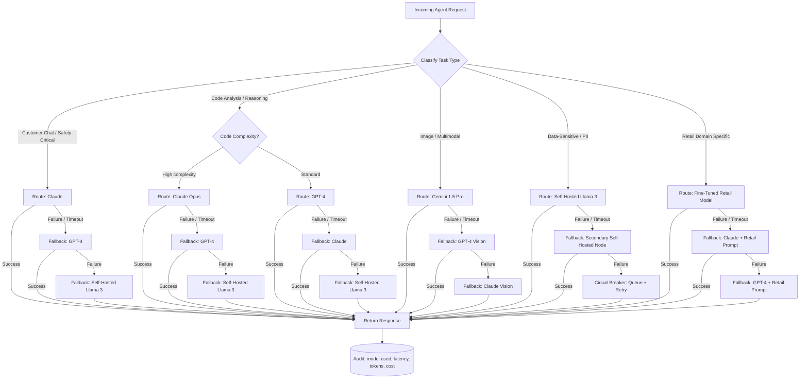
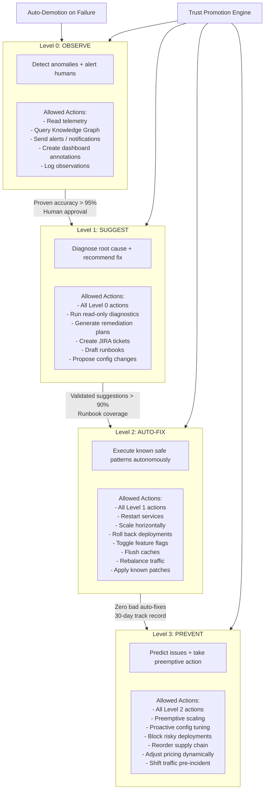
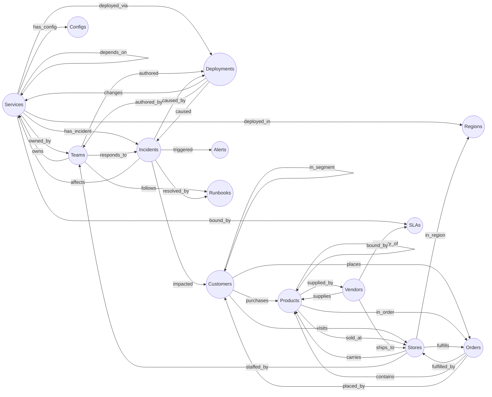
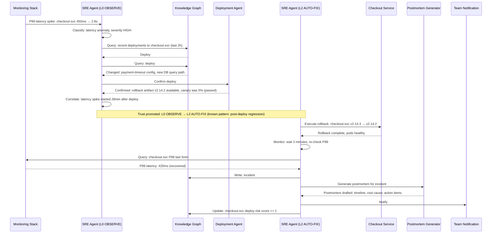

# Layer 3 — AI & Intelligence Engine

GodsEye AI layer: 20+ autonomous agents across 4 families, unified by a shared Knowledge Graph and multi-provider LLM Gateway. Every agent decision is auditable. Trust levels gate what actions agents can take without human approval.

---

## AI Mesh Architecture

```mermaid
graph TD
    AO[Agent Orchestrator]

    subgraph CustomerAI["Customer AI Family"]
        CA1[Personalization Agent]
        CA2[Chatbot / Support Agent]
        CA3[Churn Prediction Agent]
        CA4[Sentiment Analysis Agent]
        CA5[Customer Segmentation Agent]
    end

    subgraph OpsAI["Operations AI Family"]
        OA1[SRE Agent]
        OA2[Deployment Agent]
        OA3[Capacity Planning Agent]
        OA4[Incident Response Agent]
        OA5[Cost Optimization Agent]
        OA6[Security Agent]
    end

    subgraph BizAI["Business AI Family"]
        BA1[Demand Forecasting Agent]
        BA2[Pricing Agent]
        BA3[Inventory Optimization Agent]
        BA4[Fraud Detection Agent]
        BA5[Markdown Optimization Agent]
        BA6[Assortment Planning Agent]
    end

    subgraph DevAI["Developer AI Family"]
        DA1[Code Review Agent]
        DA2[Test Generation Agent]
        DA3[Documentation Agent]
        DA4[Migration Agent]
        DA5[Schema Evolution Agent]
    end

    AO --> CustomerAI
    AO --> OpsAI
    AO --> BizAI
    AO --> DevAI

    KG[(Knowledge Graph)]
    KG -.->|context| CA1
    KG -.->|context| CA2
    KG -.->|context| CA3
    KG -.->|context| CA4
    KG -.->|context| CA5
    KG -.->|context| OA1
    KG -.->|context| OA2
    KG -.->|context| OA3
    KG -.->|context| OA4
    KG -.->|context| OA5
    KG -.->|context| OA6
    KG -.->|context| BA1
    KG -.->|context| BA2
    KG -.->|context| BA3
    KG -.->|context| BA4
    KG -.->|context| BA5
    KG -.->|context| BA6
    KG -.->|context| DA1
    KG -.->|context| DA2
    KG -.->|context| DA3
    KG -.->|context| DA4
    KG -.->|context| DA5

    subgraph LLMGateway["LLM Gateway"]
        GW[Router / Load Balancer]
        Claude[Claude 3.5+ / Opus]
        GPT4[GPT-4 / GPT-4o]
        Gemini[Gemini 1.5 Pro]
        SelfHosted[Self-Hosted Llama 3]
        FineTuned[Fine-Tuned Retail Models]
    end

    GW --> Claude
    GW --> GPT4
    GW --> Gemini
    GW --> SelfHosted
    GW --> FineTuned

    AO -->|all LLM calls| GW

    AL[(Audit Log)]
    AO -->|every decision| AL
    GW -->|every inference| AL
```

---

## LLM Gateway Routing

---

## Agent Trust Levels

---

## Knowledge Graph Structure

> The Knowledge Graph is GodsEye's institutional memory. Every agent reads from it and writes back to it. Entity relationships enable cross-domain reasoning that no single agent could achieve alone.

---

## Cross-Agent Workflow: Checkout Latency Spike

---

## Agent Inventory

| # | Agent | Family | Trust Level | Key Actions |
|---|-------|--------|-------------|-------------|
| 1 | Personalization Agent | Customer AI | L1 SUGGEST | Generate product recommendations, personalize search ranking, customize homepage |
| 2 | Chatbot / Support Agent | Customer AI | L2 AUTO-FIX | Answer customer queries, process returns, escalate to human, issue credits |
| 3 | Churn Prediction Agent | Customer AI | L1 SUGGEST | Score churn risk, trigger retention campaigns, recommend offers |
| 4 | Sentiment Analysis Agent | Customer AI | L0 OBSERVE | Monitor reviews/social, detect brand issues, alert marketing team |
| 5 | Customer Segmentation Agent | Customer AI | L1 SUGGEST | Cluster customers, update segments, recommend targeting strategies |
| 6 | SRE Agent | Operations AI | L2 AUTO-FIX | Detect anomalies, correlate with deploys, auto-rollback, scale services, page on-call |
| 7 | Deployment Agent | Operations AI | L2 AUTO-FIX | Validate deploy readiness, execute canary/blue-green, rollback, update Knowledge Graph |
| 8 | Capacity Planning Agent | Operations AI | L3 PREVENT | Forecast resource needs, pre-scale for events (Black Friday), right-size infrastructure |
| 9 | Incident Response Agent | Operations AI | L2 AUTO-FIX | Orchestrate incident workflow, assign responders, update status page, draft comms |
| 10 | Cost Optimization Agent | Operations AI | L1 SUGGEST | Identify waste, recommend reserved instances, spot instance strategy, storage tiering |
| 11 | Security Agent | Operations AI | L2 AUTO-FIX | Detect intrusion, block suspicious IPs, rotate compromised credentials, patch CVEs |
| 12 | Demand Forecasting Agent | Business AI | L3 PREVENT | Predict demand by SKU/store/week, feed inventory planning, adjust for events |
| 13 | Pricing Agent | Business AI | L2 AUTO-FIX | Dynamic pricing, competitive price matching, margin-aware repricing |
| 14 | Inventory Optimization Agent | Business AI | L2 AUTO-FIX | Rebalance stock across DCs/stores, trigger replenishment, manage safety stock |
| 15 | Fraud Detection Agent | Business AI | L2 AUTO-FIX | Score transactions, block high-risk orders, flag for manual review, update rules |
| 16 | Markdown Optimization Agent | Business AI | L1 SUGGEST | Recommend clearance timing, optimize discount depth, minimize margin erosion |
| 17 | Assortment Planning Agent | Business AI | L1 SUGGEST | Recommend store-level assortments, identify gaps, propose new vendor products |
| 18 | Code Review Agent | Developer AI | L1 SUGGEST | Review PRs, flag anti-patterns, suggest improvements, check security, verify tests |
| 19 | Test Generation Agent | Developer AI | L2 AUTO-FIX | Generate unit/integration tests, maintain coverage targets, create edge-case tests |
| 20 | Documentation Agent | Developer AI | L1 SUGGEST | Generate API docs, update runbooks, draft architecture decision records |
| 21 | Migration Agent | Developer AI | L2 AUTO-FIX | Schema migrations, data backfill, API version migration, legacy system cutover |
| 22 | Schema Evolution Agent | Developer AI | L1 SUGGEST | Analyze schema changes for compatibility, recommend migration strategy, validate rollback |

---

## LLM Model Selection Matrix

| Task Type | Primary Model | Fallback 1 | Fallback 2 | Rationale |
|-----------|--------------|------------|------------|-----------|
| Customer chat (safety-critical) | Claude 3.5 Sonnet | GPT-4o | Self-Hosted Llama 3 | Best safety guardrails, lowest hallucination rate |
| Complex reasoning / planning | Claude Opus | GPT-4 | Self-Hosted Llama 3 | Strongest multi-step reasoning |
| Code analysis / review | Claude Opus | GPT-4 | Self-Hosted CodeLlama | Top coding benchmarks, large context window |
| Code generation | Claude Sonnet | GPT-4o | Self-Hosted CodeLlama | Speed + quality balance for generation tasks |
| Image / visual analysis | Gemini 1.5 Pro | GPT-4 Vision | Claude Vision | Best multimodal for product image understanding |
| Data-sensitive / PII operations | Self-Hosted Llama 3 | Secondary Self-Hosted | Queue + Retry | Data never leaves private infrastructure |
| Demand forecasting prompts | Fine-Tuned Retail Model | Claude + Retail Prompt | GPT-4 + Retail Prompt | Domain-specific fine-tuning outperforms general models |
| Pricing optimization | Fine-Tuned Retail Model | Claude + Retail Prompt | GPT-4 + Retail Prompt | Trained on historical margin/elasticity data |
| Sentiment analysis | Claude Sonnet | GPT-4o-mini | Self-Hosted Llama 3 | Nuanced tone detection at scale |
| Incident summarization | Claude Sonnet | GPT-4o | Self-Hosted Llama 3 | Accurate technical summarization |
| Document / runbook generation | Claude Sonnet | GPT-4o | Self-Hosted Llama 3 | Long-form structured output quality |
| Schema analysis | Claude Opus | GPT-4 | Self-Hosted Llama 3 | Precision required for DDL / migration safety |
| Fraud pattern detection | Fine-Tuned Retail Model | Claude + Fraud Prompt | Self-Hosted Llama 3 | Trained on retailer's historical fraud data |
| Customer segmentation | Fine-Tuned Retail Model | Claude + Retail Prompt | GPT-4 + Retail Prompt | Retail behavioral embeddings |
| Inventory rebalancing | Fine-Tuned Retail Model | Claude + Retail Prompt | GPT-4 + Retail Prompt | Trained on supply chain constraints |
