# 💼 Layer 4 — Business Operations

GodsEye replaces the patchwork of Oracle Retail, SAP, Salesforce, Manhattan, and Blue Yonder with a unified, AI-native business operations layer. 12 modules, single data model, real-time event-driven.

---

## Business Module Map

---

## Order Lifecycle

---

## Omnichannel Inventory Flow

```mermaid
flowchart TD
    subgraph Sources["Inventory Sources"]
        DC_INV[DC On-Hand]
        STORE_INV[Store On-Hand]
        TRANSIT[In-Transit / Inbound]
        VENDOR_INV[Vendor Drop-Ship Available]
    end

    subgraph Reservations["Reservations & Holds"]
        ONLINE_RES[Online Order Reservations]
        BOPIS_RES[BOPIS Reservations]
        STORE_HOLD[Store Display / Safety Stock]
        PROMO_HOLD[Promotional Pre-Allocations]
    end

    subgraph Returns["Returns Processing"]
        RET_INSPECT[Returns — Inspection Queue]
        RET_RESTOCK[Returns — Restockable]
        RET_LIQUIDATE[Returns — Liquidation / Defective]
    end

    DC_INV --> ATP_CALC
    STORE_INV --> ATP_CALC
    TRANSIT --> ATP_CALC
    VENDOR_INV --> ATP_CALC

    ONLINE_RES --> ATP_CALC
    BOPIS_RES --> ATP_CALC
    STORE_HOLD --> ATP_CALC
    PROMO_HOLD --> ATP_CALC

    RET_RESTOCK --> ATP_CALC

    ATP_CALC{{"ATP Calculation Engine\n─────────────\nATP = (DC + Store + Transit + Vendor)\n- (Online Res + BOPIS Res\n+ Store Hold + Promo Hold)\n+ Restockable Returns"}}

    ATP_CALC --> ATP_RESULT[Real-Time ATP by SKU × Location]

    ATP_RESULT --> COM_FEED[Commerce: show in-stock / out-of-stock]
    ATP_RESULT --> POS_FEED[POS: real-time floor stock]
    ATP_RESULT --> FUL_FEED[Fulfillment Router: sourcing decisions]
    ATP_RESULT --> REPLEN[Replenishment Triggers]

    REPLEN -->|below safety stock| PO_CREATE[Create Purchase Order]
    REPLEN -->|DC → Store| TRANSFER[Inter-Location Transfer]
    REPLEN -->|imbalance detected| REBALANCE[Cross-Store Rebalance]

    PO_CREATE --> TRANSIT
    TRANSFER --> TRANSIT
    REBALANCE --> TRANSIT

    RET_INSPECT -->|passes QC| RET_RESTOCK
    RET_INSPECT -->|fails QC| RET_LIQUIDATE
    RET_LIQUIDATE --> WRITE_OFF[Financial Write-Off]
```

---

## BOPIS / Ship-from-Store Decision

---

## Module Replacement Mapping

| GodsEye Module | Replaces (Legacy Systems) | Key Differentiation |
|----------------|--------------------------|---------------------|
| Commerce Engine | Salesforce Commerce Cloud, SAP Commerce, Shopify Plus, Oracle ATG | Unified headless API, AI-native personalization, single data model |
| Merchandising | Oracle Retail Merchandising (RMS), SAP Retail, JDA MMS | AI-driven assortment planning, real-time margin optimization |
| Inventory Management | Oracle Retail RIB/SIM, SAP EWM, Manhattan WMOS | Real-time ATP across all channels, AI rebalancing |
| Order Management (OMS) | Sterling OMS (IBM), Manhattan OMS, Salesforce OMS, Fluent Commerce | Event-driven, sub-second routing, unified order state |
| Fulfillment Engine | Manhattan Active, Blue Yonder WMS, Körber (HighJump) | Multi-node optimization (DC + store + vendor), AI capacity planning |
| Point of Sale (POS) | Oracle Xstore, NCR Voyix, Toshiba Global Commerce | Cloud-native, offline-first, unified with e-commerce |
| CRM / Loyalty | Salesforce CRM, Oracle CX, Braze, mParticle + custom loyalty | Unified customer graph, AI churn prediction, real-time segments |
| Supply Chain Management | Blue Yonder (JDA), Kinaxis, SAP IBP, Oracle SCM Cloud | AI demand sensing, autonomous replenishment, vendor collaboration |
| Workforce Management | Kronos (UKG), Legion, Reflexis (Zebra) | AI shift optimization, demand-aligned staffing, integrated with POS |
| Finance & Accounting | SAP FICO, Oracle ERP Cloud, NetSuite | Retail-native GL, real-time margin by SKU/store/channel |
| Marketing Engine | Salesforce Marketing Cloud, Adobe Campaign, Braze, Klaviyo | AI-driven campaign optimization, unified with CRM + Commerce |
| Vendor Management | SAP Ariba, Coupa, Oracle Procurement, Bamboo Rose | AI vendor scoring, automated PO, compliance tracking |

---

## Build vs. Buy Roadmap

| Module | Phase 1: Third-Party (Initial) | Phase 2: Build Own (Target) | Migration Trigger |
|--------|-------------------------------|----------------------------|-------------------|
| Commerce Engine | Shopify Plus (headless) | GodsEye Commerce | >$500M GMV or need custom checkout |
| Merchandising | Custom + spreadsheets | GodsEye Merchandising | After core Commerce + Inventory stable |
| Inventory Management | Custom-built (priority) | GodsEye Inventory (own from Day 1) | Build immediately — foundational |
| OMS | Custom-built (priority) | GodsEye OMS (own from Day 1) | Build immediately — core differentiator |
| Fulfillment Engine | ShipBob / Shippo + custom routing | GodsEye Fulfillment | After multi-node complexity justifies it |
| POS | Square / Toast (initial) | GodsEye POS | When store count > 50 or omni features gap |
| CRM / Loyalty | Segment + Braze + custom loyalty | GodsEye CRM | When CDP cost > build cost or AI features needed |
| Supply Chain Management | Blue Yonder (demand planning) | GodsEye Supply Chain | When AI forecasting agent outperforms vendor |
| Workforce Management | UKG / Deputy | GodsEye Workforce | When AI scheduling ROI is provable |
| Finance & Accounting | NetSuite / QuickBooks Enterprise | GodsEye Finance | Last to migrate — regulatory complexity |
| Marketing Engine | Braze + Klaviyo | GodsEye Marketing | When CRM is owned + AI personalization mature |
| Vendor Management | Coupa / custom portal | GodsEye Vendor Mgmt | When vendor count > 200 or automation ROI clear |
