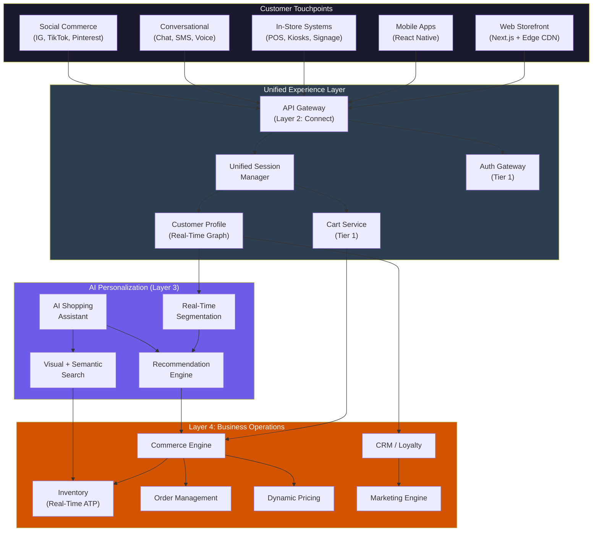
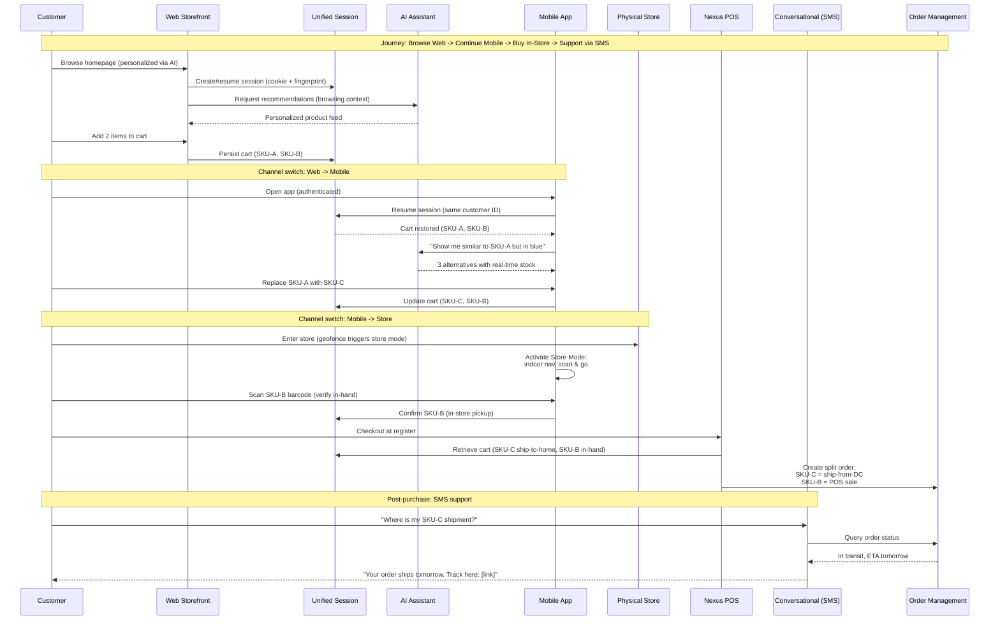
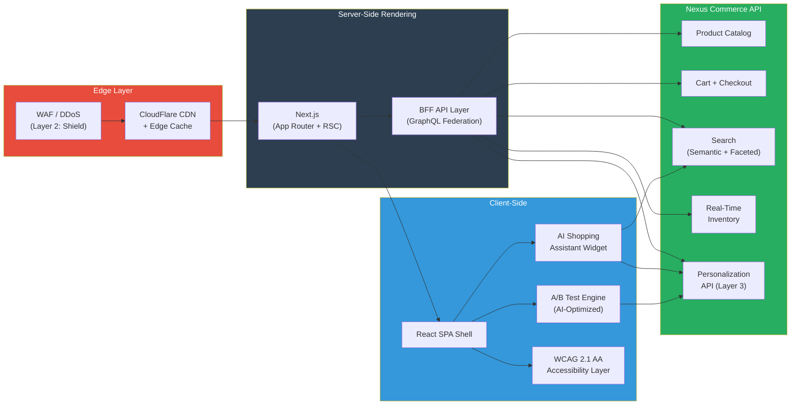
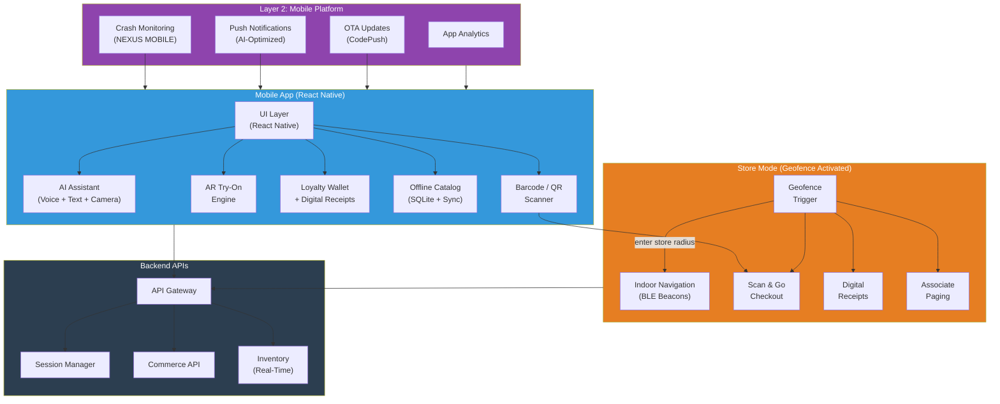
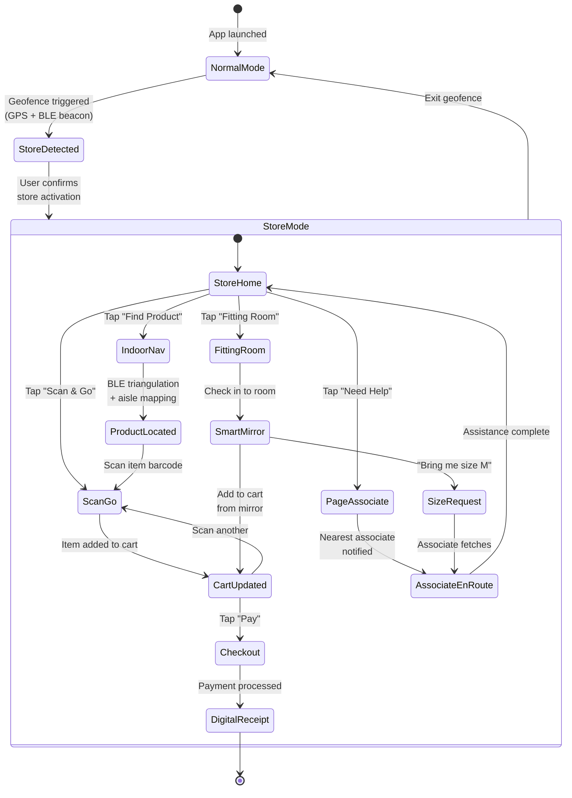
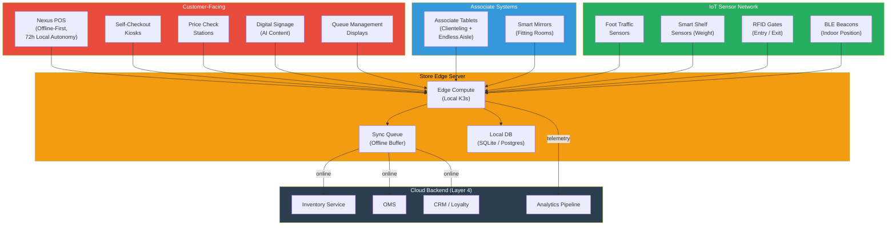
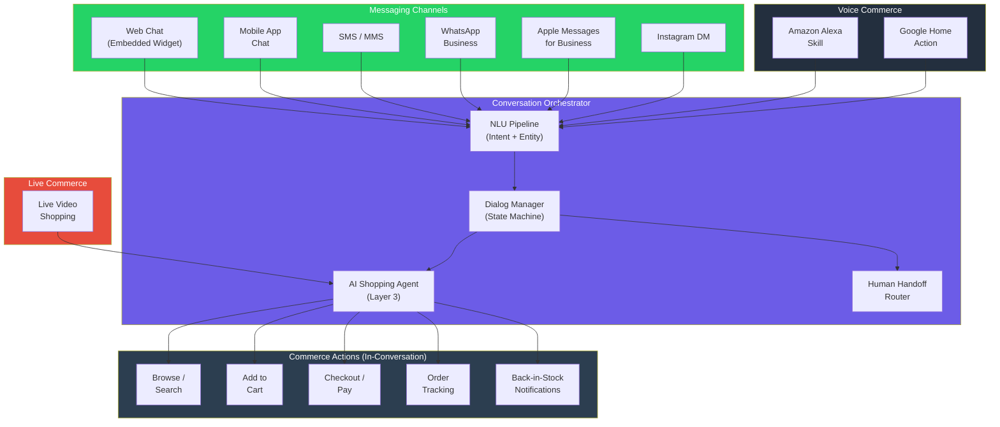
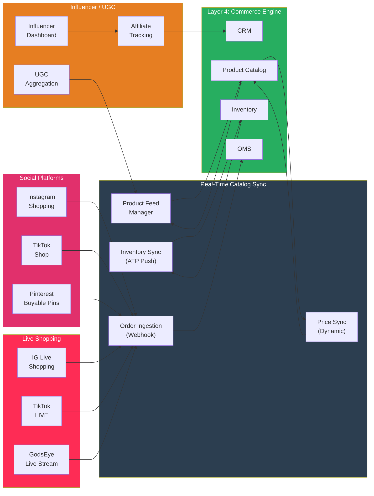
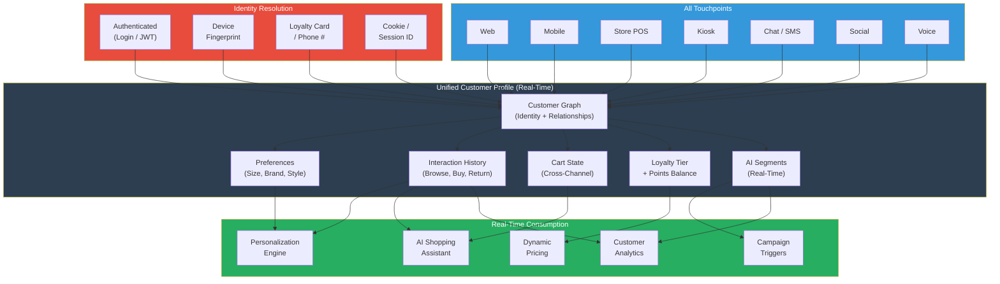
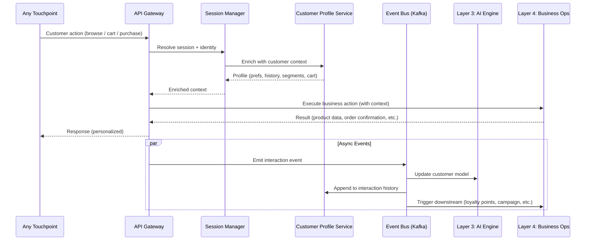

# 🛍️ Customer Experience Layer

Every surface the shopper touches. All channels share a single unified session, cart, and customer profile backed by Layer 4 services. AI personalization from Layer 3 is injected at every touchpoint in real time.

---

## Unified Touchpoint Architecture

---

## Cross-Channel Customer Journey

---

## Web Storefront

Headless React/Next.js frontend consuming Nexus Commerce API. Edge-cached via CloudFlare + SSR for sub-second TTFB. AI Shopping Assistant embedded as persistent chat widget with full catalog access.

| Capability | Implementation |
|---|---|
| Framework | Next.js 14+ (App Router, React Server Components) |
| Rendering | SSR + ISR, edge-cached at 200+ PoPs |
| TTFB | < 200ms (P95), < 100ms (P50) |
| AI Assistant | Persistent chat widget, full browse/search/add-to-cart |
| Personalization | Homepage, PDP, search results, recommendations |
| Inventory | Real-time ATP on every PDP, updated via WebSocket |
| Checkout | One-click (saved payment + address), Apple Pay, Google Pay |
| Accessibility | WCAG 2.1 AA, screen reader tested, keyboard-navigable |
| A/B Testing | AI-optimized multivariate, auto-allocating traffic to winners |
| Performance Budget | LCP < 2.5s, FID < 100ms, CLS < 0.1 |

---

## Mobile App Architecture

React Native (iOS + Android) with AI assistant (voice + text + camera), barcode scanner, and a geofence-activated Store Mode.

### Store Mode Flow

---

## In-Store Systems

| System | Details |
|---|---|
| Nexus POS | Cloud-native, offline-first. 72-hour local autonomy. Conflict-free sync (CRDTs). Unified with e-commerce cart/pricing. |
| Self-Checkout Kiosks | Touch + scan interface. Weight verification. Loss prevention integration. |
| Price Check Stations | Scan barcode, show real-time price + promotions + related items. |
| Digital Signage | AI-driven content: daypart-aware, weather-responsive, inventory-linked. |
| Associate Tablets | Clienteling (customer history + preferences), endless aisle (order out-of-stock from DC), task management. |
| Smart Mirrors | RFID-tagged garments detected on entry. Request alternate sizes. Add to cart. Outfit recommendations. |
| IoT Sensors | Foot traffic heatmaps, shelf out-of-stock detection (weight sensors), RFID shrink gates, BLE positioning. |
| Queue Management | Real-time wait estimation. Dynamic lane opening. "Queue at register 4" routing. |

---

## Conversational Commerce

Full commerce capabilities within any conversation: browse catalog, search (text + image), add to cart, apply coupons, checkout, track orders. Proactive messaging: "Text me when back in stock" subscribes the customer to an inventory event via Layer 4.

---

## Social Commerce

---

## Omnichannel Data Flow

How customer context follows the shopper across every touchpoint. A single `customer_id` resolves to unified profile, cart, preferences, and interaction history regardless of channel.

### Event Flow Per Interaction

---

## Channel Capability Matrix

| Capability | Web | Mobile | POS | Kiosk | Chat/SMS | Voice | Social |
|---|:---:|:---:|:---:|:---:|:---:|:---:|:---:|
| Browse catalog | Yes | Yes | -- | Yes | Yes | Yes | Yes |
| Search (text) | Yes | Yes | -- | Yes | Yes | Yes | -- |
| Search (visual / camera) | -- | Yes | -- | -- | Yes | -- | -- |
| AI assistant | Yes | Yes | -- | -- | Yes | Yes | -- |
| Add to cart | Yes | Yes | Yes | -- | Yes | Yes | Yes |
| Checkout | Yes | Yes | Yes | Yes | Yes | Yes | Yes |
| Real-time inventory | Yes | Yes | Yes | Yes | Yes | Yes | Yes |
| Loyalty / rewards | Yes | Yes | Yes | -- | Yes | -- | -- |
| Personalized recs | Yes | Yes | -- | Yes | Yes | Yes | -- |
| AR try-on | -- | Yes | -- | -- | -- | -- | -- |
| Barcode scan | -- | Yes | Yes | Yes | -- | -- | -- |
| Back-in-stock alerts | Yes | Yes | -- | -- | Yes | -- | -- |
| Digital receipts | Yes | Yes | Yes | Yes | -- | -- | -- |
| Order tracking | Yes | Yes | -- | -- | Yes | Yes | -- |
| Returns / exchanges | Yes | Yes | Yes | -- | Yes | -- | -- |
