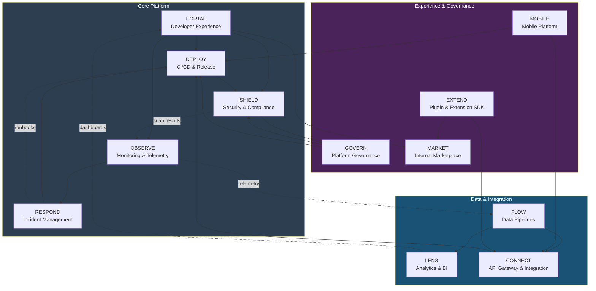
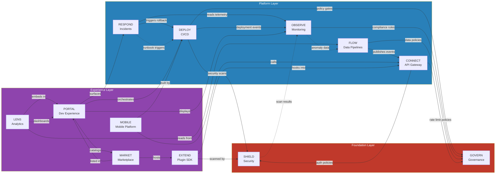

# 🛠️ Layer 2 -- Engineering Platform

> **12 modules. One control plane. Everything a mid-market retailer needs to build, ship, secure, and operate software -- without assembling 40 vendors.**

Strategy: Start with best-in-class third-party integrations. Gradually decouple. Build own where differentiation matters.

---

## Platform Module Map

---

## Module Details

---

### PORTAL -- Developer Experience Hub

**What it does:** Single pane of glass for every developer interaction -- project scaffolding, documentation, service catalog, environment management.

**Competes with:** Backstage (Spotify), Port, Cortex, OpsLevel

**Key Capabilities:**
- Service catalog with ownership, SLO, and dependency metadata
- Project scaffolding via opinionated templates (cookiecutter + custom)
- Unified search across code, docs, APIs, runbooks, and incidents
- Environment self-service (spin up staging in 90 seconds)
- Developer scorecards (DORA metrics, security posture, documentation coverage)
- AI-powered code assistant integrated into IDE and portal

**Open-Core Split:** *([Full pricing details](../strategy/open-core.md))*

| Free | Team ($8/user/mo) | Enterprise ($20/user/mo) |
|------|-------------------|--------------------------|
| Service catalog | SSO integration | AI code assistant |
| Basic scaffolding templates | Self-service environment provisioning | Custom template builder |
| Documentation wiki | Basic developer scorecards | Full DORA dashboards |
| Environment list view | | Audit log |

---

### OBSERVE -- Monitoring & Telemetry

**What it does:** Unified observability across metrics, logs, traces, and profiling -- correlated in real time with AI-driven anomaly detection.

**Competes with:** Datadog, New Relic, Dynatrace, Grafana Cloud

**Key Capabilities:**
- OpenTelemetry-native ingestion (metrics, logs, traces, profiling)
- AI anomaly detection with auto-baselining per service
- Distributed tracing with automatic service map generation
- Log aggregation with structured query language
- Custom dashboards with drag-and-drop builder
- SLO tracking with burn-rate alerts

**Open-Core Split:** *([Full pricing details](../strategy/open-core.md))*

| Free | Team ($8/user/mo) | Enterprise ($20/user/mo) |
|------|-------------------|--------------------------|
| Metrics + logs + traces ingestion | Custom dashboards | AI anomaly detection |
| Basic dashboards | 90-day retention | Predictive alerting |
| OpenTelemetry collector | SLO tracking | Cross-cloud correlated views |
| 7-day retention | | 13-month retention |
| | | Continuous profiling |
| | | SLO burn-rate automation |

---

### RESPOND -- Incident Management

**What it does:** End-to-end incident lifecycle -- detection, triage, collaboration, resolution, and post-mortem -- powered by AI root cause analysis.

**Competes with:** PagerDuty, Opsgenie, FireHydrant, incident.io

**Key Capabilities:**
- AI-powered alert correlation and deduplication (reduce noise by 80%)
- Automated severity classification based on business impact
- War room creation with integrated chat, timeline, and runbooks
- AI root cause analysis with suggested remediation
- Post-mortem generation with action item tracking
- On-call scheduling with fair rotation algorithms

**Open-Core Split:** *([Full pricing details](../strategy/open-core.md))*

| Free | Team ($8/user/mo) | Enterprise ($20/user/mo) |
|------|-------------------|--------------------------|
| Alert routing and escalation | Multi-team war rooms | AI root cause analysis |
| On-call scheduling | Basic remediation playbooks | Automated remediation playbooks |
| Basic incident timeline | | Business impact scoring |
| Manual post-mortems | | AI-generated post-mortems |
| | | SLA compliance tracking |

---

### DEPLOY -- CI/CD & Release Engineering

**What it does:** Build, test, and deploy to multi-cloud Kubernetes with progressive delivery, feature flags, and automated rollbacks.

**Competes with:** GitHub Actions + ArgoCD, GitLab CI, Harness, Spinnaker

**Key Capabilities:**
- GitOps-native with ArgoCD under the hood
- Progressive delivery (canary, blue/green, A/B, shadow)
- Feature flag management with gradual rollout
- Multi-cloud deployment orchestration (single pipeline, 3 clouds)
- Automated rollback on SLO breach
- Build caching and hermetic builds (Bazel-compatible)

**Open-Core Split:** *([Full pricing details](../strategy/open-core.md))*

| Free | Team ($8/user/mo) | Enterprise ($20/user/mo) |
|------|-------------------|--------------------------|
| GitOps deployment (single cloud) | Multi-cloud deployment (2 clouds) | Full triplet orchestration (3 clouds) |
| Basic canary deployments | Feature flag management | Advanced progressive delivery |
| Manual rollback | Environment promotion | Automated SLO-breach rollback |
| | | Build performance analytics |
| | | Compliance gates (SOX, PCI) |

---

### SHIELD -- Security & Compliance

**What it does:** Shift-left security across the entire SDLC -- code scanning, dependency audit, runtime protection, compliance automation.

**Competes with:** Snyk, Wiz, Prisma Cloud, SonarQube, Veracode

**Key Capabilities:**
- SAST / DAST / SCA scanning in CI pipeline
- Container image scanning and SBOM generation
- Runtime threat detection (Falco-based)
- Policy-as-code (OPA / Rego) for infrastructure and application
- PCI-DSS, SOC2, HIPAA compliance automation
- Secret scanning with auto-rotation

**Open-Core Split:** *([Full pricing details](../strategy/open-core.md))*

| Free | Team ($8/user/mo) | Enterprise ($20/user/mo) |
|------|-------------------|--------------------------|
| SAST scanning | DAST scanning | IAST (interactive) |
| Basic dependency audit | Runtime threat detection | Full SCA with license compliance |
| Container image scanning | | Compliance dashboard (PCI, SOC2) |
| OPA policy engine | | Secret auto-rotation |
| | | SBOM management & export |

---

### FLOW -- Data Pipelines

**What it does:** Managed data pipeline orchestration -- batch and streaming -- with schema registry, data quality gates, and lineage tracking.

**Competes with:** Fivetran + dbt + Airflow, Databricks, Confluent, Airbyte

**Key Capabilities:**
- Visual pipeline builder (DAG-based)
- Stream processing (Kafka Streams / Flink) and batch (Spark)
- Schema registry with backward/forward compatibility enforcement
- Data quality gates with automatic quarantine
- End-to-end data lineage tracking
- CDC (Change Data Capture) from all GodsEye databases

**Open-Core Split:** *([Full pricing details](../strategy/open-core.md))*

| Free | Team ($8/user/mo) | Enterprise ($20/user/mo) |
|------|-------------------|--------------------------|
| Basic DAG orchestration | Visual pipeline builder | Managed Flink / Spark |
| Kafka consumer/producer | CDC connectors | Cross-cloud data sync |
| Schema registry | Data quality gates | Lineage tracking |

---

### LENS -- Analytics & BI

**What it does:** Self-service analytics for retail operators -- real-time dashboards, AI-powered insights, natural language queries.

**Competes with:** Looker, Tableau, Power BI, Metabase, ThoughtSpot

**Key Capabilities:**
- Real-time retail dashboards (sales, inventory, foot traffic)
- Natural language query interface ("show me top sellers in Northeast last week")
- AI-generated insights with proactive anomaly alerts
- Embedded analytics SDK for white-label integration
- Semantic layer with business metric definitions
- Export to Excel, PDF, Slack, and scheduled email

**Open-Core Split:** *([Full pricing details](../strategy/open-core.md))*

| Free | Team ($8/user/mo) | Enterprise ($20/user/mo) |
|------|-------------------|--------------------------|
| Pre-built retail dashboards | Custom dashboard builder | Natural language queries (AI) |
| SQL query interface | Scheduled reports | Embedded analytics SDK |
| CSV export | | AI-generated insights |
| Basic charts | | Semantic layer management |

---

### MOBILE -- Mobile Platform

**What it does:** Mobile app framework for retail (associate apps, customer apps, manager apps) with offline-first architecture and MDM integration.

**Competes with:** Expo / React Native platform, Ionic, Flutter (raw), Tulip

**Key Capabilities:**
- Cross-platform framework (Flutter-based, iOS + Android)
- Offline-first data sync with conflict resolution
- Push notification service with segmentation
- Mobile device management (MDM) integration
- Barcode / QR / NFC scanning SDK
- Store associate task management framework

**Open-Core Split:** *([Full pricing details](../strategy/open-core.md))*

| Free | Team ($8/user/mo) | Enterprise ($20/user/mo) |
|------|-------------------|--------------------------|
| Flutter app templates | Segmented push with A/B testing | Custom app builder |
| Basic offline sync | App analytics | Advanced conflict resolution |
| Push notifications | | NFC + RFID integration |
| Barcode scanning | | MDM integration |

---

### CONNECT -- API Gateway & Integration

**What it does:** Unified API gateway with rate limiting, transformation, and a pre-built connector library for retail ecosystem integration (ERP, POS, WMS, 3PL).

**Competes with:** Kong, Apigee, MuleSoft, Boomi, Tray.io

**Key Capabilities:**
- API gateway with rate limiting, auth, and request transformation
- Pre-built connectors (SAP, Oracle, Shopify, Square, NetSuite, and 50+)
- GraphQL federation layer across all GodsEye services
- Webhook management with retry and dead-letter queue
- API versioning with automatic deprecation warnings
- Integration monitoring with SLA tracking

**Open-Core Split:** *([Full pricing details](../strategy/open-core.md))*

| Free | Team ($8/user/mo) | Enterprise ($20/user/mo) |
|------|-------------------|--------------------------|
| API gateway (rate limit, auth) | 30 pre-built connectors | 50+ connectors + custom builder |
| 10 pre-built connectors | Webhook retry + DLQ | GraphQL federation |
| REST API management | | Advanced transformation rules |
| Basic webhook support | | API monetization |
| | | Integration SLA tracking |

---

### GOVERN -- Platform Governance

**What it does:** Centralized policy engine for cost management, resource quotas, naming conventions, tagging enforcement, and organizational standards.

**Competes with:** Rafay, Loft, vCluster, env0, Spacelift

**Key Capabilities:**
- Cost allocation and chargeback per team/service
- Resource quota management across multi-cloud
- Tagging policy enforcement (all resources must be tagged)
- Naming convention validator
- Drift detection and auto-remediation
- FinOps dashboards with optimization recommendations

**Open-Core Split:** *([Full pricing details](../strategy/open-core.md))*

| Free | Team ($8/user/mo) | Enterprise ($20/user/mo) |
|------|-------------------|--------------------------|
| Basic cost visibility | Cross-cloud quota federation | Full chargeback / showback |
| Resource quotas | Drift detection | FinOps optimization engine |
| Tag policy linting | | Auto-remediation |
| | | Approval workflows |

---

### MARKET -- Internal Marketplace

**What it does:** Curated catalog of approved services, templates, libraries, and golden paths -- the "app store" for internal engineering teams.

**Competes with:** Backstage marketplace, internal platform teams (custom-built)

**Key Capabilities:**
- Golden path templates for common service patterns
- Approved library catalog with version pinning
- Self-service infrastructure modules (Terraform modules, Helm charts)
- Review and approval workflow for new additions
- Usage analytics (which templates are most adopted)
- Dependency impact analysis ("what breaks if we update this library?")

**Open-Core Split:** *([Full pricing details](../strategy/open-core.md))*

| Free | Team ($8/user/mo) | Enterprise ($20/user/mo) |
|------|-------------------|--------------------------|
| Template catalog | Usage analytics | Review and approval workflows |
| Helm chart repository | Version pinning | Dependency impact analysis |
| Basic library listing | | Automated compliance checks |
| | | Private marketplace for org-specific assets |
| | | Auto-upgrade proposals |

---

### EXTEND -- Plugin & Extension SDK

**What it does:** SDK and runtime for third-party and internal plugin development -- safely extend any GodsEye module without forking.

**Competes with:** Shopify App SDK, Salesforce Lightning, WordPress Plugin API

**Key Capabilities:**
- Plugin SDK (TypeScript / Python) with typed API surface
- Sandboxed execution runtime (V8 isolates + WASM)
- Event hook system (subscribe to any platform event)
- UI extension points (inject custom components into Portal)
- Plugin versioning with backward compatibility guarantees
- Marketplace publishing pipeline with automated review

**Open-Core Split:** *([Full pricing details](../strategy/open-core.md))*

| Free | Team ($8/user/mo) | Enterprise ($20/user/mo) |
|------|-------------------|--------------------------|
| Plugin SDK (TypeScript) | Python SDK | Visual plugin builder |
| Basic event hooks | Full event hook catalog | WASM runtime |
| CLI-based development | | Private plugin registry |
| | | UI extension points |

---

## Incident Flow -- Module Interaction

```mermaid
sequenceDiagram
    participant USER as End User
    participant APP as Retail Application
    participant OBS as OBSERVE
    participant RESP as RESPOND
    participant AI as AI Diagnosis Engine
    participant DEP as DEPLOY
    participant SH as SHIELD
    participant PORT as PORTAL
    participant OPS as On-Call Engineer

    USER->>APP: Checkout request
    APP->>APP: HTTP 500 — payment timeout

    rect rgb(52, 152, 219)
        Note over OBS: Detection Phase (T=0s)
        APP->>OBS: Error rate spike (OpenTelemetry)
        OBS->>OBS: Anomaly detected:<br/>error_rate 12% (baseline 0.3%)
        OBS->>OBS: Correlate with:<br/>- latency P99 spike<br/>- payment-svc CPU 94%<br/>- DB connection pool exhausted
    end

    rect rgb(230, 126, 34)
        Note over RESP: Correlation Phase (T=15s)
        OBS->>RESP: Alert: payment-svc degraded (SEV-2)
        RESP->>RESP: Correlate with 3 other alerts:<br/>- DB connection pool alert<br/>- Payment gateway timeout alert<br/>- Cart abandonment rate spike
        RESP->>RESP: Deduplicate: 4 alerts → 1 incident
        RESP->>RESP: Auto-classify: SEV-1<br/>(revenue impact detected)
        RESP->>OPS: Page on-call (PagerDuty)
        RESP->>PORT: Create war room
    end

    rect rgb(142, 68, 173)
        Note over AI: AI Diagnosis (T=30s)
        RESP->>AI: Incident context bundle:<br/>- traces, metrics, logs<br/>- recent deployments<br/>- change history
        AI->>AI: Root cause analysis:<br/>Deploy #4521 (2h ago) introduced<br/>connection leak in payment-svc
        AI->>AI: Confidence: 94%<br/>Evidence: connection count monotonically<br/>increasing since deploy #4521
        AI->>RESP: Diagnosis: connection leak<br/>Recommendation: rollback deploy #4521
        AI->>OPS: Suggested action: rollback
    end

    rect rgb(39, 174, 96)
        Note over DEP: Automated Rollback (T=45s)
        OPS->>DEP: Approve rollback
        DEP->>DEP: Rollback payment-svc to v2.14.2<br/>(progressive: 10% → 50% → 100%)
        DEP->>DEP: Canary check: error rate dropping
        DEP->>DEP: Full rollback complete
        DEP->>OBS: Deployment event logged
    end

    rect rgb(192, 57, 43)
        Note over SH: Security Scan (T=60s)
        DEP->>SH: Trigger post-incident scan
        SH->>SH: Scan deploy #4521 diff:<br/>- No malicious code detected<br/>- Connection leak is accidental bug<br/>- No secrets exposed
        SH->>RESP: Security clear — no threat
    end

    rect rgb(44, 62, 80)
        Note over RESP: Resolution (T=90s)
        OBS->>RESP: Metrics normalized
        RESP->>RESP: Auto-resolve incident
        RESP->>OPS: Slack: incident resolved<br/>MTTR: 90 seconds
        RESP->>PORT: Post-mortem draft generated
        RESP->>DEP: Block deploy #4521 from re-deploy<br/>until fix verified
    end
```

---

## Module Dependency Graph

---

## Module Technology Stack Summary

| Module      | Primary OSS                     | Managed Service (Phase 1)        | Build Own (Phase 2+)          |
|-------------|----------------------------------|----------------------------------|-------------------------------|
| **PORTAL**  | Backstage                        | --                               | GodsEye Portal                |
| **OBSERVE** | Prometheus, Grafana, Jaeger      | Datadog (bridge)                 | GodsEye Observe               |
| **RESPOND** | Alertmanager                     | PagerDuty, Slack                 | GodsEye Respond               |
| **DEPLOY**  | ArgoCD, Tekton, Flux             | GitHub Actions (CI)              | GodsEye Deploy                |
| **SHIELD**  | Falco, OPA, Trivy                | Snyk (SCA)                       | GodsEye Shield                |
| **FLOW**    | Kafka, Flink, Airflow            | Confluent (managed Kafka)        | GodsEye Flow                  |
| **LENS**    | Apache Superset, ClickHouse      | --                               | GodsEye Lens                  |
| **MOBILE**  | Flutter, Firebase (notifications)| Expo (push service)              | GodsEye Mobile SDK            |
| **CONNECT** | Kong, GraphQL Mesh               | --                               | GodsEye Connect               |
| **GOVERN**  | Open Cost, Kyverno               | env0 (IaC management)            | GodsEye Govern                |
| **MARKET**  | Backstage plugins                | --                               | GodsEye Market                |
| **EXTEND**  | V8 Isolates, Extism (WASM)       | --                               | GodsEye Extend Runtime        |
