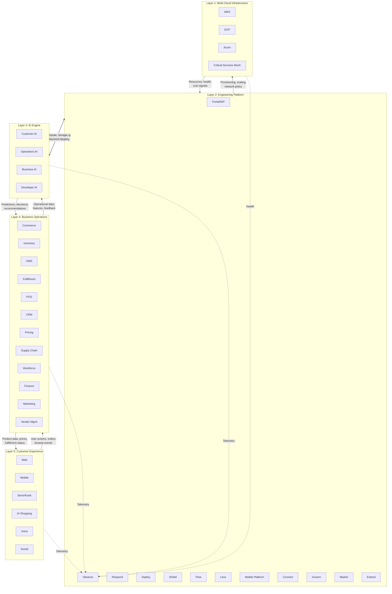
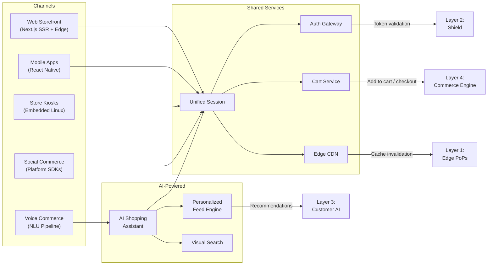
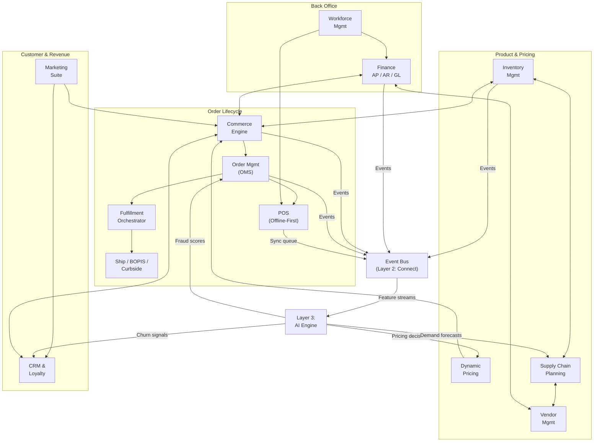
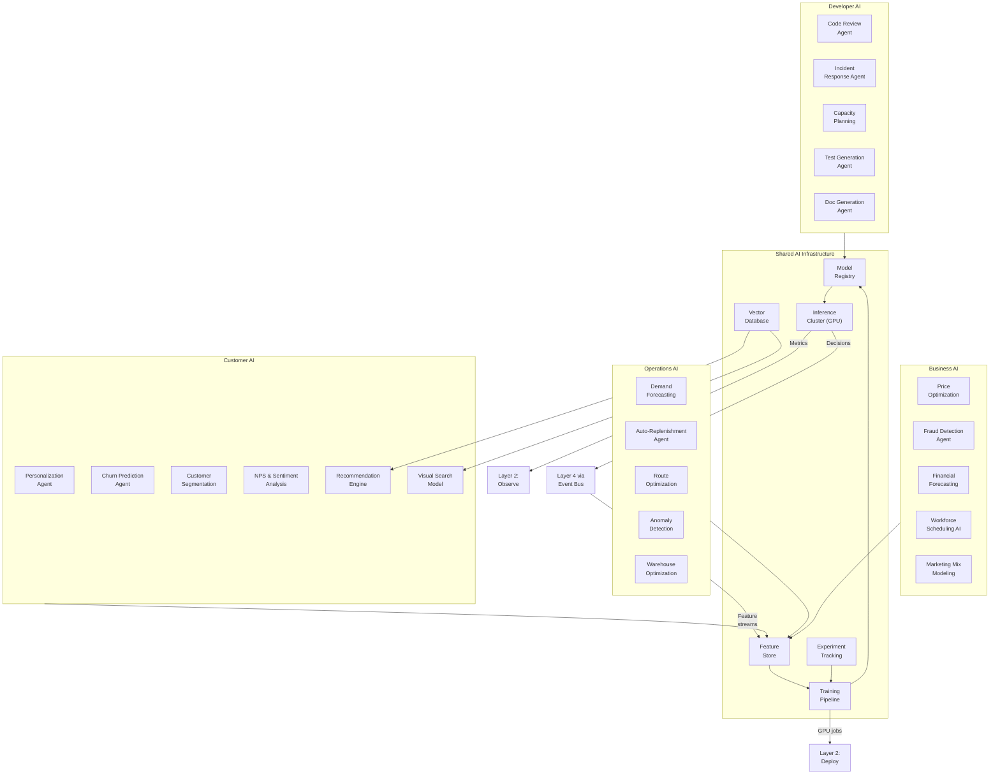
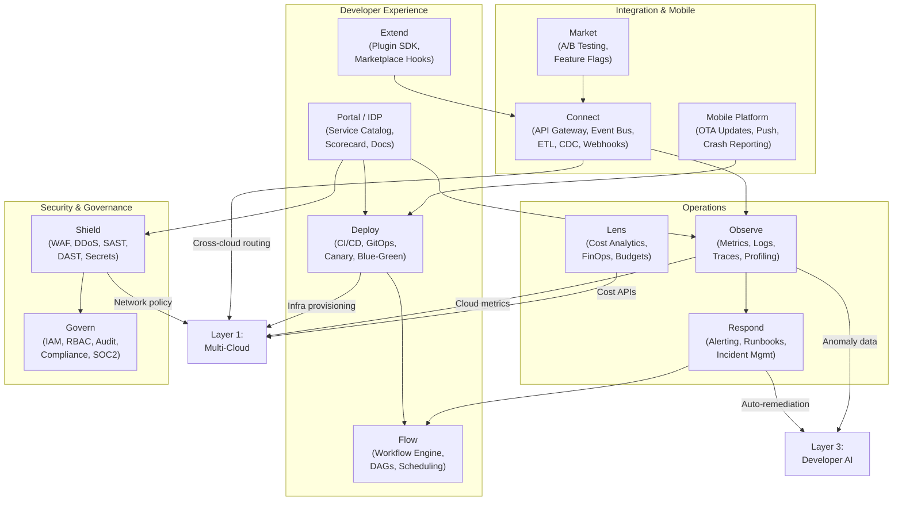
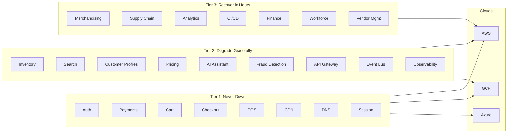
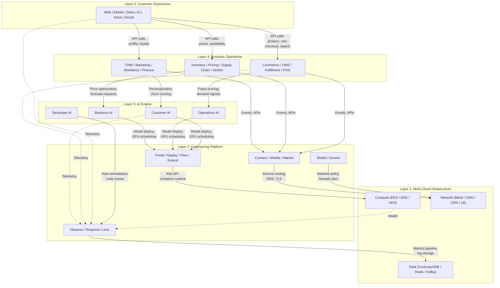

# 📐 Five-Layer Architecture

## Inter-Layer Data Flow

---

## Layer 5: Customer Experience

Every surface the customer touches. All channels feed into a unified session backed by Layer 4 services. AI Shopping Assistant uses Layer 3 Customer AI for real-time personalization.

---

## Layer 4: Business Operations

Core transactional systems. Every component exposes gRPC + async event interfaces. POS operates in offline-first mode with 72-hour local autonomy and conflict-free sync.

---

## Layer 3: AI Engine

Four AI domains, 20+ specialized agents. All models run on platform-managed inference clusters. Agents consume event streams from Layer 4 and push decisions back via the event bus.

---

## Layer 2: Engineering Platform

Internal developer platform plus all operational tooling. Every Layer 4 and Layer 3 service is deployed, observed, secured, and governed through Layer 2 components.

---

## Layer 1: Multi-Cloud Infrastructure

All compute, storage, and networking. Critical Services Mesh ensures Tier 1 services remain available across all three cloud providers with automatic failover in under 30 seconds.

```mermaid
flowchart TB
    subgraph Mesh["Critical Services Mesh"]
        GlobalLB["Global Load\nBalancer"]
        ServiceMesh["Service Mesh\n(mTLS, Circuit Breakers)"]
        DNS["Multi-Cloud\nDNS (Active-Active)"]
        CertMgmt["Certificate\nManagement"]
    end

    subgraph AWS["AWS (Primary)"]
        AWS_EKS["EKS Clusters"]
        AWS_RDS["RDS / Aurora"]
        AWS_S3["S3"]
        AWS_CF["CloudFront"]
        AWS_KMS["KMS"]
        AWS_GPU["GPU Instances\n(p5 / inf2)"]
    end

    subgraph GCP["GCP (Secondary)"]
        GCP_GKE["GKE Clusters"]
        GCP_SQL["Cloud SQL"]
        GCP_GCS["GCS"]
        GCP_CDN["Cloud CDN"]
        GCP_KMS["Cloud KMS"]
        GCP_GPU["GPU Instances\n(A3 / TPU v5)"]
    end

    subgraph Azure["Azure (Tertiary)"]
        AZ_AKS["AKS Clusters"]
        AZ_SQL["Azure SQL"]
        AZ_Blob["Blob Storage"]
        AZ_FD["Front Door"]
        AZ_KV["Key Vault"]
    end

    subgraph DataLayer["Cross-Cloud Data"]
        CockroachDB["CockroachDB\n(Global SQL)"]
        Redis["Redis Cluster\n(Cross-Region)"]
        Kafka["Kafka\n(Multi-DC)"]
        ObjectSync["Object Store\nSync"]
    end

    GlobalLB --> AWS_CF
    GlobalLB --> GCP_CDN
    GlobalLB --> AZ_FD

    DNS --> GlobalLB
    ServiceMesh --> AWS_EKS
    ServiceMesh --> GCP_GKE
    ServiceMesh --> AZ_AKS

    CockroachDB --> AWS_RDS
    CockroachDB --> GCP_SQL
    CockroachDB --> AZ_SQL

    Kafka --> AWS_EKS
    Kafka --> GCP_GKE
    Redis --> AWS_EKS
    Redis --> GCP_GKE
    Redis --> AZ_AKS

    ObjectSync --> AWS_S3
    ObjectSync --> GCP_GCS
    ObjectSync --> AZ_Blob

    CertMgmt --> AWS_KMS
    CertMgmt --> GCP_KMS
    CertMgmt --> AZ_KV
```

---

## Service Classification

All 36 components are classified by availability requirements. Classification determines cloud deployment topology and failover behavior.

| Tier | SLA | Cloud Topology | Failover | Services |
|---|---|---|---|---|
| **Tier 1: Never Down** | 99.999% | All 3 clouds (active-active-active) | < 30 sec automatic | Auth, Payments, Cart, Checkout, POS, CDN, DNS, Session Mgmt |
| **Tier 2: Degrade Gracefully** | 99.99% | 2 clouds (active-passive) | < 5 min, reduced features | Inventory, Search, Customer Profiles, Pricing, AI Shopping Assistant, Fraud Detection, API Gateway, Event Bus, Observability |
| **Tier 3: Recover in Hours** | 99.9% | 1 cloud + backup | < 4 hr from backup | Merchandising, Supply Chain, Analytics, CI/CD, Finance, Workforce Mgmt, Vendor Mgmt |

### Tier Deployment Topology

---

## Cross-Layer Dependency Map

Each layer depends strictly on the layers below it. No upward hard dependencies. Telemetry flows bypass this rule via async event streams to Layer 2 Observe.

