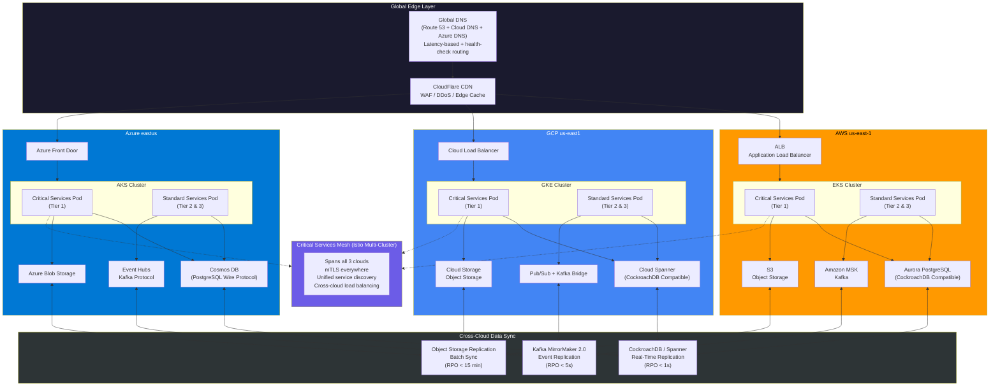

# ☁️ Layer 1 -- Multi-Cloud Infrastructure

> **The Triplet Model -- Three Clouds, Zero Data Centers, Never Go Down.** See [Triplet Model Strategy](../strategy/triplet-model.md) for the full methodology.

GodsEye runs active-active across three cloud providers. Every critical byte has three homes. No single cloud failure takes the platform offline.

---

## Multi-Cloud Network Topology

---

## Service Tier Classification

---

## Failover Sequence -- AWS Region Failure

---

## Auto-Scaling Flow

---

## Cloud Service Mapping

| Service          | AWS                          | GCP                          | Azure                        | Abstraction Layer            |
|------------------|------------------------------|------------------------------|------------------------------|------------------------------|
| **Compute**      | EC2 / Fargate                | Compute Engine / Cloud Run   | Virtual Machines / ACI       | Terraform + Crossplane       |
| **Kubernetes**   | EKS                          | GKE                          | AKS                          | Cluster API + ArgoCD         |
| **Database**     | Aurora PostgreSQL             | Cloud Spanner                | Cosmos DB (PG wire)          | CockroachDB compatibility    |
| **Object Store** | S3                           | Cloud Storage                | Blob Storage                 | MinIO gateway abstraction    |
| **Load Balancer**| ALB / NLB                    | Cloud Load Balancing         | Azure Front Door             | Envoy / Istio ingress        |
| **CDN**          | CloudFront (backup)          | Cloud CDN (backup)           | Azure CDN (backup)           | CloudFlare (primary)         |
| **IAM**          | AWS IAM                      | Cloud IAM                    | Entra ID                     | SPIFFE/SPIRE + OPA           |
| **Secrets**      | Secrets Manager              | Secret Manager               | Key Vault                    | HashiCorp Vault (primary)    |
| **Message Queue**| MSK (Kafka)                  | Pub/Sub + Kafka bridge       | Event Hubs (Kafka protocol)  | Kafka API abstraction        |
| **Monitoring**   | CloudWatch                   | Cloud Monitoring             | Azure Monitor                | Prometheus + Grafana (primary)|
| **DNS**          | Route 53                     | Cloud DNS                    | Azure DNS                    | CloudFlare DNS (primary)     |
| **Container Reg**| ECR                          | Artifact Registry            | ACR                          | Harbor (primary)             |

---

## Egress Cost Strategy

| Strategy                          | Mechanism                                                        | Estimated Savings |
|-----------------------------------|------------------------------------------------------------------|-------------------|
| **CloudFlare Bandwidth Alliance** | Zero egress from participating clouds through CF                 | 40-60%            |
| **Compression at Edge**           | Brotli / gzip on all API responses; protobuf for service-to-service | 20-30%            |
| **Regional Affinity Routing**     | Keep requests within same cloud when possible; cross-cloud only for sync | 15-25%            |
| **Batch Sync Windows**            | Object storage replication during off-peak (2am-6am UTC)         | 10-15%            |
| **Data Gravity Awareness**        | Place compute near data; avoid cross-cloud reads for analytics   | 15-20%            |
| **Kafka Topic Partitioning**      | Partition by region; only replicate partition leaders cross-cloud | 20-30%            |
| **gRPC over REST**                | Binary protocol for all internal service communication           | 30-40% on payload |
| **Committed Use Discounts**       | 1-3 year commitments on baseline egress across all 3 clouds      | 20-40%            |
| **Edge Caching TTL Tuning**       | Aggressive caching for catalog/images (TTL 24h); short for pricing (TTL 60s) | 50-70% on static |

---

## Design Principles

1. **No cloud-native lock-in** -- Every managed service has an OSS abstraction in front of it.
2. **Terraform + Crossplane** -- All infrastructure is declarative and version-controlled.
3. **Blast radius containment** -- A single cloud failure never exceeds 33% capacity loss.
4. **Cost-aware tiering** -- Not everything needs 3x replication. Tier accordingly.
5. **Egress is the enemy** -- Treat cross-cloud bandwidth as a first-class cost center.
