# 🔭 GodsEye Platform Architecture

GodsEye is the complete AI-first technology spine for mid-market retail ($1-50B revenue). One platform replaces your entire vendor stack -- ERP, commerce, CRM, observability, consulting, and infrastructure -- with 36 integrated components, 22+ central AI agents, 100-200 per-project Sentinel agents, and multi-cloud resilience across AWS, GCP, and Azure.

## 🏗️ Platform Stack

```mermaid
block-beta
  columns 1

  block:L5["🛍️ LAYER 5 — CUSTOMER EXPERIENCE"]:1
    columns 6
    Web["Web Storefront"]
    Mobile["Mobile Apps"]
    Store["Store Kiosks"]
    AIShopping["AI Shopping Assistant"]
    Voice["Voice Commerce"]
    Social["Social Commerce"]
  end

  block:L4["💼 LAYER 4 — BUSINESS OPERATIONS"]:1
    columns 6
    Commerce["Commerce Engine"]
    Inventory["Inventory Mgmt"]
    OMS["Order Mgmt (OMS)"]
    Fulfillment["Fulfillment"]
    POS["Point of Sale"]
    CRM["CRM"]
    Pricing["Dynamic Pricing"]
    SupplyChain["Supply Chain"]
    Workforce["Workforce Mgmt"]
    Finance["Finance & AP/AR"]
    Marketing["Marketing Suite"]
    VendorMgmt["Vendor Mgmt"]
  end

  block:L3["🧠 LAYER 3 — AI ENGINE"]:1
    columns 4
    CustomerAI["Customer AI\n(Personalization, Churn,\nSegmentation, NPS)"]
    OpsAI["Operations AI\n(Demand Forecast, Replenish,\nRoute Optimize, Anomaly)"]
    BizAI["Business AI\n(Price Optimize, Fraud,\nFinance Forecast, Workforce)"]
    DevAI["Developer AI\n(Code Review, Incident,\nCapacity, Test Gen)"]
  end

  block:L2["🛠️ LAYER 2 — ENGINEERING PLATFORM"]:1
    columns 6
    Portal["Portal / IDP"]
    Observe["Observe"]
    Respond["Respond"]
    Deploy["Deploy"]
    Shield["Shield"]
    Flow["Flow"]
    Lens["Lens"]
    MobilePlat["Mobile Platform"]
    Connect["Connect"]
    Govern["Govern"]
    Market["Market"]
    Extend["Extend"]
  end

  block:L1["☁️ LAYER 1 — MULTI-CLOUD INFRASTRUCTURE"]:1
    columns 3
    AWS["AWS\n(Primary)"]
    GCP["GCP\n(Secondary)"]
    Azure["Azure\n(Tertiary)"]
  end

  L5 --> L4
  L4 --> L3
  L3 --> L2
  L2 --> L1

  style Web fill:#059669,stroke:#34d399,color:#fff
  style Mobile fill:#059669,stroke:#34d399,color:#fff
  style Store fill:#059669,stroke:#34d399,color:#fff
  style AIShopping fill:#059669,stroke:#34d399,color:#fff
  style Voice fill:#059669,stroke:#34d399,color:#fff
  style Social fill:#059669,stroke:#34d399,color:#fff

  style Commerce fill:#d97706,stroke:#fbbf24,color:#fff
  style Inventory fill:#d97706,stroke:#fbbf24,color:#fff
  style OMS fill:#d97706,stroke:#fbbf24,color:#fff
  style Fulfillment fill:#d97706,stroke:#fbbf24,color:#fff
  style POS fill:#d97706,stroke:#fbbf24,color:#fff
  style CRM fill:#d97706,stroke:#fbbf24,color:#fff
  style Pricing fill:#d97706,stroke:#fbbf24,color:#fff
  style SupplyChain fill:#d97706,stroke:#fbbf24,color:#fff
  style Workforce fill:#d97706,stroke:#fbbf24,color:#fff
  style Finance fill:#d97706,stroke:#fbbf24,color:#fff
  style Marketing fill:#d97706,stroke:#fbbf24,color:#fff
  style VendorMgmt fill:#d97706,stroke:#fbbf24,color:#fff

  style CustomerAI fill:#7c3aed,stroke:#a78bfa,color:#fff
  style OpsAI fill:#7c3aed,stroke:#a78bfa,color:#fff
  style BizAI fill:#7c3aed,stroke:#a78bfa,color:#fff
  style DevAI fill:#7c3aed,stroke:#a78bfa,color:#fff

  style Portal fill:#2563eb,stroke:#60a5fa,color:#fff
  style Observe fill:#2563eb,stroke:#60a5fa,color:#fff
  style Respond fill:#2563eb,stroke:#60a5fa,color:#fff
  style Deploy fill:#2563eb,stroke:#60a5fa,color:#fff
  style Shield fill:#2563eb,stroke:#60a5fa,color:#fff
  style Flow fill:#2563eb,stroke:#60a5fa,color:#fff
  style Lens fill:#2563eb,stroke:#60a5fa,color:#fff
  style MobilePlat fill:#2563eb,stroke:#60a5fa,color:#fff
  style Connect fill:#2563eb,stroke:#60a5fa,color:#fff
  style Govern fill:#2563eb,stroke:#60a5fa,color:#fff
  style Market fill:#2563eb,stroke:#60a5fa,color:#fff
  style Extend fill:#2563eb,stroke:#60a5fa,color:#fff

  style AWS fill:#ff9900,stroke:#ffb84d,color:#fff
  style GCP fill:#4285f4,stroke:#79b0ff,color:#fff
  style Azure fill:#0078d4,stroke:#4da6ff,color:#fff
```

## 📊 Key Numbers

| Metric | Value |
|---|---|
| Total Components | 36 |
| Central AI Agents | 22+ (across 4 families) |
| Project Sentinel Agents | 100-200 (one per cloud project) |
| Cloud Providers | 3 (AWS, GCP, Azure) |
| Offline POS Capability | 72 hours |
| Target Market | Mid-market retail, $1-50B revenue |
| Tier 1 Availability Target | 99.999% |
| Max Failover Time (Tier 1) | < 30 seconds |
| Recovery Time (Tier 3) | < 4 hours |
| Sentinel Phases | 4 (Shadow Observer → Guided Assistant → Autonomous Operator → Predictive Guardian) |

## 🔄 What GodsEye Replaces

| Capability | Incumbent Vendors Replaced | GodsEye Component |
|---|---|---|
| ERP / Finance | Oracle ERP Cloud, SAP S/4HANA, NetSuite | Layer 4: Finance, Supply Chain, Workforce |
| Commerce | Shopify Plus, Salesforce Commerce Cloud, Magento | Layer 4: Commerce Engine + Layer 5: Web/Mobile |
| CRM & Marketing | Salesforce CRM, HubSpot, Adobe Experience Cloud | Layer 4: CRM, Marketing Suite |
| Point of Sale | Oracle Xstore, Shopify POS, NCR Voyix | Layer 4: POS (72hr offline) |
| Order Management | Manhattan OMS, IBM Sterling | Layer 4: OMS, Fulfillment |
| Inventory & Supply Chain | Blue Yonder, Kinaxis, SAP IBP | Layer 4: Inventory, Supply Chain |
| Observability | Datadog, Splunk, New Relic, PagerDuty | Layer 2: Observe, Respond, Lens |
| Internal Dev Platform | Backstage, Cortex, Port | Layer 2: Portal / IDP |
| CI/CD & Infra | Jenkins, ArgoCD, Terraform Cloud | Layer 2: Deploy, Flow |
| Security & Compliance | Wiz, Snyk, Vault | Layer 2: Shield, Govern |
| AI / ML Platform | Databricks, SageMaker, Vertex AI | Layer 3: Full AI Engine |
| Consulting & Integration | Accenture, Deloitte, Infosys | Platform-native; no glue code needed |

## 🎯 Architecture Principles

1. **AI-native** -- AI agents are not bolted on; they are the decision layer (Layer 3) between operations and infrastructure.
2. **Multi-cloud by default** -- Tier 1 services run on all 3 clouds simultaneously. No single cloud is a SPOF.
3. **Offline-first POS** -- Stores operate fully for 72 hours without connectivity; sync reconciles automatically.
4. **Zero-vendor-lock** -- Every component is platform-owned. No third-party SaaS in the critical path.
5. **Event-driven** -- All cross-layer communication flows through the event bus with guaranteed delivery.
6. **Sentinel-per-project** -- Every cloud project gets its own AI sentinel that patrols 24/7, reports daily to engineers, and collaborates with peer sentinels at night.
