# 🔨 Build vs Buy Strategy

> **Core Principle:** Start with third-party dependencies, gradually decouple and build our own services.

GodsEye does not attempt to replace everything on day one. The strategy is to **augment existing Oracle/SAP/Salesforce installations first** (prove value as an intelligent overlay), then **gradually replace** modules when GodsEye-native alternatives are production-hardened.

---

## Module Evolution Matrix

| Module | Phase 1: Third-Party | Phase 2: Hybrid | Phase 3: GodsEye Native |
|---|---|---|---|
| **Commerce** | Shopify Plus / commercetools | GodsEye Commerce API (wraps existing) | Full headless commerce engine |
| **Payments** | Stripe / Adyen (multi-gateway) | Add smart routing + fallback logic | Full payment orchestration platform |
| **POS** | Existing NCR / Toshiba terminals | GodsEye POS overlay (UI + intelligence) | Full GodsEye POS (PWA, offline-first) |
| **Inventory** | Oracle Retail Inventory | GodsEye real-time overlay (event-driven) | Full GodsEye Inventory (CRDT-based) |
| **OMS** | Manhattan / Salesforce OMS | GodsEye orchestration layer | Full GodsEye OMS |
| **CRM / Loyalty** | Salesforce Service Cloud | GodsEye CRM overlay + unified profiles | Full GodsEye CRM |
| **Observability** | Datadog / New Relic | GodsEye observability (Grafana stack) | Full GodsEye Observe |
| **AI / ML** | Claude Opus 4.6 / GPT-5.3 Codex APIs | Fine-tuned models + self-hosted Llama 4 / Mistral 3 | GodsEye retail AI models |
| **Auth** | Okta / Auth0 | Keycloak managed (single realm) | Multi-cloud Keycloak mesh |
| **Search** | Algolia / Elasticsearch | OpenSearch managed | GodsEye Search (AI-powered, vector + lexical) |
| **Data Pipeline** | Fivetran / dbt | GodsEye Flow overlay | Full GodsEye Flow |

---

## Decision Framework

When evaluating each module, apply this decision tree:


### Decision Criteria Summary

| Factor | Build | Buy |
|---|---|---|
| Strategic differentiation | High (core IP) | Low (commodity) |
| Vendor lock-in risk | Reduces | Increases |
| Time to market | Slower | Faster |
| Annual cost trajectory | Decreasing | Increasing |
| Data ownership | Full | Partial |
| Customization depth | Unlimited | Constrained |

---

## Decoupling Strategy

Every third-party dependency is accessed through a **GodsEye Adapter** -- never directly. This enables zero-downtime swaps.


### Adapter Contract

Each adapter implements a **standard GodsEye interface**:

```
GodsEyeAdapter<T>
  ├── connect()          # Initialize connection to provider
  ├── healthCheck()      # Verify provider availability
  ├── execute(cmd: T)    # Run operation against provider
  ├── fallback(cmd: T)   # Degrade gracefully on failure
  └── metrics()          # Expose latency, error rate, throughput
```

Swapping a provider means implementing a new adapter -- application code never changes.

---

## Integration Architecture

Full view of how GodsEye APIs wrap third-party services during the hybrid phase:


---

## Phase Timeline

```mermaid
gantt
    title GodsEye Build vs Buy — Module Evolution Timeline
    dateFormat YYYY-MM
    axisFormat %b %Y

    section Commerce
    Shopify Plus / commercetools           :done, com1, 2025-01, 2025-06
    GodsEye Commerce API (hybrid)          :active, com2, 2025-06, 2026-06
    Full GodsEye Headless Commerce         :com3, 2026-06, 2027-06

    section Payments
    Stripe / Adyen multi-gateway           :done, pay1, 2025-01, 2025-06
    Smart routing + fallback               :active, pay2, 2025-06, 2026-06
    Full Payment Orchestrator              :pay3, 2026-06, 2027-06

    section POS
    NCR / Toshiba existing                 :done, pos1, 2025-01, 2025-06
    GodsEye POS overlay                    :active, pos2, 2025-06, 2026-06
    Full GodsEye POS (PWA)                 :pos3, 2026-06, 2027-06

    section Inventory
    Oracle Retail Inventory                :done, inv1, 2025-01, 2025-06
    GodsEye real-time overlay              :active, inv2, 2025-06, 2026-06
    Full GodsEye Inventory                 :inv3, 2026-06, 2027-06

    section OMS
    Manhattan / Salesforce OMS             :done, oms1, 2025-01, 2025-09
    GodsEye orchestration layer            :active, oms2, 2025-09, 2026-09
    Full GodsEye OMS                       :oms3, 2026-09, 2027-06

    section CRM / Loyalty
    Salesforce Service Cloud               :done, crm1, 2025-01, 2025-09
    GodsEye CRM overlay                    :active, crm2, 2025-09, 2026-09
    Full GodsEye CRM                       :crm3, 2026-09, 2027-06

    section Observability
    Datadog / New Relic                    :done, obs1, 2025-01, 2025-06
    Grafana stack (hybrid)                 :active, obs2, 2025-06, 2026-03
    Full GodsEye Observe                   :obs3, 2026-03, 2027-01

    section AI / ML
    Claude Opus 4.6 / GPT-5.3 APIs         :done, ai1, 2025-01, 2025-06
    Fine-tuned + self-hosted Llama 4       :active, ai2, 2025-06, 2026-06
    GodsEye Retail AI Models               :ai3, 2026-06, 2027-06

    section Auth
    Okta / Auth0                           :done, auth1, 2025-01, 2025-06
    Keycloak managed                       :active, auth2, 2025-06, 2026-03
    Multi-cloud Keycloak mesh              :auth3, 2026-03, 2027-01

    section Search
    Algolia / Elasticsearch                :done, srch1, 2025-01, 2025-06
    OpenSearch managed                     :active, srch2, 2025-06, 2026-06
    GodsEye Search (AI-powered)            :srch3, 2026-06, 2027-06

    section Data Pipeline
    Fivetran / dbt                         :done, dp1, 2025-01, 2025-06
    GodsEye Flow overlay                   :active, dp2, 2025-06, 2026-06
    Full GodsEye Flow                      :dp3, 2026-06, 2027-06
```



---

## Phase Summary

| Phase | Timeline | Approach | Risk Profile |
|---|---|---|---|
| **Phase 1** -- Third-Party Heavy | Months 1-6 | Integrate best-of-breed SaaS behind GodsEye adapters. Prove value as an intelligent overlay on top of Oracle/SAP/Salesforce. | Low technical risk, high vendor dependency |
| **Phase 2** -- Hybrid | Months 6-18 | Run GodsEye services alongside third-party. Shadow mode, canary rollouts, gradual traffic shift. | Medium risk, reduced vendor dependency |
| **Phase 3** -- GodsEye Native | Months 18+ | Full GodsEye-native services for all modules. Third-party retained only where strategic (e.g., multi-gateway payments). | Low vendor dependency, full control |

### Migration Pattern per Module

```
1. Deploy GodsEye adapter wrapping third-party
2. Build GodsEye-native service behind feature flag
3. Shadow mode: run both, compare outputs
4. Canary: route 5% → 25% → 50% → 100% to native
5. Decommission third-party adapter
6. Remove third-party contract
```

---

## Key Constraints

- **Payments**: Always maintain multi-gateway. Stripe + Adyen minimum. GodsEye orchestrates, never replaces payment processors.
- **AI/ML**: Self-hosted models for latency-critical paths (search ranking, fraud scoring). External APIs for complex reasoning (customer service, content generation).
- **Auth**: Keycloak is the strategic choice. Migrate off Okta/Auth0 early -- auth vendor lock-in is the most dangerous.
- **Data Pipeline**: Own the orchestration. Never let Fivetran own your data topology.
