# 🤝 Community Contribution Strategy

> **The open-source community doesn't just use GodsEye — they build it.** Every connector, plugin, template, bug fix, and doc improvement accelerates the platform faster than any internal engineering team could alone.

---

## How to Contribute

| Contribution Type | Skill Level | Impact | Example |
|------------------|------------|--------|---------|
| **Bug Reports** | Beginner | Platform stability | "POS sync fails when store has 10K+ SKUs" |
| **Documentation** | Beginner | Lower onboarding friction | Improve setup guide, add troubleshooting |
| **Translations** | Beginner | Global market expansion | Translate docs to Spanish, Japanese, Hindi |
| **Bug Fixes** | Intermediate | Platform reliability | Fix race condition in inventory sync |
| **Connectors** (CONNECT) | Intermediate | Broader integration ecosystem | Build SAP S/4HANA connector |
| **Plugins** (EXTEND) | Intermediate | Feature velocity | Build loyalty points calculator plugin |
| **Templates** (MARKET) | Intermediate | Faster time-to-value | Grocery store starter template |
| **Core Features** | Advanced | Platform capability | Add RFID support to POS module |
| **AI Agents** | Advanced | Intelligence layer | Build a returns optimization agent |
| **Performance** | Advanced | Better experience for all | Optimize query planner, reduce P99 latency |

---

## Development Setup

```
# 1. Fork and clone
git clone https://github.com/YOUR_USERNAME/godseye.git
cd godseye

# 2. Install dependencies
make setup  # installs Go, Node, Python, Rust toolchains

# 3. Start local development environment
make dev    # Docker Compose: all services + single-node K8s (kind)

# 4. Run tests
make test          # unit tests
make test-integ    # integration tests (requires local K8s)

# 5. Open dev portal
open http://localhost:3000  # GodsEye Portal (local)
```

### Repository Structure

| Directory | Language | What It Contains |
|-----------|---------|------------------|
| `/services/` | Go | Backend microservices (Commerce, Inventory, OMS, etc.) |
| `/agents/` | Python | AI agents (all 22+ central agents) |
| `/platform/` | Go + TypeScript | L2 Engineering Platform modules (PORTAL, OBSERVE, etc.) |
| `/web/` | TypeScript (Next.js) | Web Storefront |
| `/mobile/` | Dart (Flutter) | Mobile app framework |
| `/infra/` | Terraform + YAML | Infrastructure as Code, Helm charts, ArgoCD manifests |
| `/sdk/` | TypeScript + Python | EXTEND plugin SDK, client libraries |
| `/connectors/` | Go | CONNECT pre-built connectors |
| `/docs/` | Markdown | This documentation site (Docusaurus) |

---

## PR Review Process


### Review SLAs

| PR Type | First Review | Target Merge |
|---------|-------------|--------------|
| Bug fix (< 50 lines) | 24 hours | 48 hours |
| Feature (< 500 lines) | 48 hours | 1 week |
| Large feature / RFC | 1 week | 2-4 weeks |
| Documentation | 24 hours | 48 hours |
| Security fix | 4 hours | 24 hours |

---

## RFC Process — Major Features

Any change that affects public APIs, introduces new modules, or modifies architecture requires an RFC (Request for Comments).

```mermaid
flowchart LR
    IDEA["💡 Idea\nDiscussion issue\nor Discord thread"] --> DRAFT["📝 RFC Draft\nrfcs/NNNN-title.md\nin PR"]
    DRAFT --> DISCUSS["💬 Community Discussion\n2-week comment period"]
    DISCUSS --> TSC["🗳️ TSC Vote\nMajority approval required"]
    TSC -->|Approved| IMPLEMENT["🔨 Implementation\nPR(s) referencing RFC"]
    TSC -->|Rejected| ARCHIVE["📦 Archived\nWith rationale documented"]
```



### RFC Template

```markdown
# RFC-NNNN: [Title]

## Summary
One paragraph explaining the proposal.

## Motivation
Why should this be built? What problem does it solve?

## Detailed Design
Technical details, API changes, data model changes.

## Alternatives Considered
What else was evaluated and why it was rejected.

## Migration Plan
How existing users transition to the new behavior.

## Unresolved Questions
Open items to be resolved during implementation.
```

---

## Plugin Development (EXTEND SDK)

Build plugins that extend any GodsEye module. Publish to the Marketplace and earn 80% revenue share.

### Quick Start

```typescript
// my-plugin/src/index.ts
import { GodsEyePlugin, EventHook } from '@godseye/extend-sdk';

export default class LoyaltyPointsPlugin extends GodsEyePlugin {
  name = 'loyalty-points-calculator';
  version = '1.0.0';

  @EventHook('order.completed')
  async onOrderCompleted(event: OrderCompletedEvent) {
    const points = Math.floor(event.total * 10); // 10 points per dollar
    await this.api.loyalty.addPoints(event.customerId, points);
    await this.api.notifications.send(event.customerId, {
      title: `You earned ${points} points!`,
      channel: 'push',
    });
  }
}
```

### Plugin Types

| Type | Extends | Example |
|------|---------|---------|
| **Event Hook** | Reacts to platform events | Send SMS on order shipped |
| **UI Extension** | Adds components to Portal | Custom dashboard widget |
| **Connector** | Adds integration to CONNECT | SAP S/4HANA connector |
| **Agent Skill** | Adds capability to AI agents | Returns risk scoring |
| **Report Template** | Adds to LENS | Seasonal performance report |
| **Workflow Step** | Adds to FLOW pipelines | Custom data transformation |

### Marketplace Publishing

```
# 1. Build and test
godseye plugin build
godseye plugin test

# 2. Security scan (automated)
godseye plugin scan

# 3. Submit for review
godseye plugin submit --marketplace

# 4. Published! (after automated + human review)
# Customers can install via: godseye plugin install loyalty-points-calculator
```

---

## Contributor Tiers & Rewards

| Tier | Criteria | Rewards |
|------|----------|---------|
| **Contributor** | 1+ merged PR | Name in CONTRIBUTORS.md, community badge, contributor role in Discord |
| **Active Contributor** | 10+ PRs over 3+ months | Free Team license, early roadmap access, contributor Slack channel |
| **Core Contributor** | Sustained significant contributions to a module | Marketplace revenue share, GodsEye Cloud credits ($500/mo), conference sponsorship |
| **Maintainer** | Trusted steward of a module, PR review authority | Paid stipend ($2-5K/mo), Enterprise license, direct module roadmap input |

### Path to Maintainer


---

## Technical Steering Committee (TSC)

| Aspect | Detail |
|--------|--------|
| **Size** | 5-9 members |
| **Composition** | 3 GodsEye core team (permanent seats) + 2-6 community maintainers (elected) |
| **Term** | 1 year for elected seats, renewable |
| **Responsibilities** | Approve RFCs, set technical direction, resolve disputes, manage releases |
| **Meetings** | Bi-weekly (public minutes posted to GitHub Discussions) |
| **Voting** | Simple majority for RFCs, 2/3 supermajority for governance changes |

---

## Community Channels

| Channel | Purpose | Link |
|---------|---------|------|
| **GitHub Discussions** | Feature requests, Q&A, RFCs | github.com/godseye/godseye/discussions |
| **Discord** | Real-time chat, contributor coordination | discord.gg/godseye |
| **Monthly Community Call** | Demo new features, roadmap updates, Q&A | 1st Thursday of each month, recorded |
| **Quarterly Contributor Summit** | In-depth technical sessions, hackathon | Virtual + in-person (rotating cities) |
| **Blog** | Release announcements, technical deep dives | godseye.dev/blog |
| **Twitter / X** | Updates, community highlights | @GodsEyePlatform |

---

## Good First Issues

Every module maintains a backlog of `good-first-issue` labeled issues:

| Label | Difficulty | Typical Scope |
|-------|-----------|---------------|
| `good-first-issue` | Beginner | Small bug fix, doc update, test addition |
| `help-wanted` | Intermediate | Feature implementation, connector, template |
| `rfc-needed` | Advanced | Architectural change, new module |
| `hacktoberfest` | Any | Seasonal campaign issues |

---

## Code of Conduct

GodsEye follows the [Contributor Covenant v2.1](https://www.contributor-covenant.org/version/2/1/code_of_conduct/). All contributors and community members agree to maintain a welcoming, inclusive, harassment-free environment.

Violations can be reported to conduct@godseye.dev. The Community Council reviews all reports within 48 hours.
