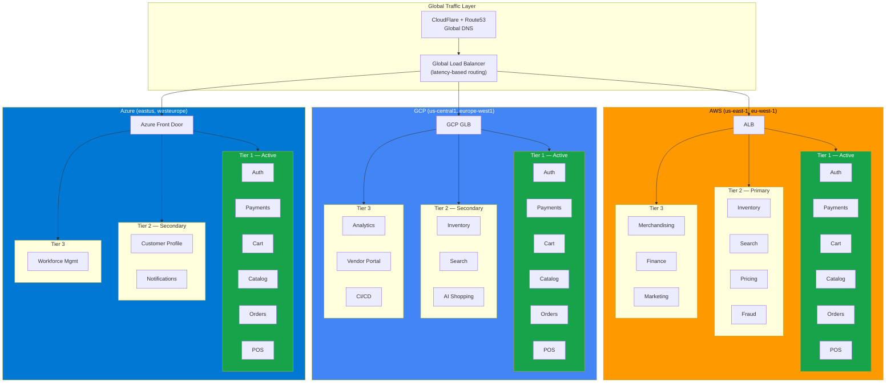
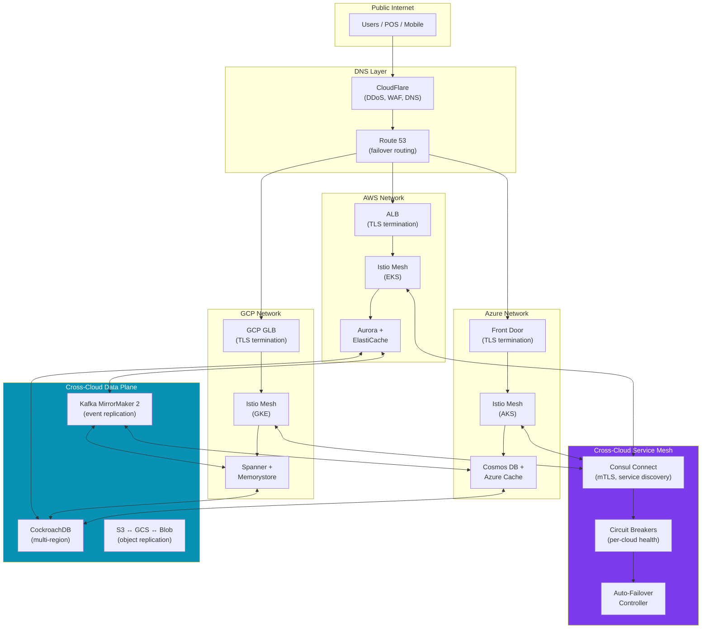
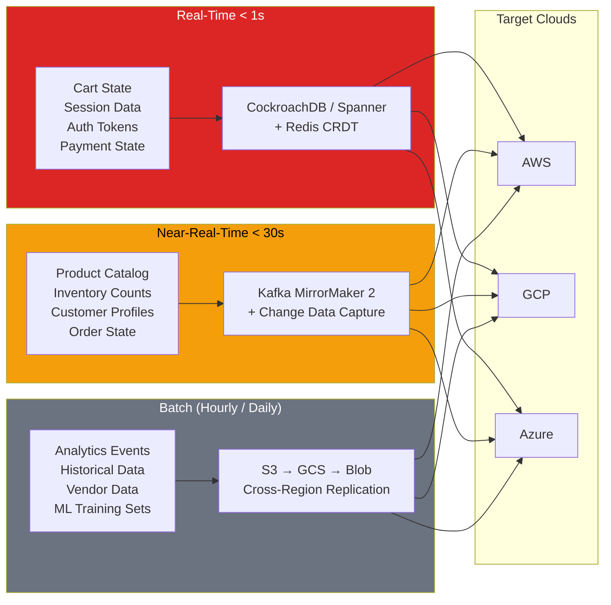
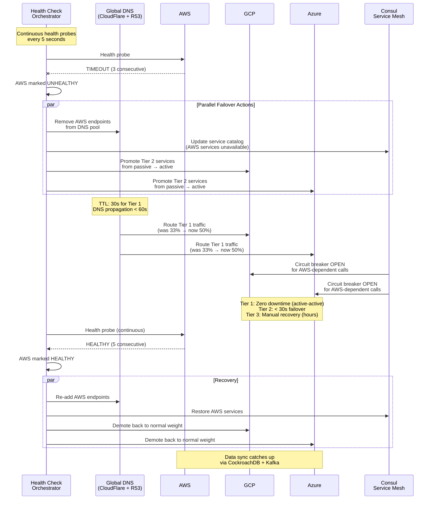
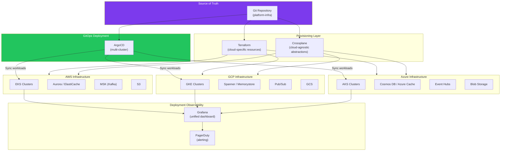

# ☁️ Multi-Cloud Strategy

> **The Triplet Model:** GodsEye runs on AWS (primary), GCP (secondary), and Azure (tertiary) — three clouds, zero data centers. Every layer of the stack — infrastructure, development, data, AI, and operations — is distributed across this triangle. See [Triplet Model Strategy](./triplet-model.md) for the full methodology.

---

## Service Tier Classification

Every GodsEye service is assigned a deployment tier based on business criticality.

### Tier 1 -- CRITICAL ("Never Down")

**Runs on ALL 3 clouds, active-active.**

| Service | AWS | GCP | Azure |
|---|:---:|:---:|:---:|
| Auth / Identity | EKS | GKE | AKS |
| Payment Gateway | EKS | GKE | AKS |
| Cart / Checkout | EKS | GKE | AKS |
| Product Catalog (read) | EKS | GKE | AKS |
| Order Capture | EKS | GKE | AKS |
| POS Engine | EKS | GKE | AKS |
| DNS / GLB | Route 53 | Cloud DNS | Azure DNS |
| CDN | CloudFront | Cloud CDN | Azure CDN |
| Session Store | ElastiCache | Memorystore | Azure Cache |
| SSL/TLS Termination | ALB | GCP GLB | Front Door |
| Rate Limiting | EKS | GKE | AKS |
| Health Check Orchestrator | EKS | GKE | AKS |

### Tier 2 -- IMPORTANT ("Degrade Gracefully")

**Runs on 2 clouds, active-passive.**

| Service | Primary | Secondary |
|---|---|---|
| Inventory | AWS | GCP |
| Search | AWS | GCP |
| Customer Profile | GCP | Azure |
| Pricing Engine | AWS | GCP |
| Notifications | AWS | Azure |
| AI Shopping Assistant | GCP | AWS |
| Fraud Detection | AWS | GCP |
| API Gateway | AWS | GCP |
| Kafka / Event Bus | AWS (MSK) | GCP (Pub/Sub) |
| Observability Pipeline | AWS | GCP |

### Tier 3 -- STANDARD ("Recover in Hours")

**Runs on 1 cloud. Cold standby or restore-from-backup.**

| Service | Cloud |
|---|---|
| Merchandising | AWS |
| Supply Chain Planning | AWS |
| Vendor Portal | GCP |
| Workforce Management | Azure |
| Finance / Accounting | AWS |
| Analytics / BI | GCP (BigQuery) |
| Marketing Automation | AWS |
| Returns Processing | AWS |
| CI/CD Platform | GCP |
| Developer Portal | GCP |
| Data Warehouse | GCP (BigQuery) |
| Batch Processing | AWS (EMR) |

---

## Three-Tier Deployment Architecture



---

## Cross-Cloud Network Topology



### Network Specifications

| Component | Technology | Purpose |
|---|---|---|
| Global DNS | CloudFlare + Route 53 | DDoS protection, latency-based routing, failover |
| Per-Cloud LB | ALB / GCP GLB / Azure Front Door | TLS termination, health checks, regional routing |
| Service Mesh | Istio + Consul Connect | mTLS between services, circuit breakers, auto-failover |
| Cross-Cloud Mesh | Consul Connect (WAN federation) | Service discovery across clouds, encrypted tunnels |
| Kubernetes | EKS / GKE / AKS | Container orchestration per cloud |

---

## Cross-Cloud Data Sync



### Sync Tier Details

| Tier | Latency Target | Data Types | Technology | Consistency Model |
|---|---|---|---|---|
| Real-Time | < 1 second | Cart, session, auth tokens, payment state | CockroachDB / Spanner + Redis CRDT | Strong (serializable) for payments; eventual for session |
| Near-Real-Time | < 30 seconds | Catalog, inventory, profiles, orders | Kafka MirrorMaker 2 + CDC | Eventual consistency with ordering guarantees |
| Batch | Hourly / Daily | Analytics, history, vendor data, ML datasets | S3 cross-region replication, scheduled ETL | Eventually consistent, idempotent loads |

---

## Conflict Resolution Strategy

| Data Type | Strategy | Rationale |
|---|---|---|
| Operational data (config, metadata) | **Last-write-wins** (LWW) with vector clocks | Simple, sufficient for low-contention data |
| Cart / Session | **CRDT** (Conflict-free Replicated Data Types) | Supports concurrent updates from multiple clouds without coordination |
| Inventory counts | **Application-level merge** | Business rules determine merge (e.g., min-of-all-counts for safety) |
| Order state | **Event sourcing** | Full audit trail; replay events to reconstruct state after conflict |
| Payment state | **Single-leader with synchronous replication** | Cannot tolerate conflicts; one cloud owns write, others replicate |

---

## Failover Flow

What happens when an entire cloud goes down:



### Failover SLAs

| Tier | Detection Time | Failover Time | Total Downtime | Data Loss |
|---|---|---|---|---|
| Tier 1 (Critical) | 15 seconds | 0 seconds (active-active) | **0 seconds** | Zero (synchronous replication) |
| Tier 2 (Important) | 15 seconds | < 30 seconds | **< 45 seconds** | < 1 second of events (async replication) |
| Tier 3 (Standard) | 15 seconds | Manual (1-4 hours) | **1-4 hours** | < 1 hour (backup restore) |

---

## Infrastructure as Code



### IaC Stack

| Layer | Tool | Purpose |
|---|---|---|
| Cloud resources | **Terraform** | VPCs, subnets, K8s clusters, managed DBs, IAM -- cloud-specific modules |
| Cloud abstractions | **Crossplane** | Cloud-agnostic CRDs for databases, caches, queues -- single manifest, multi-cloud |
| Workload deployment | **ArgoCD** | GitOps sync of Helm charts and Kustomize overlays to all clusters |
| Secrets | **Vault (HashiCorp)** | Centralized secrets, auto-rotation, cloud-agnostic access |
| Policy | **OPA / Gatekeeper** | Enforce deployment policies (resource limits, labels, security) across all clusters |

### Deployment Flow

```
1. Engineer merges PR to platform-infra repo
2. Terraform Cloud detects change → plans + applies infra changes
3. Crossplane controller reconciles cloud-agnostic resources
4. ArgoCD detects new manifests → syncs to EKS + GKE + AKS
5. Canary rollout: 5% → 25% → 50% → 100% per cloud
6. Grafana dashboards validate health across all clusters
7. Auto-rollback if error rate > 1% in any cloud
```

---

## Cost Model

| Tier | Multi-Cloud Overhead | Justification |
|---|---|---|
| Tier 1 (3x clouds) | ~2.8x single-cloud cost | Revenue-critical. Downtime cost >> infrastructure cost. |
| Tier 2 (2x clouds) | ~1.6x single-cloud cost | Degradation acceptable. Passive replica is minimal compute. |
| Tier 3 (1x cloud) | 1x (no overhead) | Hours of downtime tolerable. Backup restore sufficient. |
| **Blended average** | **~1.7x single-cloud** | Acceptable for enterprise retail SLAs. |

---

## Summary

| Dimension | Approach |
|---|---|
| **Compute** | Kubernetes everywhere (EKS/GKE/AKS) -- identical workloads, cloud-agnostic manifests |
| **Data** | CockroachDB for strong consistency, Kafka for event streaming, object store replication for batch |
| **Networking** | CloudFlare + Consul Connect mesh -- encrypted, observable, auto-failover |
| **Deployment** | Terraform + Crossplane + ArgoCD -- single Git repo, multi-cloud rollout |
| **Failover** | Tier-based: zero downtime (Tier 1), graceful degradation (Tier 2), manual recovery (Tier 3) |
| **Cost** | ~1.7x single-cloud blended. Worth it for five-nines on revenue-critical paths. |
