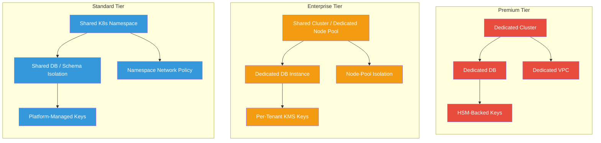
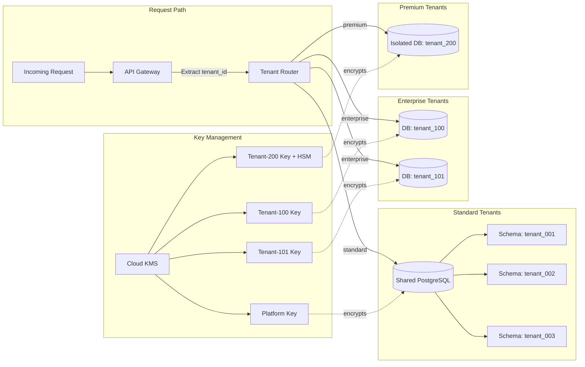
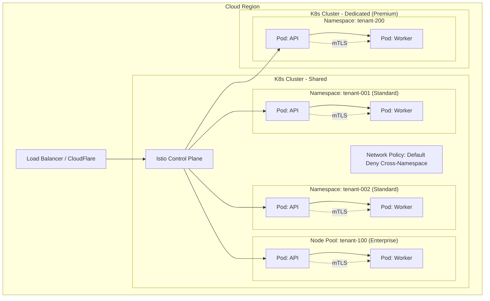
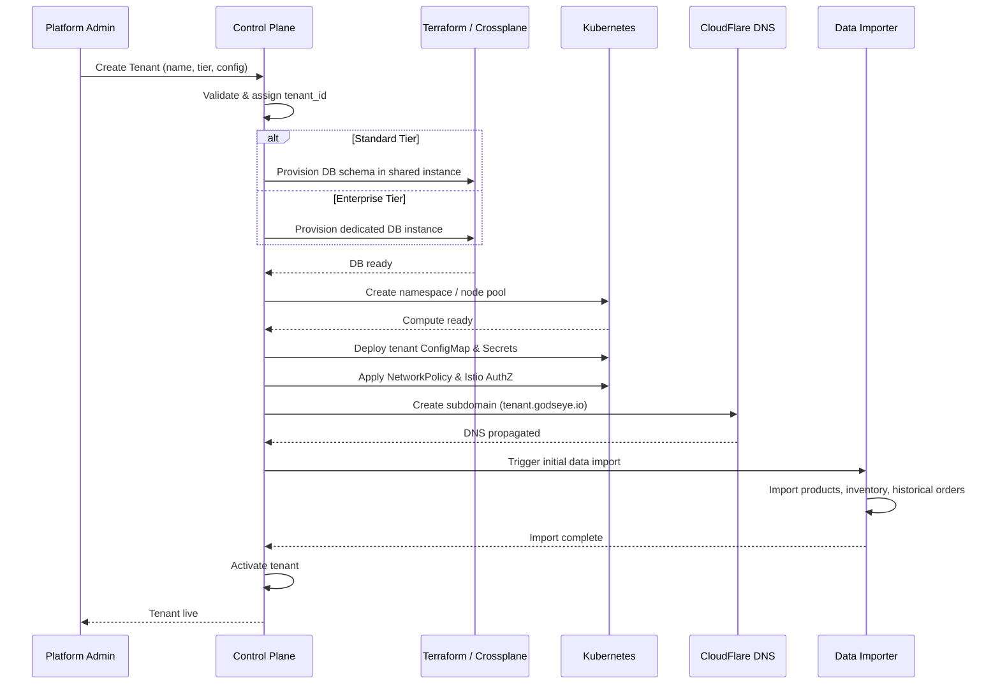
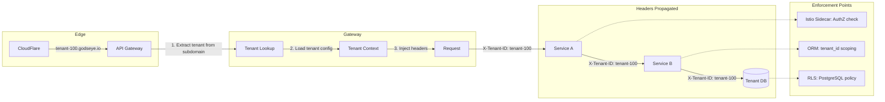

# 🏢 Multi-Tenant Architecture

GodsEye uses a **Bridge Model** multi-tenancy approach -- a tiered isolation strategy that lets each tenant operate at the isolation level matching their size, compliance posture, and budget. Tenant tiers map to [pricing tiers](./open-core.md): Free users get Standard isolation, Team gets Enterprise isolation, Enterprise gets Premium isolation.

## Tenant Tiers

| Dimension | Standard | Enterprise | Premium |
|---|---|---|---|
| **Target** | Smaller retailers | Mid-market ($1-10B rev) | Large retailers ($10B+) / strict compliance |
| **Compute** | Shared K8s namespaces | Shared cluster, dedicated node pools | Dedicated clusters |
| **Database** | Shared PostgreSQL, schema-per-tenant | Dedicated DB instance per tenant | Dedicated DB + dedicated cloud project |
| **Encryption** | Platform-managed keys | Per-tenant keys (cloud KMS) | Per-tenant keys + HSM-backed |
| **Network** | Namespace-level network policies | Node-pool-level isolation + mTLS | Dedicated VPC / VNet |
| **Compliance** | SOC 2 shared | SOC 2 + PCI-DSS Level 2 | PCI-DSS Level 1 scope, HIPAA-ready |



## Data Isolation

### Schema-per-Tenant (Standard)

Each tenant gets a dedicated PostgreSQL schema within a shared database instance. All queries are scoped by `tenant_id` enforced at the ORM/query layer and verified via row-level security (RLS) policies.

### Dedicated DB (Enterprise / Premium)

Enterprise and Premium tenants receive a fully dedicated database instance provisioned via Terraform. Connection routing is handled at the platform layer -- the application resolves the correct connection pool based on the tenant context extracted from the incoming request.

### Encryption and Residency

- **At rest**: AES-256 encryption. Standard tenants share a platform key; Enterprise/Premium tenants get a dedicated key in the cloud KMS (AWS KMS / GCP Cloud KMS / Azure Key Vault).
- **Data residency**: Per-tenant configuration specifies allowed regions. The platform enforces that tenant data is stored and processed only in those regions.
- **Cross-tenant leakage prevention**: Query-level enforcement (RLS + ORM tenant scoping), plus audit logging of every cross-schema/cross-DB access attempt.



## Compute Isolation

### Network Policies

Default-deny between all tenant namespaces. Ingress/egress rules are explicitly defined per namespace, allowing only platform services (API gateway, service mesh control plane) to communicate cross-namespace.

### Service Mesh (Istio)

All service-to-service calls use mTLS. Tenant context is propagated via request headers (`X-Tenant-ID`, `X-Tenant-Tier`). Authorization policies in Istio enforce that a service can only access resources for the tenant identified in the request.



## Tenant Onboarding Flow



### Onboarding Steps Summary

| Step | Action | Tooling |
|---|---|---|
| 1 | Create tenant record | Control Plane API |
| 2 | Provision database | Terraform / Crossplane |
| 3 | Deploy K8s resources | ArgoCD + Helm |
| 4 | Configure DNS | CloudFlare API |
| 5 | Import initial data | Custom data pipeline (Kafka + workers) |
| 6 | Activate | Feature flag flip + health check |

## Tenant Configuration

Each tenant carries a configuration object that controls platform behavior:

```yaml
# Example: tenant-100.yaml
tenant:
  id: tenant-100
  name: "Acme Retail"
  tier: enterprise
  region: us-east-1
  features:
    ai_agents: true
    demand_forecasting: true
    dynamic_pricing: false       # not enabled for this tenant
    real_time_analytics: true
  branding:
    primary_color: "#1a73e8"
    logo_url: "https://cdn.godseye.io/tenant-100/logo.svg"
  integrations:
    erp: sap_s4hana
    pos: oracle_xstore
    payment: adyen
  compliance:
    pci_dss_level: 2
    data_residency: [us-east-1, us-west-2]
  ai:
    llm_provider: claude          # tenant-level LLM preference
    self_hosted_models: false
    agent_memory_ttl: 30d
```

## Request Routing with Tenant Context

Every request entering the platform is stamped with tenant context at the edge and carries it through the entire call chain.



## Scaling and Noisy-Neighbor Prevention

| Mechanism | Purpose |
|---|---|
| **HPA per tenant namespace** | Horizontal Pod Autoscaling scoped to each tenant's workloads |
| **Resource Quotas** | CPU/memory limits per namespace prevent a single tenant from starving others |
| **Priority Classes** | Higher-tier tenants get scheduling priority during contention |
| **Pod Disruption Budgets** | Ensure minimum replica counts during cluster operations |
| **Tenant-aware scheduling** | Affinity/anti-affinity rules place enterprise/premium pods on dedicated node pools |
| **Rate limiting** | Per-tenant rate limits at the API gateway (token bucket) |

```yaml
# Example: ResourceQuota for a Standard tenant namespace
apiVersion: v1
kind: ResourceQuota
metadata:
  name: tenant-001-quota
  namespace: tenant-001
spec:
  hard:
    requests.cpu: "4"
    requests.memory: 8Gi
    limits.cpu: "8"
    limits.memory: 16Gi
    pods: "50"
    services: "10"
    persistentvolumeclaims: "5"
```
