# 💰 Open-Core Monetization Strategy

> **The code is free. That's not a bug — it's the distribution strategy.**

GodsEye is open-core: the full platform source code is available under the Business Source License (BSL 1.1). Anyone can self-host, modify, and contribute. Revenue comes from **managed hosting**, **enterprise features**, and **support SLAs** — not from restricting access to the code.

This is the same model that built Red Hat ($34B acquisition), MongoDB ($1.7B ARR), GitLab, Grafana Labs, CockroachDB, and Sentry into billion-dollar companies. The code being free is what gets millions of users without spending millions on marketing.

---

## 1. Why Open-Core Wins for Retail

| Model | Code Access | Revenue Source | GodsEye Fit |
|-------|------------|----------------|-------------|
| Proprietary SaaS | Closed | Subscriptions | Lock-in, slow adoption, expensive sales |
| Pure Open Source | Fully open | Donations / support | No sustainable revenue |
| **Open-Core (BSL)** | **Source-available, self-hostable** | **Managed hosting + enterprise features** | **Best of both — fast adoption, sustainable revenue** |

Companies don't pay for code. They pay to **not deal with** code:

- **Managed hosting** — they don't want to hire infra engineers to run a retail platform
- **Enterprise features** — SSO, audit logs, compliance, RBAC are non-negotiable for a 10,000-person retailer
- **Support SLAs** — when checkout is down on Black Friday, they need someone to call within 4 hours
- **Data gravity** — once 50,000 products and 5 years of transaction history live in GodsEye Cloud, migration cost exceeds any subscription fee

---

## 2. Licensing — Business Source License (BSL 1.1)

### License Comparison

| License | Self-Host | Modify | Contribute Back | Cloud Provider Can Resell | GodsEye Choice |
|---------|----------|--------|-----------------|--------------------------|----------------|
| MIT | Yes | Yes | Optional | Yes (no protection) | Too permissive |
| Apache 2.0 | Yes | Yes | Optional | Yes (no protection) | Too permissive |
| AGPL v3 | Yes | Yes | Must share | Yes (if they share code) | Partial protection |
| SSPL | Yes | Yes | Must share | No (but legally ambiguous) | Too aggressive |
| **BSL 1.1** | **Yes** | **Yes** | **Optional** | **No (clear, enforceable)** | **Selected** |

### How BSL Works for GodsEye

```mermaid
flowchart LR
    subgraph BSL["BSL 1.1 License"]
        ALLOWED["✅ Allowed\n\n• Self-host for internal use\n• Modify source code\n• Build plugins on top\n• Use in development/staging\n• Contribute improvements back\n• Run for your own retail business"]
        RESTRICTED["🚫 Restricted\n\n• Offer GodsEye as a\n  managed service to\n  third parties without\n  commercial license"]
        SUNSET["⏳ Sunset\n\nAfter 4 years, each\nversion converts to\nApache 2.0\n(fully open source)"]
    end

    ALLOWED --> SUNSET
    RESTRICTED -->|"Commercial license\navailable"| PARTNER["Cloud Partner Program\n(AWS, GCP, Azure\nmarketplace listings)"]
```

### Per-Module License

| Module Category | License | Rationale |
|----------------|---------|-----------|
| Core platform (L2-L4) | BSL 1.1 | Primary IP, needs cloud resale protection |
| AI agents (L3) | BSL 1.1 | Competitive advantage, fine-tuned models |
| Client SDKs & CLIs | Apache 2.0 | Maximize adoption, no resale risk |
| EXTEND plugin SDK | Apache 2.0 | Encourage community plugin ecosystem |
| API specs & protocols | Apache 2.0 | Interoperability, standards adoption |
| Documentation | CC BY 4.0 | Community-editable, attributable |
| Example apps & templates | MIT | Lowest friction for getting started |

---

## 3. Three-Tier Pricing

### Overview

| Dimension | Free (Community) | Team ($8/user/mo) | Enterprise ($20/user/mo) |
|-----------|-----------------|-------------------|--------------------------|
| Deployment | Self-hosted only | Self-hosted or GodsEye Cloud | Self-hosted or GodsEye Cloud |
| Support | Community (GitHub, Discord) | Email + Slack (48hr SLA) | Dedicated CSM + SLA (4hr P1) |
| Users | Unlimited | Unlimited | Unlimited |
| Cloud projects | Up to 3 | Up to 20 | Unlimited |
| Data retention | 7 days (telemetry) | 90 days | Unlimited + compliance export |
| SSO / SAML | — | — | Yes |
| Audit logs | — | Basic | Full + compliance export |
| SLA guarantee | — | 99.9% | 99.99% |
| Compliance | — | — | SOC 2, PCI-DSS, HIPAA |

---

### L1: Infrastructure — Multi-Cloud

| Capability | Free | Team | Enterprise |
|------------|------|------|------------|
| Single-cloud K8s deployment (EKS or GKE or AKS) | Yes | Yes | Yes |
| Terraform / Crossplane modules | Yes | Yes | Yes |
| Helm charts + ArgoCD manifests | Yes | Yes | Yes |
| Multi-cloud deployment (2 clouds) | — | Yes | Yes |
| Full triplet (3 clouds, active-active) | — | — | Yes |
| Cross-cloud data sync (async, < 30s) | — | Yes | Yes |
| Cross-cloud data sync (real-time, < 1s) | — | — | Yes |
| Cloud cost optimization agent | — | — | Yes |
| Egress optimization engine | — | — | Yes |
| Disaster recovery automation | — | — | Yes |
| Cross-cloud service mesh (Consul + Istio) | — | — | Yes |

### L2: Engineering Platform (12 Modules)

> Full per-module breakdown in [Engineering Platform](../architecture/engineering-platform.md). Summary below.

| Module | Free | Team | Enterprise |
|--------|------|------|------------|
| **PORTAL** | Service catalog, basic templates, docs | SSO integration, env provisioning | AI code assistant, DORA dashboards, audit log |
| **OBSERVE** | Metrics + logs + traces, 7-day retention | 90-day retention, custom dashboards | AI anomaly detection, 13-month retention, SLO automation |
| **RESPOND** | Alert routing, on-call scheduling | Multi-team war rooms, basic playbooks | AI root cause analysis, auto-remediation, SLA tracking |
| **DEPLOY** | GitOps (single cloud), basic canary | Multi-cloud deploy, feature flags | Auto-rollback on SLO, compliance gates (SOX, PCI) |
| **SHIELD** | SAST, container scanning, OPA | DAST, runtime detection | Full SCA, compliance dashboard, secret auto-rotation, SBOM |
| **FLOW** | Basic DAGs, Kafka, schema registry | Visual pipeline builder, CDC | Managed Flink/Spark, cross-cloud sync, lineage |
| **LENS** | Pre-built dashboards, SQL, CSV export | Custom dashboards, scheduled reports | NL queries (AI), embedded SDK, AI insights |
| **MOBILE** | Flutter templates, basic offline, barcode | Segmented push, A/B testing | Custom app builder, NFC/RFID, MDM |
| **CONNECT** | API gateway, 10 connectors, REST | 30 connectors, webhook retry | 50+ connectors, GraphQL federation, API monetization |
| **GOVERN** | Basic cost visibility, quotas, tag linting | Cross-cloud federation, drift detection | FinOps engine, chargeback, approval workflows |
| **MARKET** | Template catalog, Helm charts | Usage analytics, version pinning | Approval workflows, dependency analysis, private marketplace |
| **EXTEND** | TypeScript SDK, basic hooks, CLI dev | Python SDK, full hooks catalog | Visual builder, WASM runtime, private registry |

### L3: AI Engine

| Capability | Free | Team | Enterprise |
|------------|------|------|------------|
| LLM Gateway (single provider, BYO key) | Yes | Yes | Yes |
| Knowledge Graph (read-only) | Yes | Yes | Yes |
| 5 core agents (L0-L1 trust) | Yes | Yes | Yes |
| All 22+ central agents (L0-L2 trust) | — | Yes | Yes |
| L3 PREVENT trust level | — | — | Yes |
| Project Sentinel agents | — | Up to 20 | Unlimited (100-200) |
| Multi-provider LLM failover chain | — | Yes | Yes |
| Fine-tuned retail models | — | — | Yes |
| Custom agent builder | — | — | Yes |
| Self-hosted LLM support (Llama 4, Mistral) | Yes (BYO) | Yes (managed) | Yes (managed + fine-tuned) |
| Agent audit log | 7-day | 90-day | Unlimited + compliance export |
| A2A inter-agent protocol | Basic | Full | Full + custom protocols |
| Triplet loss embeddings (product matching) | — | Yes (pre-trained) | Yes (custom fine-tuned) |
| Vector search (Pinecone/Weaviate) | — | Managed index (1M vectors) | Unlimited + multi-region replicas |

### L4: Business Operations

| Capability | Free | Team | Enterprise |
|------------|------|------|------------|
| Commerce Engine (headless, single store) | Yes | Yes | Yes |
| Product Catalog (up to 10K SKUs) | Yes | Yes | Yes |
| Basic OMS (order lifecycle) | Yes | Yes | Yes |
| POS (single register, cloud-connected) | Yes | Yes | Yes |
| Inventory (single location) | Yes | Yes | Yes |
| Multi-location inventory + ATP | — | Yes | Yes |
| Multi-store POS + offline-first (72hr) | — | — | Yes |
| Fulfillment engine (DC + store + vendor) | — | Yes (basic) | Yes (AI-optimized) |
| Demand Forecasting agent | — | Weekly forecasts | Daily per-SKU, < 15% MAPE |
| Dynamic Pricing agent | — | — | Yes |
| Fraud Detection | — | Rule-based | AI + GNN + custom rules |
| CRM + Loyalty program | — | Yes | Yes + AI churn prediction |
| Supply Chain Management | — | — | Yes |
| Workforce Management | — | — | Yes |
| Finance & AP/AR | — | — | Yes |
| Marketing automation | — | Basic campaigns | AI-optimized, multi-channel |
| Vendor Management | — | — | Yes |
| Multi-currency / multi-region | — | — | Yes |

### L5: Customer Experience

| Capability | Free | Team | Enterprise |
|------------|------|------|------------|
| Web Storefront (Next.js, SSR, CDN) | Yes | Yes | Yes |
| AI Shopping Assistant (basic, text) | Yes | Yes | Yes |
| Mobile app framework (React Native) | — | Yes | Yes |
| Social commerce integrations | — | Yes | Yes |
| Visual Search & Style AI | — | — | Yes |
| Voice Commerce (Alexa, Google Home) | — | — | Yes |
| In-Store Systems (kiosks, digital signage, smart mirrors) | — | — | Yes |
| AR try-on | — | — | Yes |
| Live Commerce (live video shopping) | — | — | Yes |
| Personalization Engine (AI homepage, email, push) | — | Basic rules | AI-powered, real-time |

---

## 4. Enterprise-Only Features — What Companies Pay For

These are the features a 10-person startup doesn't need but a 10,000-person retailer cannot live without:

| Feature | Why Enterprises Need It | Free/Team Alternative |
|---------|------------------------|-----------------------|
| **SSO / SAML / OIDC** | Corporate identity, one login for everything | Local auth (username/password) |
| **Audit Logging** | SOX compliance, security investigations | Basic logs, 7-day retention |
| **PCI-DSS Compliance** | Process credit cards legally | Use 3rd-party payment processor |
| **SOC 2 / HIPAA Reporting** | Vendor assessment, regulated industries | Self-attest |
| **Custom RBAC (OPA/Rego)** | Per-department, per-store permissions | Basic role-based access |
| **Dedicated Database** | Data isolation, performance guarantees | Shared schema (row-level isolation) |
| **HSM-Backed Encryption** | Hardware key management, compliance | Platform-managed keys |
| **99.99% SLA** | Contractual uptime guarantee | Best-effort |
| **4-Hour P1 Support** | Black Friday checkout is down at 2am | Community forums |
| **Dedicated CSM** | Quarterly business reviews, roadmap input | Self-service docs |
| **Cross-Cloud Active-Active** | Zero-downtime, no single cloud dependency | Single-cloud deployment |
| **L3 PREVENT Trust** | AI agents block risks proactively | L0-L2 (observe, suggest, auto-fix) |
| **Unlimited Sentinels** | One AI agent per cloud project | Up to 20 (Team) or none (Free) |

---

## 5. GodsEye Cloud — Managed Hosting

> **This is where 70-80% of revenue comes from.** Companies can self-host for free. Most will pay to not deal with it.

### Why Companies Choose Managed

| Concern | Self-Hosted (Free) | GodsEye Cloud (Paid) |
|---------|-------------------|---------------------|
| Infrastructure | You hire infra engineers | We handle it |
| Upgrades | You test + deploy monthly patches | Automatic, zero-downtime |
| Scaling | You configure HPA, node pools, spot | Auto-scaling, burst-to-cloud |
| Backups | You manage backup schedules + restore drills | Continuous, point-in-time recovery |
| Security patches | You monitor CVEs + apply patches | Same-day patching, automated |
| Uptime | Best-effort, your team on-call | 99.99% SLA, our SRE team 24/7 |
| Monitoring | You set up Prometheus + Grafana | Pre-configured, AI anomaly detection |
| Cost | $0 software + $X infrastructure + $Y team | $8-20/user/mo all-in |

### Architecture — Control Plane + Tenant Data Planes

**Customer chooses their cloud.** GodsEye Cloud runs equally on AWS, GCP, and Azure. Each tenant gets an isolated environment on their preferred provider. See [Triplet Model](./triplet-model.md) for cloud equalization strategy and [Multi-Tenant](./multi-tenant.md) for isolation tiers.

---

## 6. Revenue Model

### Revenue Streams

```mermaid
flowchart LR
    subgraph Revenue["💰 Revenue Streams"]
        CLOUD["GodsEye Cloud\n(Managed Hosting)\n70-75%"]
        LICENSE["Enterprise Licenses\n(Self-Hosted)\n10-15%"]
        SERVICES["Professional Services\n(Migration, Integration)\n5-10%"]
        MARKETPLACE["Marketplace Revenue Share\n(Community Plugins)\n3-5%"]
        TRAINING["Training & Certification\n(GodsEye Certified Engineer)\n2-3%"]
    end

    CLOUD --> ARR["Annual\nRecurring\nRevenue"]
    LICENSE --> ARR
    SERVICES --> ARR
    MARKETPLACE --> ARR
    TRAINING --> ARR
```

### Conversion Funnel

### ARR Projections

| Year | Free Users | Team Users | Enterprise Users | GodsEye Cloud % | Est. ARR |
|------|-----------|------------|------------------|-----------------|----------|
| Y1 | 500 | 50 | 10 | 30% | $500K |
| Y2 | 2,000 | 250 | 40 | 45% | $2.8M |
| Y3 | 8,000 | 1,000 | 150 | 55% | $14M |
| Y4 | 25,000 | 3,000 | 400 | 65% | $42M |
| Y5 | 60,000 | 8,000 | 1,000 | 75% | $120M |

> **Benchmark:** 0.1% of Google Workspace's user base = 3M users. If 5% convert to Team at $8/user/mo = $14.4M ARR. The open-source community is building features while earning their share.

### Revenue Math — Year 3 Example

| Stream | Calculation | Revenue |
|--------|------------|---------|
| GodsEye Cloud (Team) | 550 users × $8/mo × 12 | $528K |
| GodsEye Cloud (Enterprise) | 82 users × $20/mo × 12 | $197K |
| Self-hosted Enterprise licenses | 68 orgs × $50K/yr avg | $3.4M |
| Self-hosted Team licenses | 450 orgs × $15K/yr avg | $6.75M |
| Professional services | 30 engagements × $80K avg | $2.4M |
| Marketplace rev share (20%) | $2M GMV × 20% | $400K |
| Training & certification | 500 certs × $500 each | $250K |
| **Total** | | **~$14M** |

---

## 7. Community Contribution Model

> **"Let's hope someone will build it for us."** — That's not hope, it's a strategy. Every successful open-core company gets more feature velocity from community than from internal engineering.

### Contributor Tiers

| Tier | Criteria | Rewards |
|------|----------|---------|
| **Contributor** | 1+ merged PR | Name in CONTRIBUTORS.md, community badge |
| **Active Contributor** | 10+ PRs, regular activity over 3+ months | Free Team license, early access to roadmap, contributor Slack channel |
| **Core Contributor** | Sustained, significant contributions to a module | Marketplace revenue share, GodsEye Cloud credits ($500/mo), conference sponsorship |
| **Maintainer** | Trusted steward of a module, review authority | Paid stipend ($2-5K/mo), Enterprise license, direct input on module roadmap |

### Plugin Marketplace Revenue Share

### Community Governance

| Body | Role | Composition |
|------|------|-------------|
| **Technical Steering Committee (TSC)** | Approve RFCs, set technical direction, resolve disputes | 5-9 members: 3 GodsEye core team + 2-6 community maintainers |
| **Module Maintainers** | Review PRs, triage issues, manage releases per module | 1-3 per module, elected by active contributors |
| **Community Council** | Non-technical governance, events, outreach, inclusivity | Community-elected, annual terms |

### Contribution Ecosystem

| Activity | Impact | Who Benefits |
|----------|--------|--------------|
| Bug reports + fixes | Platform stability | All users |
| New connectors (CONNECT) | Broader integration ecosystem | Team + Enterprise users |
| Plugins (EXTEND) | Feature velocity without internal engineering | Plugin developers (revenue) + users |
| Translations | Global market expansion | Non-English retailers |
| Documentation | Lower onboarding friction | Free tier conversion |
| Templates (MARKET) | Faster time-to-value for new users | Template authors (revenue) + users |
| Performance optimization | Better user experience | All tiers |

> Full contribution guide in [Community Strategy](./community.md).

---

## 8. 3rd-Party to Build-Own Migration Path

Start with proven 3rd-party tools behind GodsEye adapters. Build own services as revenue funds engineering. Community accelerates the transition.

### Phase Alignment with Revenue

| Phase | Timeline | Revenue Milestone | Engineering Focus | Community Role |
|-------|----------|-------------------|-------------------|----------------|
| **Phase 1** | Months 1-12 | $0 → $500K ARR | Adapters + integrations, Free tier launch | Early adopters, bug reports, docs |
| **Phase 2** | Months 12-24 | $500K → $5M ARR | Build core modules (Commerce, Search, Observe) | Connectors, plugins, templates |
| **Phase 3** | Months 24+ | $5M → $50M+ ARR | Full GodsEye-native, enterprise features | Module contributions, marketplace growth |

### Adapter Pattern — Zero-Downtime Swap

Every 3rd-party integration goes through a GodsEye Adapter. When the native service is ready, swap the adapter — zero downtime, zero code changes for the application layer. See [Build vs Buy Strategy](./build-vs-buy.md) for the full decision framework.

---

## 9. Cloud Equalization Strategy

GodsEye Cloud runs **equally** across all three providers. No single cloud gets preferential treatment.

### Migration Roadmap

| Phase | Timeline | AWS | GCP | Azure | Key Actions |
|-------|----------|-----|-----|-------|-------------|
| Current | Now | 60% | 25% | 15% | Baseline (historical AWS-heavy) |
| Phase 1 | Q1-Q2 | 45% | 30% | 25% | Shift Tier 3 + CI runners to Azure/GCP |
| Phase 2 | Q3-Q4 | 38% | 33% | 29% | Shift Tier 2 secondaries, balance ML training |
| **Target** | **Q1-Q2 Y2** | **33%** | **33%** | **34%** | **Full equalization** |

### Why Equalize

| Benefit | Impact |
|---------|--------|
| **Vendor leverage** | 3 equal-weight contracts = 15-25% savings via competitive bidding |
| **Customer choice** | GodsEye Cloud tenants deploy on their preferred cloud |
| **Talent pool** | Hire from all 3 cloud ecosystems equally |
| **Resilience** | No cloud is "primary" — any cloud failing = 33% capacity loss, not 60% |
| **Best-of-breed** | Each cloud for what it does best — BigQuery for analytics, Bedrock for Claude, Azure for enterprise SSO |

> Full cloud architecture in [Triplet Model Strategy](./triplet-model.md).

---

## 10. Data Gravity as a Moat

Data gravity is not lock-in. GodsEye data is always **fully exportable** via open APIs. But the accumulated value makes staying worthwhile.

```mermaid
flowchart TD
    DATA["📊 More Data in GodsEye\n(transactions, catalog, customers)"]
    AI["🧠 Better AI Predictions\n(demand forecasting, personalization,\nfraud detection)"]
    VALUE["💎 More Business Value\n(higher revenue, lower shrink,\nbetter margins)"]
    STAY["🏠 Stronger Reason to Stay\n(switching cost = retraining AI\n+ rebuilding integrations\n+ migrating history)"]

    DATA --> AI --> VALUE --> STAY --> DATA

    style DATA fill:#3b82f6,color:#fff
    style AI fill:#7c3aed,color:#fff
    style VALUE fill:#059669,color:#fff
    style STAY fill:#d97706,color:#000
```

### Types of Data Gravity

| Data Type | Volume After 1 Year | Switching Cost |
|-----------|---------------------|----------------|
| Transaction history | 10M+ orders, 50M+ line items | Re-import, re-map to new schema |
| Customer profiles | 500K+ profiles with preferences, CLV scores | Lose AI-generated segments + predictions |
| Product catalog | 100K+ SKUs with images, attributes, embeddings | Re-generate embeddings, re-train matching models |
| AI model training data | 1TB+ labeled data, fine-tuned models | 6+ months to retrain models to equivalent accuracy |
| Operational telemetry | 5TB+ logs, metrics, traces, incident history | Lose anomaly baselines, incident correlations |
| Compliance audit logs | 2+ years of immutable audit trail | Regulatory risk during migration |

### Ethical Approach

GodsEye is **not** lock-in. Every byte is exportable:
- Full data export via REST + GraphQL APIs
- Standard formats (CSV, JSON, Parquet)
- Schema documentation for every table
- Migration tooling provided (even to competitors)

The moat is not the walls — it's the value inside. Customers stay because GodsEye delivers more value than the cost of staying, not because leaving is impossible.

---

## 11. OSS Company Comparison

| Company | License | Primary Revenue | ARR at Scale | Key Lesson for GodsEye |
|---------|---------|-----------------|-------------|------------------------|
| **Red Hat** | GPL | Support + subscriptions | $3.4B (acquired for $34B) | Enterprise support SLAs alone can build a billion-dollar company |
| **MongoDB** | SSPL | Atlas (managed hosting) = 65%+ | $1.7B | Managed hosting dominates; SSPL protects from cloud resale |
| **GitLab** | MIT (CE) + Proprietary (EE) | Free/Premium/Ultimate tiers | $580M | Transparent 3-tier pricing drives predictable upgrade path |
| **Grafana Labs** | AGPL v3 | Grafana Cloud (managed) | $300M+ | Give away the visualization, monetize the hosting + scale |
| **CockroachDB** | BSL 1.1 | CockroachDB Cloud | $200M+ | BSL is the gold standard for protecting against cloud resale |
| **Confluent** | Community License | Confluent Cloud = 80%+ revenue | $800M+ | Data infrastructure monetizes through managed hosting |
| **HashiCorp** | BSL 1.1 | HCP (cloud) + Enterprise licenses | $600M (acquired for $5.7B) | Multi-tool platform with unified cloud — exactly GodsEye's model |
| **Sentry** | BSL 1.1 | Sentry Cloud (managed) | $200M+ | BSL works: code is open, company thrives |
| **Elastic** | SSPL + Elastic License | Elastic Cloud | $1.2B | Moved from Apache to SSPL after AWS created OpenSearch fork |

### GodsEye's Position

GodsEye follows the **HashiCorp playbook** most closely:
- Multiple tools (Terraform, Vault, Consul, Nomad) → GodsEye's 36 components
- BSL 1.1 licensing → Same
- HCP (HashiCorp Cloud Platform) → GodsEye Cloud
- Enterprise licenses for self-hosted → Same
- Community-driven ecosystem → Same

The difference: GodsEye is **vertical** (retail-specific) while HashiCorp is horizontal (infrastructure). Vertical open-core has higher conversion rates because the enterprise features (POS, inventory, demand forecasting) are industry-specific and harder to build in-house.

---

## Summary

| Dimension | GodsEye Approach |
|-----------|-----------------|
| **License** | BSL 1.1 (converts to Apache 2.0 after 4 years) |
| **Tiers** | Free / Team ($8/user/mo) / Enterprise ($20/user/mo) |
| **Primary Revenue** | GodsEye Cloud (managed hosting) — 70-75% |
| **Enterprise Moat** | SSO, audit, compliance, SLA, dedicated CSM |
| **Cloud Strategy** | Equal across AWS, GCP, Azure (33/33/34) |
| **Community** | Contributor tiers, plugin marketplace (80/20), TSC governance |
| **Build Strategy** | 3rd-party adapters first → build own as revenue grows |
| **Data Gravity** | Not lock-in — value-based retention, fully exportable |
| **Target** | $120M ARR by Year 5, community-driven feature velocity |
