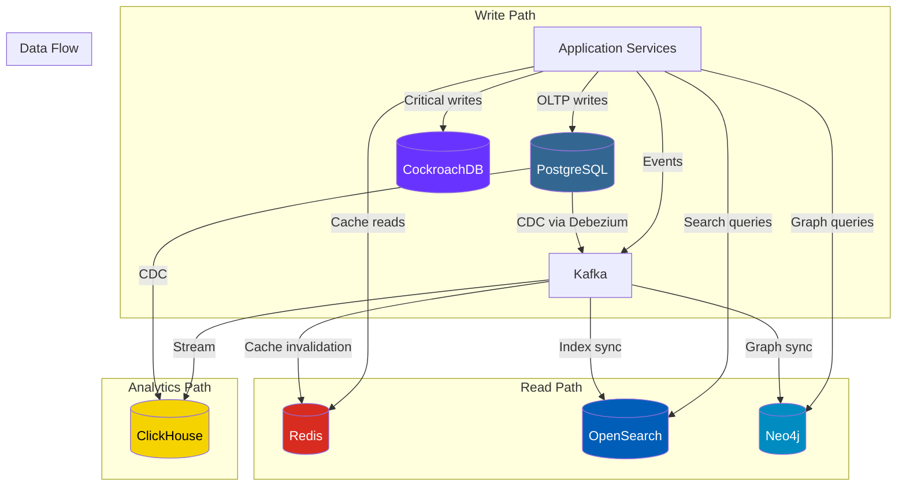
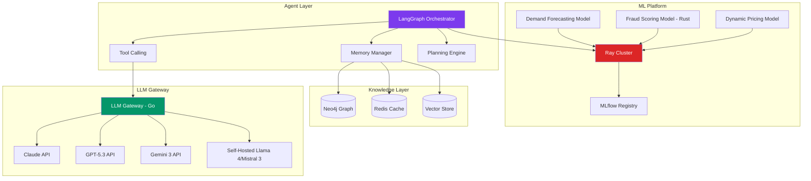
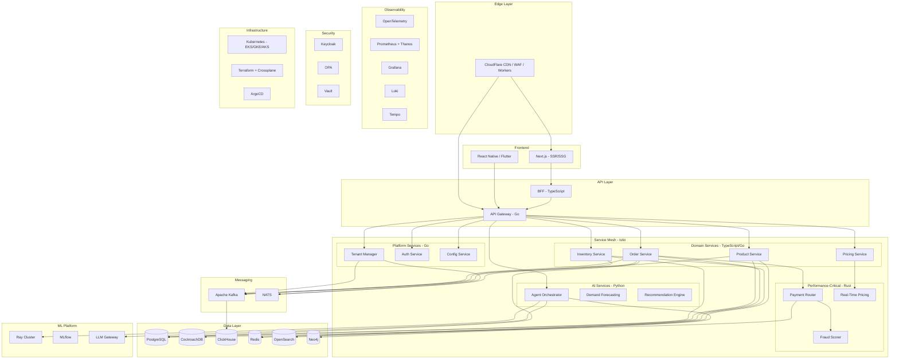

# 🔧 Technology Stack

Complete technology stack for the GodsEye platform with rationale for each choice.

## Languages

| Language | Usage | Why |
|---|---|---|
| **Go** | Platform services, API gateway, high-performance backend | Performance, native concurrency (goroutines), small statically-linked binaries ideal for multi-cloud container deployments |
| **TypeScript** | API layer, frontend (Next.js/React), Backend-for-Frontend | Full-stack consistency, massive ecosystem, type safety across client and server |
| **Python** | AI/ML pipelines, data processing, agent orchestration | Dominant AI/ML ecosystem (LangChain, LangGraph, PyTorch, scikit-learn), rapid prototyping |
| **Rust** | Performance-critical paths: payment routing, fraud scoring, real-time pricing engine | Zero-cost abstractions, memory safety without GC, predictable latency for financial operations |

## Databases

| Database | Role | Why |
|---|---|---|
| **PostgreSQL** | Primary OLTP -- tenant data, orders, products, inventory | Battle-tested, schema-per-tenant via schemas + RLS, rich extension ecosystem (PostGIS, pg_partman) |
| **CockroachDB v26** | Cross-cloud distributed SQL for Tier 1 critical data (payment records, audit logs) | Serializable isolation, automatic geo-partitioning, survives full cloud-region failures |
| **ClickHouse** | Analytics / OLAP -- time-series metrics, business intelligence queries | Column-oriented, sub-second queries on billions of rows, efficient compression |
| **Redis** | Caching, session store, shopping cart state | Sub-ms latency, CRDT support (Redis Enterprise) for cross-cloud active-active cart sync |
| **OpenSearch** | Product search, log search, full-text queries | Scalable full-text search, integrates with observability stack, OpenSearch Dashboards for ops |
| **Neo4j** | Knowledge graph -- AI agent context, product relationships, customer journey graphs | Native graph storage, Cypher query language, efficient multi-hop traversals for agent reasoning |

## Messaging and Streaming

| Technology | Role | Why |
|---|---|---|
| **Apache Kafka** | Event bus, cross-cloud replication (MirrorMaker 2), CDC | Durable, ordered, exactly-once semantics, proven at scale for event-driven architectures |
| **NATS** | Lightweight service-to-service messaging, request/reply | Ultra-low latency, small footprint, ideal for internal microservice communication where Kafka is overkill |

## Infrastructure

| Technology | Role | Why |
|---|---|---|
| **Kubernetes 1.35+** (EKS / GKE / AKS) | Compute orchestration across AWS, GCP, Azure | Industry standard, consistent abstraction across all three clouds |
| **Terraform + Crossplane** | Infrastructure as Code | Terraform for base infra, Crossplane for K8s-native cloud resource management (cloud-agnostic) |
| **ArgoCD** | GitOps continuous deployment | Declarative, auditable deployments; auto-sync from Git; multi-cluster support |
| **Istio** | Service mesh -- mTLS, traffic management, observability | Zero-trust networking, tenant-aware routing, canary/blue-green deployments, built-in telemetry |
| **CloudFlare** | CDN, DNS, DDoS protection, WAF, edge compute (Workers) | Global edge network, sub-50ms TTFB, programmable edge for tenant routing and A/B testing |

## Observability

| Technology | Role | Why |
|---|---|---|
| **OpenTelemetry** | Instrumentation standard -- traces, metrics, logs | Vendor-neutral, single SDK for all signals, wide language support |
| **Prometheus + Thanos** | Metrics collection and cross-cloud federation | Prometheus for per-cluster metrics, Thanos for global view with long-term storage |
| **Grafana** | Dashboards and alerting | Unified visualization across Prometheus, Loki, Tempo; tenant-scoped dashboards |
| **Loki** | Log aggregation | Label-based indexing (matches Prometheus model), cost-effective on object storage |
| **Tempo** | Distributed tracing backend | Integrates with OpenTelemetry, trace-to-log/metric correlation in Grafana |

## AI / ML

| Technology | Role | Why |
|---|---|---|
| **LangChain 1.0 / LangGraph 1.0** | Agent orchestration, chains, tool use, stateful workflows | Stable 1.0 releases with durable agent state, A2A/MCP protocol support, production-proven at Uber/LinkedIn/Klarna |
| **Claude Opus 4.6, GPT-5.3-Codex, Gemini 3 Pro** | LLM providers (via LLM Gateway) | Multi-model strategy avoids vendor lock-in; route by cost, latency, or capability per task |
| **Llama 4 Maverick / Mistral Large 3** (self-hosted) | On-prem LLM for data-sensitive tenants | Llama 4 Maverick (400B total, 17B active MoE), Mistral Large 3 (675B total, 41B active) -- data never leaves tenant boundary |
| **Ray** | Distributed ML training and serving | Scales from laptop to cluster, unified framework for training + inference |
| **MLflow** | Model lifecycle management | Experiment tracking, model registry, deployment management, audit trail |

## Auth and Security

| Technology | Role | Why |
|---|---|---|
| **Keycloak** | Identity and access management (IAM) | Open-source, multi-realm (one realm per tenant), active-active across clouds, OIDC/SAML |
| **Open Policy Agent (OPA)** | Policy enforcement -- RBAC, ABAC, tenant isolation policies | Declarative (Rego), decoupled from application code, auditable policy decisions |
| **HashiCorp Vault** | Secret management -- DB credentials, API keys, encryption keys | Dynamic secrets, auto-rotation, cloud KMS integration, audit logging |
| **Trivy + Snyk** | Container image scanning + dependency vulnerability scanning | Shift-left security: scan in CI/CD before images reach production |

## Frontend

| Technology | Role | Why |
|---|---|---|
| **Next.js 16** | Web storefront (SSR/SSG), admin dashboard | Server-side rendering for SEO, static generation for performance, React Server Components, `use cache` directive |
| **React Native** or **Flutter** | Mobile apps (associate-facing, customer-facing) | Cross-platform from single codebase; React Native for JS consistency, Flutter as alternative |
| **Storybook** | Component library and design system | Isolated component development, visual regression testing, living documentation |

## Full Stack Overview

## Deployment Pipeline

```mermaid
graph LR
    subgraph "Source"
        GIT[GitHub Monorepo]
    end

    subgraph "CI - GitHub Actions"
        GIT -->|push / PR| LINT[Lint + Type Check]
        LINT --> TEST[Unit + Integration Tests]
        TEST --> SCAN[Trivy + Snyk Scan]
        SCAN --> BUILD[Build Container Images]
        BUILD --> REG[Push to Container Registry]
    end

    subgraph "CD - ArgoCD"
        REG -->|Image tag update| ARGO[ArgoCD Sync]
        ARGO --> DEV[Dev Cluster]
        DEV -->|Promote| STG[Staging Cluster]
        STG -->|Promote| PROD_AWS[Prod - AWS EKS]
        STG -->|Promote| PROD_GCP[Prod - GCP GKE]
        STG -->|Promote| PROD_AZR[Prod - Azure AKS]
    end

    subgraph "Post-Deploy"
        PROD_AWS --> SMOKE[Smoke Tests]
        PROD_GCP --> SMOKE
        PROD_AZR --> SMOKE
        SMOKE --> CANARY[Canary Analysis]
        CANARY -->|Pass| ROLLOUT[Full Rollout]
        CANARY -->|Fail| ROLLBACK[Auto Rollback]
    end

    style GIT fill:#24292e,color:#fff
    style ARGO fill:#ef7b4d,color:#fff
    style PROD_AWS fill:#ff9900,color:#fff
    style PROD_GCP fill:#4285f4,color:#fff
    style PROD_AZR fill:#0078d4,color:#fff
```

## Technology Decision Matrix

Key selection criteria applied across the stack:

| Criteria | Weight | Examples |
|---|---|---|
| **Multi-cloud portability** | High | K8s over cloud-native containers, Terraform + Crossplane, CockroachDB for cross-cloud SQL |
| **Open-source first** | High | Avoid proprietary lock-in; Keycloak over Auth0, OPA over cloud-native IAM policies |
| **Tenant isolation support** | High | PostgreSQL schemas + RLS, K8s namespaces, Istio AuthZ policies |
| **Operational maturity** | Medium | Prefer CNCF graduated projects (K8s, Prometheus, OPA, Envoy/Istio) |
| **AI/ML ecosystem fit** | Medium | Python for ML, LangChain/LangGraph for agents, Ray for distributed training |
| **Performance at scale** | Medium | Rust for hot paths, ClickHouse for analytics, Redis for caching |
