# 🔺 Triplet Model — Cloud-Native Development Strategy

> **Three clouds. Zero data centers. One unified methodology for development, deployment, data, and AI.**

Inspired by Walmart's Triplet Model but adapted for a **cloud-only** approach — GodsEye runs every layer of its stack across **AWS (primary), GCP (secondary), and Azure (tertiary)** with no private infrastructure. The three clouds form a triangle of redundancy, cost competition, and best-of-breed service selection.

---

## Why Triplet Model, Not Single Cloud

| Dimension | Single Cloud | Triplet Model |
|-----------|-------------|---------------|
| Availability | 99.99% (one provider's SLA) | 99.9999% (no single cloud takes you down) |
| Vendor leverage | Zero (locked in) | High (3 providers compete for your spend) |
| Best-of-breed | Limited to one catalog | Pick the best service per workload |
| Data sovereignty | Dependent on one provider's regions | Place data exactly where regulations require |
| Talent pool | Hire for one cloud | Hire from all three ecosystems |
| Blast radius | Full outage possible | Max 33% capacity loss |
| Cost | Discounts but no leverage | 15-25% savings via competitive bidding |

---

## The Triangle


### Cloud Role Assignment — All 5 Layers

| Layer | Concern | AWS (Primary) | GCP (Secondary) | Azure (Tertiary) |
|-------|---------|---------------|-----------------|------------------|
| **L1 Infra** | Compute (K8s) | EKS — US-East, US-West | GKE — US-Central, EU-West | AKS — APAC, DR |
| **L1 Infra** | Database | Aurora PostgreSQL | Cloud Spanner | Cosmos DB (PG wire) |
| **L1 Infra** | Object Storage | S3 (source of truth) | GCS (replicated) | Blob (replicated, cold) |
| **L1 Infra** | Streaming | MSK (Kafka) | Pub/Sub + Kafka bridge | Event Hubs (Kafka protocol) |
| **L1 Infra** | CDN | CloudFront (backup) | Cloud CDN (backup) | Azure CDN (backup) |
| **L2 Platform** | CI Runners | CodeBuild (build) | Cloud Build (build) | — |
| **L2 Platform** | CD / GitOps | ArgoCD on EKS | ArgoCD on GKE | ArgoCD on AKS |
| **L2 Platform** | Dev Environments | — | Cloud Workstations | — |
| **L2 Platform** | Observability | CloudWatch (infra) | Cloud Monitoring (infra) | Azure Monitor (infra) |
| **L2 Platform** | Unified Observability | Prometheus + Grafana (cross-cloud) | — | — |
| **L2 Platform** | Secrets | — | — | — |
| **L2 Platform** | Secrets (unified) | HashiCorp Vault (cross-cloud) | — | — |
| **L3 AI** | ML Training | SageMaker (full runs) | Vertex AI (eval/validation) | Azure ML (DR retrain) |
| **L3 AI** | LLM Inference | Bedrock (Claude) | Vertex AI (Gemini) | Azure OpenAI (GPT) |
| **L3 AI** | Vector DB | Pinecone (managed) | Weaviate on GKE | Weaviate on AKS |
| **L3 AI** | Analytics / BI | — | BigQuery + Looker | — |
| **L4 Business** | Pricing Engine | EKS | GKE (failover) | — |
| **L4 Business** | Fraud Detection | EKS | GKE (failover) | — |
| **L4 Business** | ERP Integration | — | — | Azure Logic Apps |
| **L5 Customer** | Storefront | EKS + CloudFront | GKE + Cloud CDN | AKS + Azure CDN |
| **L5 Customer** | POS | EKS | GKE | AKS |
| **L5 Customer** | Identity | Cognito (user pools) | — | Entra ID (enterprise SSO) |

---

## Development Workflow — Triplet CI/CD

```mermaid
flowchart TD
    subgraph Dev["👨‍💻 Developer Workflow"]
        CODE[Engineer writes code\nFeature branch]
        PR[Pull Request\nGitHub]
        REVIEW[AI Code Review\nClaude Opus 4.6]
    end

    subgraph CI["🔨 CI — Parallel Build + Test"]
        direction TB
        BUILD_AWS[AWS CodeBuild\nBuild + Unit Tests\nSAST scan]
        BUILD_GCP[GCP Cloud Build\nBuild + Integration Tests\nContainer scan]
        GATE[Quality Gate\nAll checks must pass\nCoverage > 80%]
    end

    subgraph CD["🚀 CD — Progressive Delivery"]
        direction TB
        STAGE_AWS[Staging — AWS EKS\nCanary 5%]
        STAGE_GCP[Staging — GCP GKE\nCanary 5%]
        STAGE_AZ[Staging — Azure AKS\nCanary 5%]
        SMOKE[Cross-Cloud Smoke Tests\nAll 3 staging envs]
        PROMOTE[Promote to Production\n5% → 25% → 50% → 100%\nper cloud]
    end

    subgraph PROD["✅ Production — Active Across 3 Clouds"]
        PROD_AWS[AWS EKS\nUS-East, US-West]
        PROD_GCP[GCP GKE\nUS-Central, EU]
        PROD_AZ[Azure AKS\nAPAC, DR]
        MONITOR[Unified Monitoring\nGrafana + PagerDuty\nAuto-rollback on SLO breach]
    end

    CODE --> PR --> REVIEW
    REVIEW --> BUILD_AWS
    REVIEW --> BUILD_GCP
    BUILD_AWS --> GATE
    BUILD_GCP --> GATE

    GATE --> STAGE_AWS
    GATE --> STAGE_GCP
    GATE --> STAGE_AZ
    STAGE_AWS --> SMOKE
    STAGE_GCP --> SMOKE
    STAGE_AZ --> SMOKE

    SMOKE --> PROMOTE

    PROMOTE --> PROD_AWS
    PROMOTE --> PROD_GCP
    PROMOTE --> PROD_AZ
    PROD_AWS --> MONITOR
    PROD_GCP --> MONITOR
    PROD_AZ --> MONITOR
```



### CI/CD Pipeline — Cloud Responsibilities

| Stage | AWS | GCP | Azure | Why Split? |
|-------|-----|-----|-------|------------|
| **Build** | CodeBuild (primary runners) | Cloud Build (secondary runners) | — | Two build clouds = no CI downtime if one cloud fails |
| **Unit Tests** | Run on CodeBuild | — | — | Fast, single-cloud is fine |
| **Integration Tests** | — | Run on Cloud Build | — | Different cloud catches cloud-specific assumptions |
| **SAST / SCA** | CodeBuild + Snyk | — | — | Security scans during build |
| **Container Scan** | — | Cloud Build + Trivy | — | Independent scan on independent build |
| **Staging Deploy** | EKS staging cluster | GKE staging cluster | AKS staging cluster | All 3 clouds — catch cloud-specific bugs |
| **Smoke Tests** | Cross-cloud test suite runs against all 3 staging envs | — | — | Validate consistency across clouds |
| **Prod Deploy** | ArgoCD → EKS | ArgoCD → GKE | ArgoCD → AKS | GitOps sync, identical manifests |
| **Canary Validation** | CloudWatch metrics | Cloud Monitoring metrics | Azure Monitor metrics | Per-cloud health before promotion |
| **Rollback** | ArgoCD auto-rollback | ArgoCD auto-rollback | ArgoCD auto-rollback | Independent per cloud |

### Developer Environment

| Concern | Tool | Cloud | Notes |
|---------|------|-------|-------|
| Cloud IDE | GCP Cloud Workstations | GCP | Standardized dev environment, no local setup |
| Local dev | Docker Compose + Tilt | Local | Mirrors production K8s locally |
| Preview environments | Namespace per PR | AWS EKS | Ephemeral, auto-destroyed on PR close |
| Staging | Dedicated clusters | All 3 | Permanent staging per cloud |
| Feature flags | LaunchDarkly | SaaS | Controls rollout across all 3 clouds |
| Secrets (dev) | HashiCorp Vault | AWS (primary) | Dev secrets isolated from prod |

---

## Data Strategy — Triplet Replication

```mermaid
flowchart TD
    subgraph Sources["📊 Data Sources"]
        TX[Transaction Data\nOrders, payments, returns]
        CAT[Product Catalog\nSKUs, images, attributes]
        CUST[Customer Data\nProfiles, preferences, history]
        OPS[Operational Data\nLogs, metrics, traces]
        IOT[IoT / Edge\nPOS terminals, sensors, RFID]
    end

    subgraph AWS_Data["☁️ AWS — Primary Data Home"]
        AURORA[Aurora PostgreSQL\nTransactional OLTP]
        S3_RAW[S3 — Raw Data Lake\n(source of truth)]
        MSK_K[MSK Kafka\nEvent streaming]
        REDIS_AWS[ElastiCache Redis\nSession + cache]
        DYNAMO[DynamoDB\nHigh-throughput KV]
    end

    subgraph GCP_Data["☁️ GCP — Analytics & AI Data"]
        BQ[BigQuery\nAnalytics warehouse]
        GCS_ML[GCS — ML Training Data\n(replicated from S3)]
        SPANNER_R[Spanner\nRead replica for global]
        VERTEX_FS[Vertex AI Feature Store\nML features]
    end

    subgraph AZ_Data["☁️ Azure — Enterprise & DR"]
        COSMOS_R[Cosmos DB\nDR replica]
        BLOB_ARCHIVE[Azure Blob — Archive\nLong-term retention]
        SYNAPSE[Azure Synapse\nEnterprise reporting]
        PURVIEW[Microsoft Purview\nData governance & lineage]
    end

    TX --> AURORA
    TX --> MSK_K
    CAT --> S3_RAW
    CUST --> AURORA
    OPS --> S3_RAW
    IOT --> MSK_K

    AURORA -->|CDC via Debezium| MSK_K
    MSK_K -->|MirrorMaker 2| BQ
    MSK_K -->|MirrorMaker 2| COSMOS_R
    S3_RAW -->|Cross-cloud sync| GCS_ML
    S3_RAW -->|Cross-cloud sync| BLOB_ARCHIVE
    AURORA -->|CockroachDB replication| SPANNER_R
    AURORA -->|CockroachDB replication| COSMOS_R

    GCS_ML --> VERTEX_FS
    BLOB_ARCHIVE --> SYNAPSE
    SYNAPSE --> PURVIEW

    style AWS_Data fill:#ff9900,color:#000
    style GCP_Data fill:#4285f4,color:#fff
    style AZ_Data fill:#0078d4,color:#fff
```

### Data Ownership Matrix

| Data Domain | Write Home | Read Replicas | Analytics | Archive | Rationale |
|-------------|-----------|---------------|-----------|---------|-----------|
| Transactions | AWS Aurora | GCP Spanner, Azure Cosmos | GCP BigQuery | Azure Blob | AWS has best OLTP pricing |
| Product Catalog | AWS S3 + Aurora | All 3 (CDN-backed) | GCP BigQuery | Azure Blob | Read-heavy, globally cached |
| Customer Profiles | AWS Aurora | GCP Spanner | GCP BigQuery | Azure Blob | Co-located with auth (Cognito) |
| ML Training Data | AWS S3 | GCP GCS | — | — | Near SageMaker, replicated to Vertex |
| Analytics Events | AWS MSK → GCP BigQuery | — | GCP BigQuery (primary) | Azure Synapse | BigQuery is best analytics engine |
| Operational Logs | AWS S3 | — | GCP BigQuery | Azure Blob (cold) | High volume, low-cost storage |
| IoT / POS Data | AWS MSK | — | GCP BigQuery | Azure Blob | Real-time streaming, batch analytics |
| Enterprise Reports | — | — | Azure Synapse | — | Enterprise customers on Azure/M365 |
| Compliance / Audit | AWS S3 (immutable) | — | — | Azure Blob (WORM) | Dual-cloud immutable storage |

---

## AI/ML Pipeline — Triplet Training

```mermaid
flowchart TD
    subgraph DataPrep["📦 Data Preparation"]
        S3_DATA[AWS S3\nRaw training data]
        GCS_DATA[GCP GCS\nReplicated daily]
    end

    subgraph Training["🏋️ Model Training"]
        SM[AWS SageMaker\nPrimary training\np4d.24xlarge GPU clusters]
        VERTEX[GCP Vertex AI\nValidation runs\nChallenger model eval]
        AML[Azure ML\nDR training\nQuarterly full retrain]
    end

    subgraph Registry["📋 Model Registry"]
        SM_REG[SageMaker Model Registry\n(source of truth)]
        V_REG[Vertex AI Model Registry\n(synced)]
        A_REG[Azure ML Model Registry\n(synced)]
    end

    subgraph Serving["🚀 Model Serving"]
        EKS_INF[AWS EKS\nTriton Inference Server\nUS-East, US-West]
        GKE_INF[GCP GKE\nTriton Inference Server\nUS-Central, EU]
        AKS_INF[Azure AKS\nTriton Inference Server\nAPAC, DR]
    end

    subgraph LLM["🧠 LLM Gateway"]
        BEDROCK[AWS Bedrock\nClaude Opus / Sonnet]
        VERTEX_AI[GCP Vertex AI\nGemini 3 Pro]
        AOAI[Azure OpenAI\nGPT-5.x]
        SELF[Self-Hosted\nLlama 4 on EKS/GKE]
    end

    S3_DATA --> SM
    GCS_DATA --> VERTEX
    S3_DATA --> AML

    SM -->|Champion model| SM_REG
    VERTEX -->|Challenger metrics| SM_REG
    SM_REG --> V_REG
    SM_REG --> A_REG

    SM_REG --> EKS_INF
    V_REG --> GKE_INF
    A_REG --> AKS_INF

    EKS_INF --> BEDROCK
    GKE_INF --> VERTEX_AI
    AKS_INF --> AOAI
    EKS_INF --> SELF
    GKE_INF --> SELF

    style Training fill:#7c3aed,color:#fff
    style LLM fill:#059669,color:#fff
```

### ML Workload Distribution

| ML Workload | AWS | GCP | Azure | Split Rationale |
|-------------|-----|-----|-------|-----------------|
| **Model Training** (GPU heavy) | SageMaker — 70% of training | Vertex AI — 20% (validation) | Azure ML — 10% (DR) | AWS has best GPU availability + spot pricing |
| **Feature Store** | — | Vertex AI Feature Store | — | Tight BigQuery integration for feature engineering |
| **Experiment Tracking** | SageMaker Experiments (primary) | Vertex AI Experiments (synced) | MLflow on AKS (backup) | Source of truth on AWS, visibility on GCP |
| **Model Serving** | Triton on EKS (US-East/West) | Triton on GKE (US-Central/EU) | Triton on AKS (APAC/DR) | Latency: serve from nearest cloud |
| **Batch Inference** | SageMaker Batch Transform | Vertex AI Batch Prediction | — | Large-scale offline scoring |
| **LLM Calls** | Bedrock (Claude) | Vertex AI (Gemini) | Azure OpenAI (GPT) | Best model per task, failover chain |
| **Vector Search** | Pinecone (primary) | Weaviate on GKE (replica) | Weaviate on AKS (replica) | Managed primary, self-hosted replicas |
| **Data Labeling** | SageMaker Ground Truth | — | — | Best labeling workforce integration |

> For detailed embedding model architecture see [Triplet Loss Embeddings](../ai/triplet-loss-architecture.md).

---

## Operations — Triplet Observability


### Observability Stack — Triplet Deployment

| Concern | Technology | Deployment | Why |
|---------|-----------|------------|-----|
| Metrics collection | OpenTelemetry Collector | Daemonset on EKS, GKE, AKS | Same collector on every cloud |
| Metrics storage | Prometheus (Thanos for HA) | AWS EKS (primary) | Long-term storage, cross-cloud query |
| Logs | Loki | AWS EKS (primary) | Cost-effective, Grafana-native |
| Traces | Jaeger | AWS EKS (primary) | Distributed tracing across cloud boundaries |
| Dashboards | Grafana | AWS EKS (primary) + GCP GKE (DR) | Single pane for all 3 clouds |
| Alerting | Grafana Alerting → PagerDuty | SaaS (PagerDuty) | Cloud-independent alerting |
| AI diagnosis | GodsEye AI Incident Engine | AWS EKS | Cross-cloud root cause analysis |

---

## Testing Strategy — Triplet Validation


| Test Type | Frequency | Cloud(s) | Purpose |
|-----------|-----------|----------|---------|
| Unit tests | Every PR | AWS (CodeBuild) | Logic correctness |
| Cloud-specific integration | Every PR | All 3 | Catch cloud-specific behavior differences |
| Cross-cloud E2E | Every merge to main | All 3 staging | Verify data sync, failover, consistency |
| Chaos — cloud failure | Weekly | Production (one cloud at a time) | Validate failover SLAs |
| Chaos — network partition | Bi-weekly | Production | Validate split-brain handling |
| Chaos — latency injection | Weekly | Production | Validate routing adapts to slow cloud |
| Load test | Before major releases | All 3 production | Capacity planning validation |
| DR drill | Monthly | Kill primary (AWS) | Full failover to GCP + Azure |

---

## Cost Strategy — Triplet Optimization

```mermaid
flowchart TD
    subgraph CostInputs["💰 Cost Signals"]
        AWS_BILL[AWS CUR\nCost & Usage Report]
        GCP_BILL[GCP Billing Export\nBigQuery]
        AZ_BILL[Azure Cost Mgmt\nExport]
    end

    subgraph CostEngine["🤖 Cost Optimization Agent"]
        AGGREGATE[Aggregate Spend\nNormalize across 3 clouds]
        COMPARE[Cross-Cloud Price Compare\nSame workload, which cloud is cheaper?]
        RECOMMEND[Recommendations\nRI/Savings Plans, spot, rightsizing]
        REBALANCE[Workload Rebalancing\nShift non-critical to cheapest cloud]
    end

    subgraph Actions["✅ Optimization Actions"]
        RI[Reserved Instances\n1-3yr commits on baseline]
        SPOT[Spot / Preemptible\nTraining jobs, batch, CI runners]
        RIGHTSIZE[Right-Sizing\nOver-provisioned instances]
        STORAGE_TIER[Storage Tiering\nHot → warm → cold → archive]
        EGRESS_OPT[Egress Optimization\nRegional affinity, compression, caching]
    end

    AWS_BILL --> AGGREGATE
    GCP_BILL --> AGGREGATE
    AZ_BILL --> AGGREGATE

    AGGREGATE --> COMPARE --> RECOMMEND --> REBALANCE

    REBALANCE --> RI
    REBALANCE --> SPOT
    REBALANCE --> RIGHTSIZE
    REBALANCE --> STORAGE_TIER
    REBALANCE --> EGRESS_OPT
```



### Monthly Cost Breakdown (Estimated)

| Category | AWS (60%) | GCP (25%) | Azure (15%) | Total |
|----------|-----------|-----------|-------------|-------|
| Compute (K8s) | $45,000 | $18,000 | $12,000 | $75,000 |
| Database | $22,000 | $8,000 | $5,000 | $35,000 |
| Storage | $8,000 | $4,000 | $3,000 | $15,000 |
| ML/AI Training | $12,000 | $4,000 | $1,500 | $17,500 |
| ML/AI Inference | $8,500 | $3,200 | $2,000 | $13,700 |
| LLM API Calls | $6,000 | $3,000 | $2,000 | $11,000 |
| Streaming (Kafka) | $5,000 | $2,000 | $1,000 | $8,000 |
| CDN / Egress | $4,000 | $2,000 | $1,000 | $7,000 |
| Observability | $3,000 | $1,000 | $500 | $4,500 |
| CI/CD | $2,500 | $1,500 | — | $4,000 |
| Secrets / IAM | $500 | $200 | $300 | $1,000 |
| Cross-cloud data transfer | — | — | — | $3,000 |
| **Total** | **$116,500** | **$46,900** | **$28,300** | **$194,700** |

> **vs. Single Cloud estimate:** ~$155,000/mo. Triplet overhead is ~1.25x, not 3x, because workloads are **distributed** (not triplicated). Only Tier 1 critical services run on all 3.

---

## Infrastructure as Code — Triplet IaC


### IaC Principles

| Principle | Implementation |
|-----------|---------------|
| **One repo, three clouds** | Single `platform-infra` repo with `terraform/{aws,gcp,azure}` modules |
| **Cloud-agnostic where possible** | Crossplane CRDs for databases, caches, queues — single manifest deploys to all 3 |
| **Cloud-specific where needed** | Terraform modules for cloud-native services (Aurora, Spanner, Cosmos) |
| **Identical workloads** | Same Helm charts deployed to EKS, GKE, AKS via ArgoCD ApplicationSets |
| **State isolation** | Separate Terraform state per cloud — no cross-cloud state dependencies |
| **Drift detection** | Crossplane + Terraform Cloud detect and auto-remediate drift |
| **Policy enforcement** | OPA / Gatekeeper — same policies on all 3 clusters |

---

## Triplet Model Rules

1. **No private data centers.** Everything runs on AWS, GCP, or Azure. Period.
2. **Write once, deploy three.** Application code is cloud-agnostic. K8s manifests are identical.
3. **Cloud-specific under the hood.** Abstraction layers (Crossplane, Consul, Envoy) handle cloud differences.
4. **Best-of-breed per workload.** Use each cloud for what it does best — don't force-fit.
5. **Data has one home.** Every data domain has a write-home cloud. Others get read replicas.
6. **Test on all three.** Every PR runs integration tests on all 3 clouds. Cloud-specific bugs die in CI.
7. **Fail gracefully.** Losing any single cloud = graceful degradation, never total outage.
8. **Compete your vendors.** Annual pricing reviews across all 3. Shift workloads to cheapest provider.
9. **Egress is the enemy.** Minimize cross-cloud data transfer. Place compute near data.
10. **No cloud-native lock-in.** Every managed service has an OSS abstraction in front of it.
