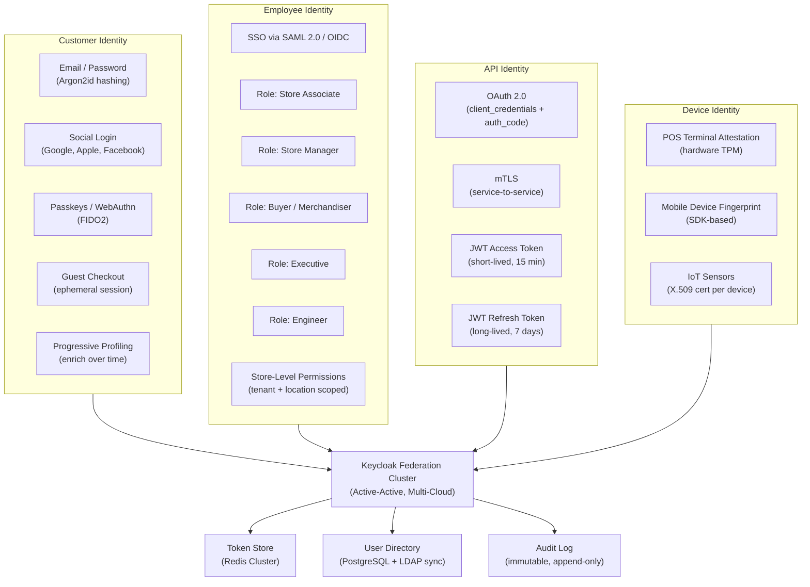
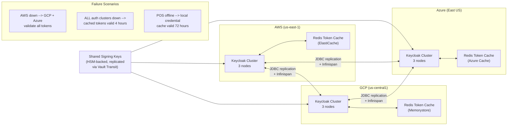
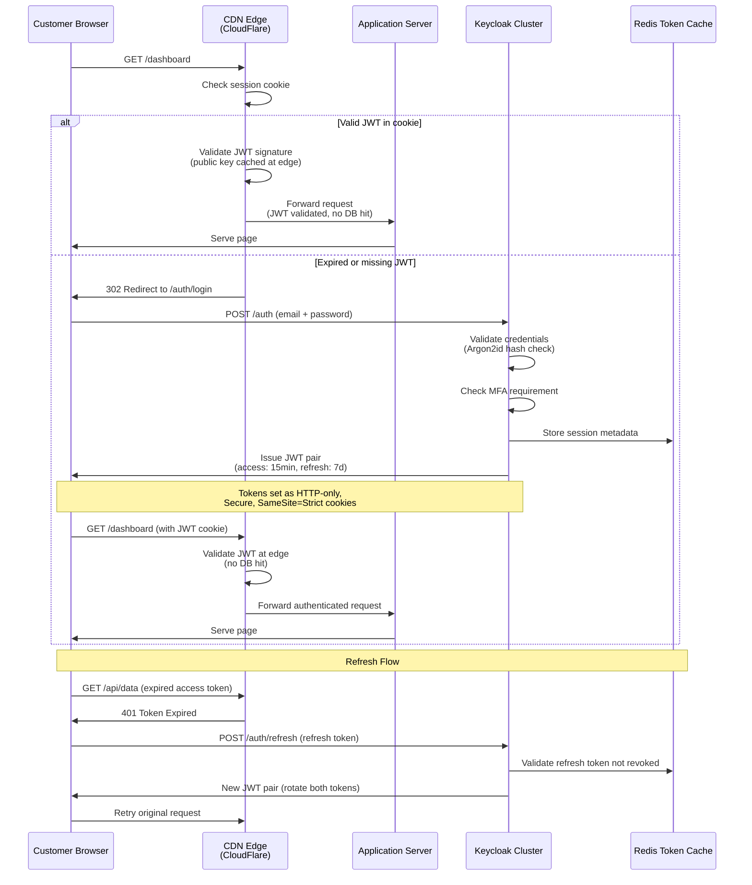
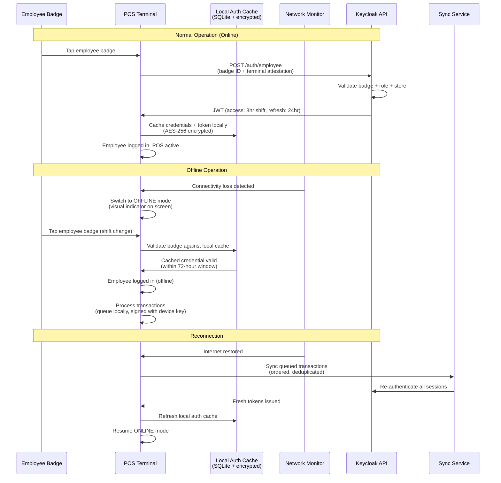
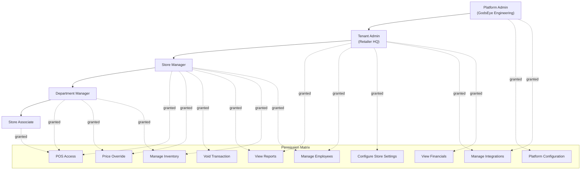

# Authentication & Identity System

GodsEye identity layer: multi-cloud active-active Keycloak federation. Four identity types, RBAC hierarchy, offline-capable POS auth. Zero-trust architecture throughout.

## Identity Architecture

## Multi-Cloud Auth Resilience

## Auth Flow - Customer

## Auth Flow - POS Offline

## RBAC Model

## Build vs Buy Strategy

| Component | Phase 1 (Launch) | Phase 2 (Scale) | Phase 3 (Own) |
|---|---|---|---|
| **Identity Provider** | Auth0 managed | Keycloak on K8s (managed DB) | Own Keycloak clusters, multi-cloud |
| **Token Store** | Auth0 built-in | Redis ElastiCache | Multi-cloud Redis federation |
| **MFA** | Auth0 Guardian | Auth0 + custom TOTP | Own MFA service (WebAuthn focus) |
| **User Directory** | Auth0 DB | PostgreSQL + LDAP bridge | Distributed PostgreSQL (CockroachDB) |
| **Social Login** | Auth0 connectors | Auth0 connectors | Direct OIDC integration |
| **Device Attestation** | N/A | Third-party SDK | Own attestation service |

## Token Lifecycle

| Token Type | TTL | Refresh Policy | Revocation Strategy | Storage |
|---|---|---|---|---|
| **Customer Access JWT** | 15 minutes | Silent refresh via refresh token | Revocation list in Redis (check at edge) | HTTP-only cookie |
| **Customer Refresh Token** | 7 days | Rotate on each use (one-time use) | Immediate revocation on logout/password change | HTTP-only cookie |
| **Employee Access JWT** | 8 hours (shift) | Manual refresh at shift change | Revoked on clock-out or termination | POS local store + cookie |
| **Employee Offline Cache** | 72 hours | Refreshed on reconnection | Purged on reconnection or expiry | POS SQLite (AES-256) |
| **API Client Token** | 1 hour | client_credentials re-grant | Client secret rotation, scope reduction | In-memory only |
| **Service Mesh mTLS** | 24 hours | Auto-rotated by Istio/SPIFFE | Certificate revocation via CRL | Envoy sidecar |
| **Device Certificate** | 90 days | Auto-renewed 7 days before expiry | Remote wipe triggers cert revocation | Device TPM/Secure Enclave |
