# 🛒 Headless Commerce Engine

GodsEye Commerce is a headless API-first engine that powers every selling channel -- web, mobile, POS, social, voice, and marketplace. A single backend, many frontends.

## Commerce Architecture

## Checkout Flow

## Search & Discovery Pipeline

## Product Catalog Data Model

```mermaid
erDiagram
    PRODUCT {
        uuid id PK
        string name
        string slug
        text description
        string brand
        enum status "active/draft/archived"
        timestamp created_at
        timestamp updated_at
    }

    VARIANT {
        uuid id PK
        uuid product_id FK
        string size
        string color
        string material
        decimal weight_kg
        string dimensions
        boolean is_active
    }

    SKU {
        uuid id PK
        uuid variant_id FK
        string sku_code UK
        string upc_barcode UK
        string ean_barcode
        enum fulfillment_type "ship/pickup/digital"
    }

    INVENTORY {
        uuid id PK
        uuid sku_id FK
        uuid location_id FK
        integer qty_on_hand
        integer qty_reserved
        integer qty_available "computed: on_hand - reserved"
        integer reorder_point
        timestamp last_counted
    }

    LOCATION {
        uuid id PK
        string name
        enum type "warehouse/store/vendor"
        string address
        decimal latitude
        decimal longitude
        boolean ships_orders
        boolean allows_pickup
    }

    CATEGORY {
        uuid id PK
        uuid parent_id FK "self-referencing"
        string name
        string slug
        integer depth
        string path "materialized path"
    }

    ATTRIBUTE {
        uuid id PK
        uuid product_id FK
        string key "e.g. fabric, origin, care"
        string value
        boolean filterable
        boolean searchable
    }

    MEDIA {
        uuid id PK
        uuid product_id FK
        enum type "image/video/3d_model/document"
        string url
        string alt_text
        integer sort_order
        integer width_px
        integer height_px
    }

    PRICING {
        uuid id PK
        uuid sku_id FK
        string currency "USD/CAD/EUR..."
        decimal base_price
        decimal sale_price "nullable"
        timestamp sale_start
        timestamp sale_end
        string region "nullable — region override"
        decimal cost_price "for margin calc"
    }

    REVIEW {
        uuid id PK
        uuid product_id FK
        uuid customer_id FK
        integer rating "1-5"
        text title
        text body
        boolean verified_purchase
        enum status "pending/approved/rejected"
        timestamp created_at
    }

    PRODUCT ||--o{ VARIANT : "has many"
    VARIANT ||--o{ SKU : "has many"
    SKU ||--o{ INVENTORY : "stocked at"
    INVENTORY }o--|| LOCATION : "held in"
    PRODUCT }o--o{ CATEGORY : "belongs to (many-to-many)"
    PRODUCT ||--o{ ATTRIBUTE : "has many"
    PRODUCT ||--o{ MEDIA : "has many"
    SKU ||--o{ PRICING : "priced per region/currency"
    PRODUCT ||--o{ REVIEW : "has many"
    CATEGORY ||--o{ CATEGORY : "parent-child hierarchy"
```

## Reference Tables

### API Endpoint Summary

| Endpoint | Method | Description | Avg Response | p99 Response | Auth |
|---|---|---|---|---|---|
| `/products` | GET | List products (paginated, filtered) | 45ms | 120ms | Public |
| `/products/{id}` | GET | Single product with variants, media, pricing | 30ms | 80ms | Public |
| `/products/{id}/reviews` | GET | Paginated reviews for product | 25ms | 60ms | Public |
| `/search` | POST | Full-text + faceted search | 80ms | 200ms | Public |
| `/search/visual` | POST | Image-based visual search | 250ms | 600ms | Public |
| `/search/autocomplete` | GET | Typeahead suggestions | 15ms | 40ms | Public |
| `/cart` | GET | Retrieve current cart | 20ms | 50ms | Session |
| `/cart/items` | POST | Add item to cart | 35ms | 90ms | Session |
| `/cart/items/{id}` | PATCH | Update quantity | 25ms | 70ms | Session |
| `/cart/items/{id}` | DELETE | Remove item from cart | 20ms | 50ms | Session |
| `/checkout` | POST | Initiate checkout session | 150ms | 400ms | Authenticated |
| `/checkout/shipping-rates` | POST | Fetch multi-carrier rates | 300ms | 800ms | Authenticated |
| `/checkout/tax` | POST | Calculate tax per jurisdiction | 100ms | 250ms | Authenticated |
| `/checkout/complete` | POST | Submit order + payment auth | 1.2s | 2.8s | Authenticated |
| `/orders` | GET | List customer orders | 40ms | 100ms | Authenticated |
| `/orders/{id}` | GET | Order detail + tracking | 35ms | 90ms | Authenticated |
| `/inventory/{sku}` | GET | Real-time ATP for SKU | 15ms | 40ms | Internal |
| `/inventory/{sku}/locations` | GET | ATP by location (store/warehouse) | 25ms | 60ms | Internal |

### Build vs. Buy Roadmap

| Component | Phase 1 (Launch) | Phase 2 (12-18 months) | Phase 3 (24+ months) | Long-Term Strategy |
|---|---|---|---|---|
| Product Catalog | **GodsEye-built** | GodsEye-built | GodsEye-built | Core IP -- own forever |
| Search & Discovery | **Algolia** (managed) | Migrate to self-hosted OpenSearch + custom AI re-ranker | Full GodsEye Search with ML ranking | Own -- search quality is a differentiator |
| Cart & Checkout | **GodsEye-built** | GodsEye-built | GodsEye-built | Core IP -- own forever |
| Pricing Engine | **GodsEye-built** | GodsEye-built + ML dynamic pricing | GodsEye-built | Core IP -- competitive advantage |
| Promotion Engine | **GodsEye-built** | GodsEye-built | GodsEye-built | Core IP -- retailer customization |
| Inventory (ATP) | **GodsEye-built** | GodsEye-built | GodsEye-built | Core IP -- real-time ATP is critical |
| Tax Calculation | **TaxJar / Avalara** | TaxJar / Avalara | TaxJar / Avalara | **Keep third-party forever** -- tax law complexity not worth internalizing |
| Shipping Rates | **EasyPost / Shippo** | EasyPost / Shippo | EasyPost / Shippo | **Keep third-party forever** -- carrier integrations are commodity |
| Payment Processing | **Stripe / Adyen** | Stripe / Adyen + fallback | Multi-PSP via Payment Orchestrator | **Keep third-party** -- PCI L1 compliance not worth building |
| GraphQL Federation | **Apollo Router** (managed) | Self-hosted Apollo Router | Evaluate alternatives | Likely keep managed |
| API Gateway | **Kong Cloud** | Self-hosted Kong on K8s | Self-hosted Envoy | Migrate to self-hosted for cost/control |
| CDN / Edge | **Cloudflare** | Cloudflare + Fastly (multi-CDN) | Multi-CDN with custom routing | Keep third-party, add redundancy |
