# 🔄 Cross-Cloud Data Synchronization

GodsEye operates across AWS (primary), GCP (secondary), and Azure (tertiary). Every byte of data has a classification tier, a sync method, and a conflict resolution strategy. No exceptions.

## Data Classification & Sync Strategy

```mermaid
graph TD
    subgraph RT["Tier 1: Real-Time < 1s"]
        direction LR
        RT1[Cart State]
        RT2[Session Data]
        RT3[Auth Tokens]
        RT4[Payment Transactions]
        RT5[Inventory Reservations]
    end

    subgraph NRT["Tier 2: Near-Real-Time < 30s"]
        direction LR
        NRT1[Product Catalog]
        NRT2[Inventory Levels]
        NRT3[Customer Profiles]
        NRT4[Order Status]
        NRT5[Promotions]
    end

    subgraph BATCH["Tier 3: Batch — Hourly/Daily"]
        direction LR
        B1[Analytics Aggregates]
        B2[Historical Transactions]
        B3[Vendor Data]
        B4[Product Master]
        B5[Financial Reconciliation]
    end

    RT -->|Sync via| RTSYNC["CockroachDB / Spanner\nMulti-region replication\n+ Redis CRDT cross-cloud"]
    NRT -->|Sync via| NRTSYNC["Kafka MirrorMaker 2\nCross-cloud topic replication\nExactly-once semantics"]
    BATCH -->|Sync via| BSYNC["Object Storage Replication\nS3 ↔ GCS ↔ Blob\n+ Scheduled ETL Pipelines"]

    RTSYNC --> STORE[(All Clouds Consistent)]
    NRTSYNC --> STORE
    BSYNC --> STORE

    style RT fill:#ff6b6b,color:#fff
    style NRT fill:#ffa94d,color:#fff
    style BATCH fill:#69db7c,color:#fff
    style RTSYNC fill:#339af0,color:#fff
    style NRTSYNC fill:#339af0,color:#fff
    style BSYNC fill:#339af0,color:#fff
```

## Cross-Cloud Replication Topology

## Conflict Resolution Flow

## Event-Driven Architecture

## Reference Tables

### Data Type Sync Matrix

| Data Type | Sync Method | Target Latency | Conflict Resolution | Partition Key |
|---|---|---|---|---|
| Cart state | CockroachDB multi-region + Redis CRDT | < 200ms | CRDT merge (OR-Set) | `customer_id` |
| Session data | Redis CRDT cross-cloud | < 100ms | CRDT merge (LWW-Register) | `session_id` |
| Auth tokens | CockroachDB multi-region | < 500ms | Last-write-wins (short TTL) | `user_id` |
| Payment transactions | CockroachDB serializable txn | < 1s | Event sourcing (strict order) | `transaction_id` |
| Inventory reservations | CockroachDB + Kafka | < 1s | Aggregate + reject overflow | `sku_id` |
| Product catalog | Kafka MirrorMaker 2 | < 10s | Last-write-wins + version vector | `product_id` |
| Inventory levels | Kafka MirrorMaker 2 | < 15s | Aggregate from all warehouses | `sku_id + location_id` |
| Customer profiles | Kafka MirrorMaker 2 | < 30s | CRDT merge (nested maps) | `customer_id` |
| Order status | Kafka MirrorMaker 2 | < 10s | Event sourcing (state machine) | `order_id` |
| Promotions | Kafka MirrorMaker 2 | < 30s | Version vector, highest wins | `promo_id` |
| Analytics aggregates | Object storage replication + ETL | 1-6 hours | Recompute from source events | Date partition |
| Historical transactions | Object storage replication | 6-24 hours | Immutable (append-only) | Date partition |
| Financial reconciliation | Scheduled ETL pipeline | Daily | Manual review + auto-match | Date partition |

### Build vs. Buy Roadmap

| Component | Phase 1 (Launch) | Phase 2 (12-18 months) | Phase 3 (24+ months) |
|---|---|---|---|
| Transactional DB | CockroachDB Cloud (managed) | Self-managed CockroachDB on K8s | Self-managed + custom replication layer |
| Event Streaming | Confluent Cloud Kafka | Self-managed Kafka on K8s | Self-managed + custom MirrorMaker config |
| Object Storage | AWS S3 + GCS + Azure Blob (native) | Same (no change needed) | Same (commodity, no advantage to build) |
| Cache Layer | Redis Cloud (managed) | Self-managed Redis + custom CRDT | Custom CRDT cache layer (if scale demands) |
| ETL Pipelines | Fivetran + dbt Cloud | Self-managed dbt + Airflow | Custom ETL framework (if needed) |
| Conflict Resolution | Application-level (custom) | Application-level (custom) | Dedicated conflict resolution service |
