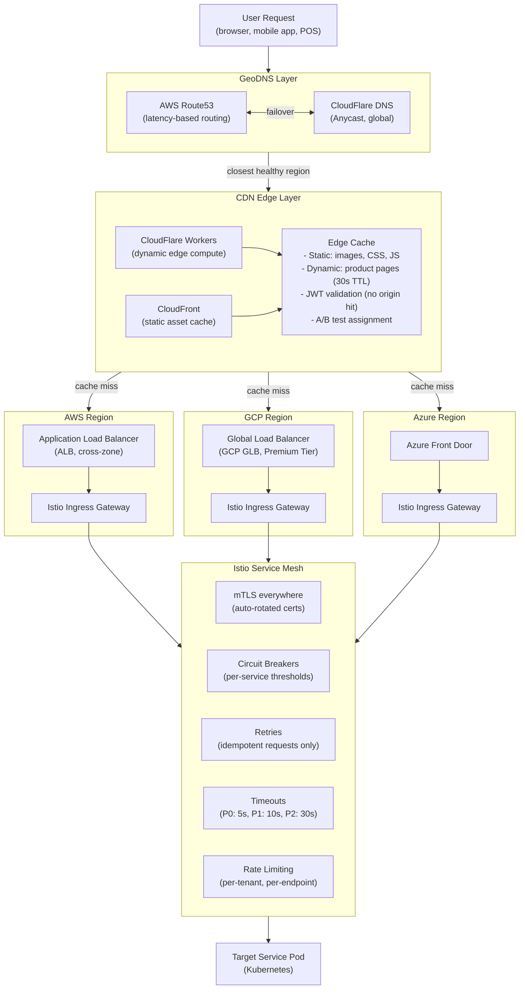
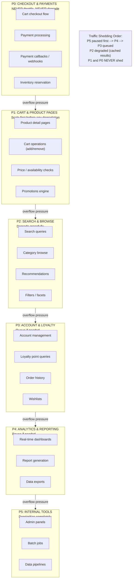
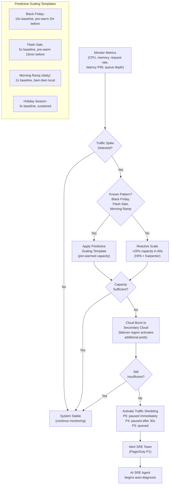
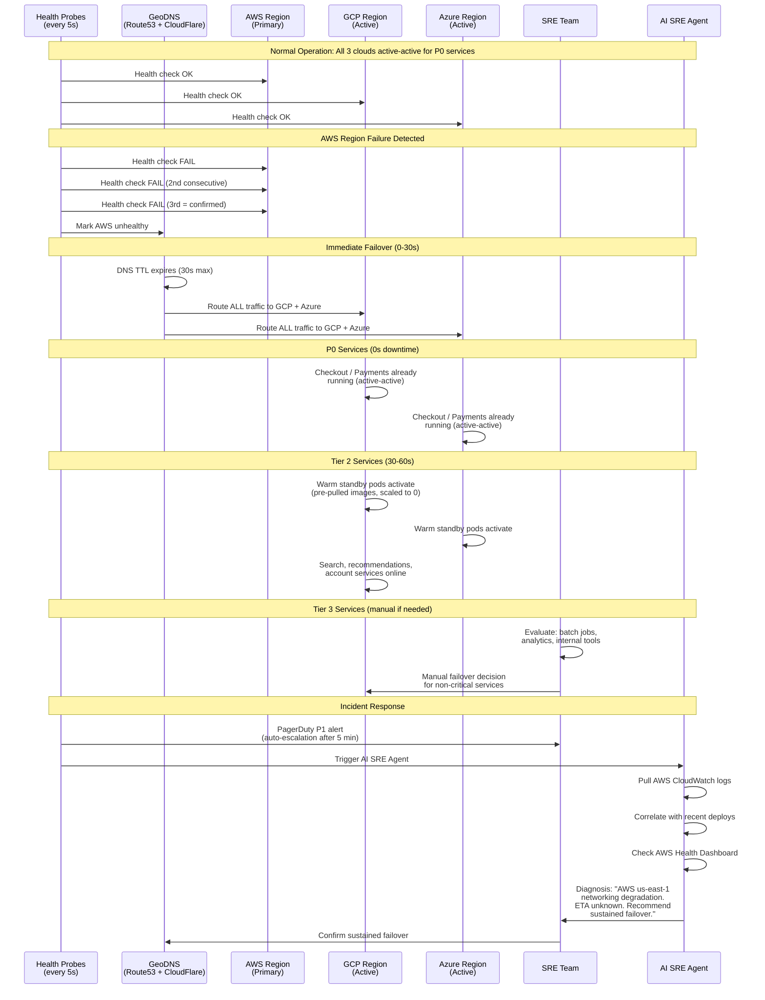

# Global Load Balancing & Traffic Management

GodsEye traffic layer: GeoDNS + CDN edge + per-cloud LBs + Istio service mesh. Priority-based traffic shaping ensures checkout/payments never degrade. Multi-cloud failover in under 60 seconds.

## Traffic Flow

## Traffic Priority

## Auto-Scaling Decision Flow

## Failover Sequence

## CDN Caching Strategy

| Asset Type | CDN TTL | Origin Cache-Control | Invalidation Strategy | Edge Location |
|---|---|---|---|---|
| **Static Assets** (CSS, JS, fonts) | 1 year | `immutable, max-age=31536000` | Filename hash versioning (cache bust) | All PoPs |
| **Product Images** | 24 hours | `max-age=86400, stale-while-revalidate=3600` | Purge by tag on image update | All PoPs |
| **Product Pages (HTML)** | 30 seconds | `max-age=30, stale-while-revalidate=60` | Instant purge on price/stock change | Regional PoPs |
| **API Responses (catalog)** | 60 seconds | `max-age=60, stale-if-error=300` | Purge on catalog mutation | Regional PoPs |
| **API Responses (cart/checkout)** | 0 (no cache) | `no-store, no-cache` | N/A (never cached) | Pass-through |
| **Search Results** | 5 minutes | `max-age=300, stale-while-revalidate=60` | Purge on major catalog update | Regional PoPs |
| **Personalized Content** | 0 (no cache) | `private, no-cache` | N/A (never cached at CDN) | Pass-through |
| **Video / Rich Media** | 7 days | `max-age=604800` | Purge by tag on update | Major PoPs only |

## Build vs Buy Strategy

| Component | Phase 1 (Launch) | Phase 2 (Scale) | Long-Term Posture |
|---|---|---|---|
| **CDN** | CloudFlare Pro | CloudFlare Enterprise | Third-party (CloudFlare) -- never build own CDN |
| **DNS** | CloudFlare DNS + Route53 | Same + health check automation | Third-party -- never build own DNS |
| **WAF** | CloudFlare WAF | CloudFlare + custom rules | Third-party (CloudFlare) + own rule engine |
| **DDoS Protection** | CloudFlare included | CloudFlare + AWS Shield Advanced | Third-party -- never build own |
| **Cloud Load Balancers** | ALB (AWS) | ALB + GCP GLB + Azure FD | Cloud-native -- use each cloud's LB |
| **Service Mesh** | Istio (open-source) | Istio + custom Envoy filters | Open-source, self-managed (core competency) |
| **Auto-Scaling** | K8s HPA + Karpenter | + Predictive scaling (own) | Own scaling intelligence (ML-based) |
| **Traffic Shaping** | Istio rate limiting | Own priority engine | Own traffic orchestrator (core IP) |
| **Observability** | Datadog | Datadog + Grafana stack | Migrate to own Grafana/Mimir/Tempo stack |
