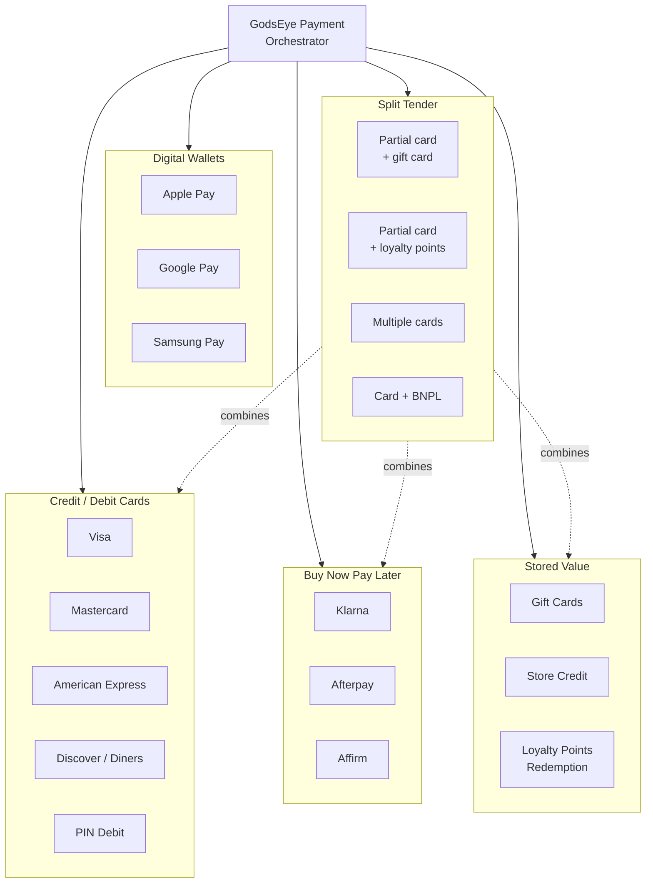

# Payment Gateway Orchestrator

GodsEye payment layer: multi-gateway smart routing, PCI-DSS Level 1 tokenization, offline-capable POS, AI-driven fraud and cost optimization. All gateways remain third-party -- GodsEye never processes raw card data.

## Payment Routing Engine

## Payment Types

## PCI-DSS Compliance Flow

## In-Store Payment Flow

## AI in Payments

## Gateway Comparison

| Capability | Stripe | Adyen | Square | Worldpay | Checkout.com |
|---|---|---|---|---|---|
| **Card Present (POS)** | Via Terminal API | Native | Native | Native | Limited |
| **Card Not Present (Web)** | Native | Native | Native | Native | Native |
| **Apple Pay / Google Pay** | Yes | Yes | Yes | Yes | Yes |
| **BNPL Integration** | Klarna, Afterpay | Klarna, Afterpay, Affirm | Afterpay (owned) | Limited | Klarna |
| **Multi-Currency** | 135+ currencies | 150+ currencies | Limited | 120+ currencies | 150+ currencies |
| **Regions** | Global | Global | US, CA, AU, JP, UK, EU | Global | Global |
| **Interchange++** | Yes | Yes | No (flat rate) | Yes | Yes |
| **Typical Blended Rate** | 2.9% + $0.30 | 2.6% + $0.10 | 2.6% + $0.10 | 2.5% + $0.10 | 2.5% + $0.20 |
| **Tokenization Vault** | Yes (native) | Yes (native) | Yes (native) | Yes | Yes (native) |
| **Real-Time Reporting** | Yes | Yes | Yes | Delayed | Yes |
| **Primary Use in GodsEye** | E-commerce default | Enterprise / global | In-store (SMB tier) | High-volume routing | EU / UK primary |

## Build vs Buy Strategy

| Component | Phase 1 (Launch) | Phase 2 (Scale) | Long-Term |
|---|---|---|---|
| **Payment Gateways** | Stripe + Square | Add Adyen + Worldpay | All remain third-party (NEVER build own) |
| **Smart Router** | Simple rules engine | ML-based optimization | Own routing engine (core IP) |
| **Fraud Engine** | Stripe Radar + basic rules | Add Sardine / Sift | Own ML models + third-party signals |
| **Tokenization Vault** | Stripe tokens + VGS | VGS multi-gateway | Own vault (HSM-backed, multi-cloud) |
| **Chargeback Mgmt** | Manual + Stripe tools | Chargeflow / Midigator | Own system + third-party alert networks |
| **Reconciliation** | Per-gateway reports | Aggregated dashboard | Own real-time reconciliation engine |
| **POS Terminal Mgmt** | Square Terminal / Stripe Terminal | Multi-vendor support | Own terminal management platform |
