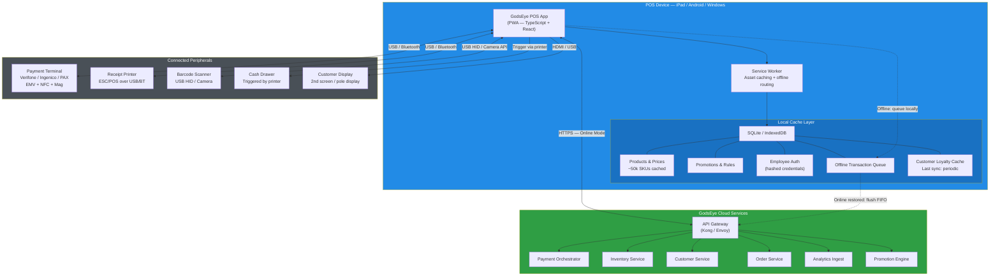
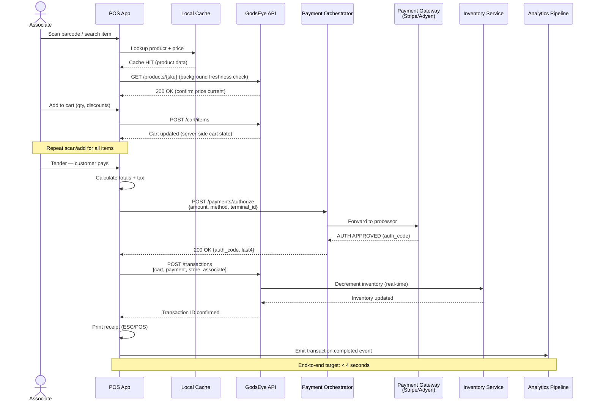
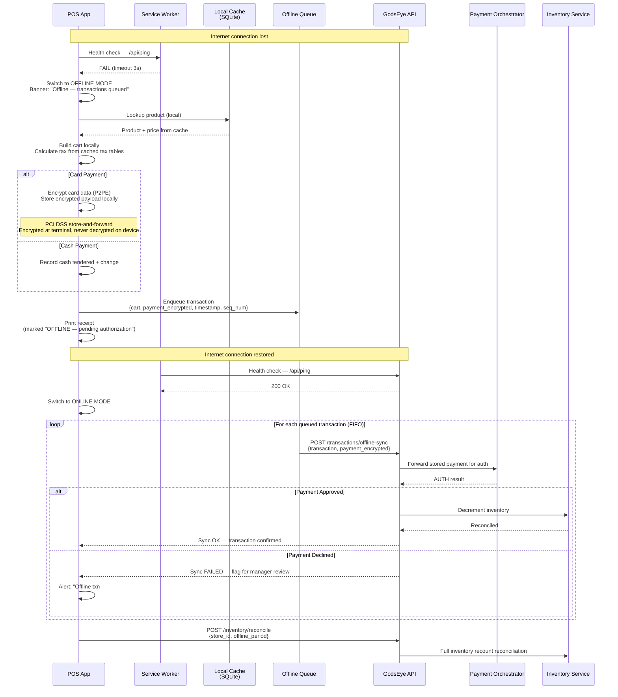
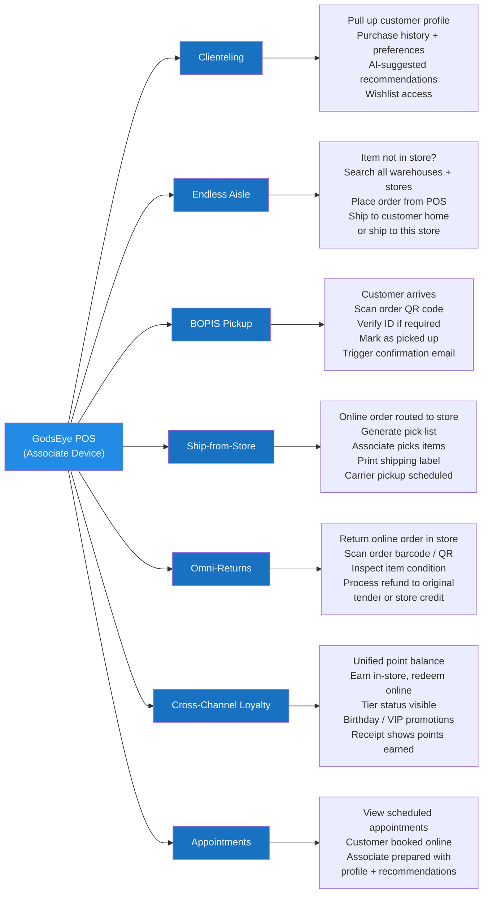

# 🖥️ Point of Sale System

GodsEye POS is a PWA that runs on iPad, Android tablets, and Windows terminals. It operates fully offline, syncs when connected, and integrates all omnichannel workflows. This is core IP -- built in-house from day one.

## POS Architecture

## Transaction Flow -- Online

## Transaction Flow -- Offline

## Offline Capability Stack

```mermaid
graph TD
    subgraph WORKS["Fully Functional Offline"]
        direction TB
        W1["Item Lookup & Search\n50k SKUs cached locally"]
        W2["Price Check\nCached price + tax tables"]
        W3["Employee Login\nHashed credentials stored locally"]
        W4["Card Payment\nStore-and-forward (P2PE encrypted)"]
        W5["Cash Payment\nFull cash handling + change calc"]
        W6["Returns — Limited\nRecent transactions cached\nRefund to original tender queued"]
        W7["Loyalty — Cached\nPoint balance from last sync\nNew points queued"]
        W8["Discounts & Promotions\nCached promotion rules engine"]
        W9["Receipt Printing\nFull receipt with offline indicator"]
        W10["Associate Productivity\nShift tracking, break logging"]
    end

    subgraph DEGRADED["Degraded / Unavailable Offline"]
        direction TB
        D1["Real-Time Inventory\nShows last-known count\nNo cross-store visibility"]
        D2["Online Order Lookup\nCannot query cloud orders"]
        D3["Gift Card Balance Check\nCannot validate live balance\nAccept with risk flag"]
        D4["New Promotion Activation\nCannot download new promos\nUses last-synced rules"]
        D5["Cross-Store Transfer\nRequires cloud connectivity"]
        D6["Customer Account Creation\nQueued for sync"]
        D7["Price Override Auth\nManager PIN works offline\nAudit logged on sync"]
    end

    WORKS ---|"Cache sync every 15 min\nwhen online"| SYNC["Sync Engine"]
    DEGRADED ---|"Restored on\nreconnection"| SYNC
    SYNC --> CLOUD["GodsEye Cloud"]

    style WORKS fill:#2f9e44,color:#fff
    style DEGRADED fill:#e03131,color:#fff
    style SYNC fill:#1971c2,color:#fff
```

## Omnichannel POS Workflows

## Reference Tables

### Hardware Compatibility Matrix

| Peripheral | Protocol | Supported Models | Connection | Offline Support |
|---|---|---|---|---|
| Payment Terminal | Semi-integrated (chip+PIN) | Verifone P400, Ingenico Lane/3000, PAX A80 | USB / Ethernet / Bluetooth | Store-and-forward (P2PE) |
| Receipt Printer | ESC/POS | Epson TM-T88VI, Star TSP143IV, Bixolon SRP-350V | USB / Bluetooth / Wi-Fi | Full |
| Barcode Scanner | USB HID / Camera | Socket Mobile S740, Zebra DS2208, built-in camera | USB / Bluetooth | Full |
| Cash Drawer | DK port (printer-driven) | APG Vasario, MMF Val-u Line | Printer DK port | Full |
| Customer Display | Secondary screen | Any HDMI/USB display, pole display via serial | HDMI / USB / Serial | Full |
| Label Printer | ZPL / ESC/POS | Zebra ZD421, Brother QL-820NWB | USB / Wi-Fi / Bluetooth | Full |
| Scale | RS-232 / USB | CAS SW-1S, Avery Berkel | USB / Serial | Full |

### POS Device Requirements

| Platform | Minimum Spec | Recommended | Notes |
|---|---|---|---|
| iPad | iPad 9th gen, iPadOS 16+ | iPad 10th gen or iPad Air | Camera barcode scanning built-in |
| Android Tablet | Android 12+, 4GB RAM, ARM64 | Samsung Galaxy Tab A8 or Lenovo Tab M10 | Chrome 110+ required for PWA |
| Windows Terminal | Windows 10+, 8GB RAM, SSD | Elo I-Series, HP Engage One | Supports full USB peripheral stack |
| Linux Terminal | Ubuntu 22.04+, 4GB RAM | Custom kiosk image available | Chromium-based PWA |

### Build vs. Buy

| Component | Strategy | Rationale |
|---|---|---|
| POS Application | **GodsEye-built from Day 1** | Core IP. Omnichannel workflows and offline capability are primary differentiators. Must own completely. |
| Payment Terminals | **Third-party forever** | Hardware is commodity. Verifone/Ingenico/PAX handle PCI terminal certification. Integrate via semi-integrated protocol. |
| Payment Processing | **Third-party** (Stripe/Adyen) | Processor relationships, PCI Level 1 compliance, and fraud tooling are not worth building. Abstract behind Payment Orchestrator for portability. |
| Receipt / Label Printers | **Third-party forever** | Commodity hardware. ESC/POS and ZPL are standard protocols. |
| Barcode Scanning | **Third-party hardware**, GodsEye camera scanning | Hardware scanners are commodity. Camera-based scanning (ML barcode detection) is GodsEye-built for device flexibility. |
